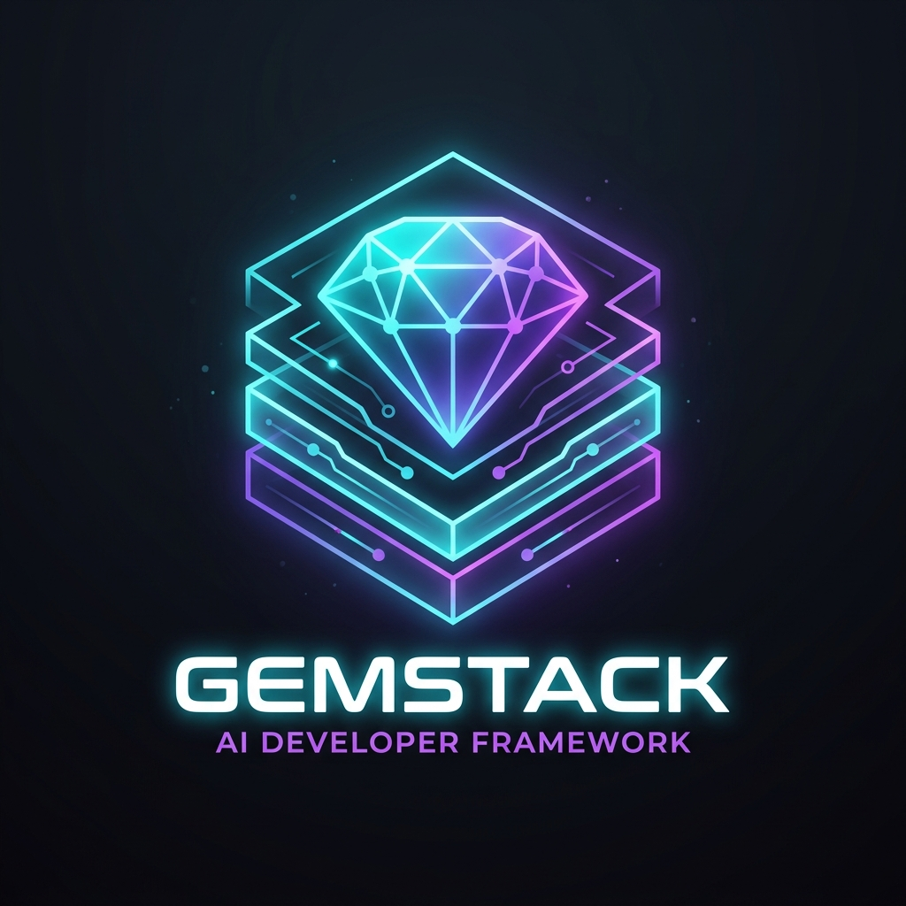

<div align="center">
  
  <h1>Gemstack v2.0.1</h1>
  <p><b>The Local-First Agentic Framework for Spec-Driven Development</b></p>

  [](https://www.npmjs.com/package/gemstack-ai)
  [](https://github.com/rtorrescodes/Gemstack/releases/tag/v2.0.1)
  [](https://github.com/rtorrescodes/Gemstack/actions)
  [](https://opensource.org/licenses/MIT)
  [](#security-architecture--safety-gates)
 
> **🛡️ Gemstack v2.0.1** — *Security Closure & Hardening Checkpoint*  
> **💡 ¿No sabes por dónde empezar o cómo funciona esto?**  
> 👉 [**¡Lee el Manual de Usuario Interactivo (La Guía Definitiva)!**](MANUAL.md) 👈
</div>

---

Gemstack is a zero-dependency, local-first framework designed to supercharge your AI Coding Agents (like Google Antigravity, Claude, Cursor, or Aider). 

Instead of letting AI write code blindly in a chaotic chat window, Gemstack installs a "Brain" directly into your repository. It enforces **Spec-Driven Development (SDD)**, injecting strict rules, autonomous skills, and rigorous security gates into the AI's context.

## ✨ Core Features & Guarantees (v2.0.1)

- 🧠 **Adaptable Spec-Driven Development (SDD)**: Four rigor levels (`quick`, `fix`, `feature`, `high-risk`) tailoring validation rigor to change impact without unnecessary friction.
- 🛡️ **Hardened Trust Boundaries & Safety Gates**: Authenticated HMAC spending tokens (`BillableActionGate`), realpath symlink enforcement, pre-commit secret blocking, and automated credential masking.
- 🔄 **Incremental Specs & Conflict Detection**: Structured `ADDED`/`MODIFIED`/`REMOVED` declarations and offline `gemstack spec merge` to mechanically detect contract collisions before merging branches.
- 📜 **Formal Contract Amendments & Decoupled Integrity**: Replaces silent contract tampering with signed, auditable amendment records (`src/lib/contract-amendments.js`) cryptographically decoupled from frozen document artifacts.
- 🩺 **Offline Health & Dependency Auditor**: `gemstack doctor` scans for orphans, undeclared packages, and local circular imports in milliseconds without network calls.
- 🧠 **Context Fatigue Detection & Persistent Memory**: Monitors token accumulation, prunes ephemeral noise, and cross-verifies `handoff.md` against git commit history.
- 🐝 **Agent Swarm Planning**: Compiles tasks into deterministic execution waves with disjoint write partition ownership.
- 👁️ **Visual QA Verification**: Disk-recomputed SHA-256 evidence hashing with offline tolerance-bounded diffing and neutral masking.
- 📦 **Zero Dependencies**: 100% native Node.js standard library with 0 runtime and 0 dev npm dependencies.

## 🚀 Quickstart

Start a new project or upgrade an existing one in seconds with **Gemstack**:

```bash
# Initialize Gemstack in your current repository
npx gemstack-ai init
```

This will generate the `.agents/`, `.gemstack/`, and `specs/` directories.

To ensure your framework is healthy or to check for manual tampering:
```bash
npx gemstack-ai doctor
```

To update your project when Gemstack releases new Agent Skills:
```bash
npx gemstack-ai update
```

## 🧠 How it Works

Gemstack works by providing an **Operating System** for your LLM via markdown files. When you chat with your agent, you use "Slash Commands" that map to specific files in your `.agents/skills/` directory.

### The SDD Workflow
1. `/specify I want to build a real-time chat app` -> The AI creates `specs/[feature]/spec.md`.
2. `/plan` -> The AI reads the spec and writes technical architecture in `plan.md`.
3. `/tasks` -> The AI breaks the plan into an actionable, parallelizable checklist.
4. **Code!** -> The AI executes the tasks.
5. `/review` -> The AI reviews the diffs against the `03-gemstack-security.md` rules.
6. `/handoff` -> The AI saves its memory to `handoff.md` so you can close your laptop and resume flawlessly tomorrow.

## 🛡️ Security Architecture & Safety Gates

Gemstack ships with `03-gemstack-security.md` and `04-gemstack-infrastructure.md`, rulebooks based on high-compliance SaaS and Cloud Native standards (OWASP, NIST). When you run `/cso` or `/review`, the AI systematically checks for:
- **AppSec (Level 2)**: IDOR Protection, Race Condition prevention, CSRF/SSRF blocking, Rate Limiting, and Audit Trails.
- **Zero Trust Secrets**: Hardcoded keys are blocked.
- **DevSecOps & Infra**: Enforces Immutable Infrastructure (Docker/Terraform), Private Subnets (VPC), IAM Least Privilege, and Cloud Secret Managers.
- **Server-Side Validation**: Complete distrust of frontend state.

### Control & Verification Matrix

| Control | Scope | Test Verification | Boundary Limit |
|---|---|---|---|
| **Spec-Driven Development (SDD)** | Architectural alignment and phase gating | Cryptographic phase hashes (`gemstack verify`) | Does not prevent human commit of unapproved manual diffs outside the CLI |
| **Filesystem Traversal & Symlink Defense** | Scaffolding, backup, install, and visual QA writes | Realpath resolution and confined atomic writes (`tests/security-p0-hardening.test.js`) | Local OS processes with root privileges outside Gemstack CLI process boundaries |
| **Secret Scanning & Hook Preservation** | Local git commits and CI pipelines | Multi-provider regex scanning and pre-commit wrapper chaining (`scripts/ci/check-secrets.js`) | Only inspects staged text files; does not inspect compiled binary blobs or external networks |
| **Spending & Cost Safety Gates** | Billable agent API and model execution | HMAC token verification (min 16 chars), cumulative session budget tracking, positive unit bounds (`src/lib/safety-gates.js`) | Enforced on calls through ProviderBoundary within Node process memory; does not intercept external network processes |
| **Skill Installation Provenance & Safe Mode** | Remote skill ingestion via HTTPS | Checksum pinning (`--sha256`), URL credential blocking, private IP/loopback filtering, and `--inspect` dry preview (`tests/skill-install-provenance.test.js`) | Requires user verification of expected sha256; `--inspect` mode previews without writing |
| **Contract Amendments Authorization** | Specification contract modifications | Minimum 16-character HMAC signature over feature, contract, versions, and payload digests (`src/lib/contract-amendments.js`) | Amendment integrity hash checks structure; mechanical authorization requires valid HMAC key |
| **Visual QA Evidence Verification** | UI screenshots and regression detection | Disk-computed SHA-256 and pluggable diff adapter; UNVERIFIED fallback (`src/lib/visual-qa.js`) | Diff accuracy depends on adapter engine; static hashes detect file modification only |
| **Agent Rulebooks & AppSec Guidance** | Agent context prompts during review & planning | CSO audit scripts and rule templates (`.agents/rules/03-gemstack-security.md`) | Agent guidance is advisory; mechanical enforcement requires CLI verify and CI gates |

## 🔒 Architecture Consistency & Phase Freezing

Gemstack mechanically prevents AI agents from silently violating or hallucinating deviations from approved architecture. Critical decisions declared in `spec.md` are frozen using canonical cryptographic contracts and checked deterministically through `plan.md`, `tasks.md`, and implementation:

```gemstack-contracts
[
  {
    "id": "zero-dependency-core",
    "type": "BOOLEAN_INVARIANT",
    "value": true
  },
  {
    "id": "external-sync",
    "type": "BOUNDARY",
    "value": "FORBIDDEN"
  }
]
```

- **SPEC** owns base architectural contracts.
- **PLAN** inherits them and may add compatible technical contracts.
- **TASKS** inherits the consolidated registry.
- Contradictions become deterministic blockers (`FROZEN_CONTRACT_VIOLATION`).
- Phase artifacts are frozen via canonical SHA-256 digests; tampering is caught immediately (`FROZEN_ARTIFACT_CHANGED`).
- `gemstack verify` performs strictly read-only verification without mutating or overwriting accepted phase hashes (`VERIFY != FREEZE`).
- Existing projects without structured contracts automatically run in **LEGACY** mode without breaking.


## 🧪 Mechanical Test Matrix & Closure Evidence

Gemstack Upgrade B guarantees that what was planned is what was physically tested:
- **Canonical Test Matrix**: `spec.md` declares canonical acceptance tests and cryptographic `acceptanceSignature`.
- **Physical Test Bindings**: `plan.md` maps canonical IDs 1:1 to physical runner test files.
- **Task Traceability**: `tasks.md` validates that all required canonical tests have implementation tasks.
- **Safe Runner Adapters**: Direct zero-shell execution of test suites and package script gates.
- **`gemstack collect`**: Mutating runner that executes tests and atomically writes `specs/<feature>/closure.json`.
- **`gemstack verify`**: Strictly read-only 6-stage validator verifying evidence freshness against `closureContextHash`.
- **`gemstack ship`**: Gatekeeper requiring verified evidence before allowing transition to `SHIPPED`.
- **Git Optionality & Legacy Support**: Works identically on clean Git, dirty Git, and non-Git projects, with graceful legacy fallback.

## 🛡️ Cost & Provider Safety Gates

Gemstack Upgrade C guarantees fail-closed safety for commercial, remote, and AI providers:
- **`ProviderCapabilityGate`**: Validates provider capability declarations before invocation without network attempts.
- **`BillableActionGate`**: Enforces strict spending authorization tokens before executing billable operations.
- **Cost Ledger (`cost-ledger.json`)**: Auditable schema tracking provider cost assumptions, freshness thresholds, and currency units.
- **Fail-Closed Unknown Cost Policy**: Operations with unclassified or ambiguous costs are strictly blocked.
- **Environment Safety**: Commercial provider execution is forbidden in `test` and `ci` environments.
- **Trusted Mock Boundaries**: Test mocks operate strictly in memory with zero network escapes.
- **Offline Purity**: `gemstack verify` runs 100% offline with zero external network or provider charges.
- **Core Invariant**: `NO PROOF OF AUTHORIZATION = NO COMMERCIAL EXECUTION`.

## 📦 Context Capsule & Compression

Gemstack Upgrade D enables deterministic, constraint-lossless context compression for cross-session continuation:
- **`gemstack context generate`**: Compiles authoritative specifications, plans, tasks, contracts, and closure evidence into `context-capsule.json`.
- **Constraint Losslessness**: 100% of normative `MUST`/`MUST NOT` constraints, frozen contracts, and acceptance criteria survive compression.
- **Authority Precedence**: Authoritative repository artifacts unconditionally override derived capsule claims (`SPEC` > `PLAN` > `TASKS` > implementation).
- **Drift & Tampering Detection**: Live SHA-256 source hashing flags modified or manually tampered capsules as `STALE`.
- **Secret Defense**: Fail-closed regex scanning strictly blocks credentials, tokens, private keys, and `.env` data.
- **Size Budgeting**: 32 KB target budget with deterministic priority condensation and 64 KB fail-closed hard cap.
- **`gemstack context show`**: Displays human-readable continuation context summary or raw JSON.
- **`gemstack context verify`**: Read-only validation of context capsule freshness and integrity.
- **Core Invariant**: `Context Capsule = derived continuation context NOT project authority`.

## 🐝 Agent Swarm Planning & Validation

Gemstack Upgrade E introduces deterministic multi-worker planning and write-set partition validation:
- **`gemstack swarm plan`**: Compiles parallelizable `tasks.md` items into deterministic concurrent waves in `specs/<feature>/swarm.json`.
- **Exclusive Write Boundaries**: Validates that concurrent tasks possess strictly disjoint write sets (`write_set(T1) ∩ write_set(T2) = ∅`), mathematically preventing write collisions.
- **Collision Avoidance**: Overlapping write sets are automatically serialized into sequential waves (`SWARM_WRITE_COLLISION_PREVENTED`).
- **Separation of Duties Gate**: Non-waivable mechanical check enforcing `author != reviewer` on all task reviews (`SWARM_SELF_REVIEW_DETECTED`).
- **Task-Scoped Context Projections**: Projects minimal, structured context payloads derived from `context-capsule.json` without raw chat transcripts or prompt noise.
- **Provider & Budget Integration**: Intercepts model invocations via Upgrade C `ProviderCapabilityGate` and `BillableActionGate` to prevent budget breaches.
- **`gemstack swarm validate`**: Pure read-only validation of wave partitions, task ownership, and review independence.
- **Explicit Boundary**: *Gemstack core coordinates and validates; Gemstack core does NOT execute autonomous coding agents.*

## 👁️ Visual QA Evidence & Offline Verification

Gemstack Upgrade E provides mechanical visual verification grounded in cryptographic digests and offline comparisons:
- **Canonical Visual Manifest (`visual-qa.json`)**: Declares scenario routes, deterministic viewports, selector masks, baseline digests, and diff tolerances.
- **Deterministic Viewports**: Standardized profiles (Desktop, Mobile, Tablet) with locked width, height, and device scale factor.
- **Cryptographic Baseline Hashing**: Baselines are tracked and pinned via canonical SHA-256 hashes (`image_sha256`); flags disk tampering (`VQA_BASELINE_TAMPERED`).
- **Neutral & Secret Masking**: Eliminates dynamic timestamp/counter diff flakiness (`[MASKED_NEUTRAL]`) and enforces mandatory automatic masking on password and credential fields (`[MASKED_SECRET]`).
- **Structured Evidence Comparison**: Fast SHA-256 match path with offline tolerance-bounded diffing (`max_diff_percentage`).
- **Explicit Promotion Semantics**: Baselines are NEVER auto-updated or healed during test or verify; requires explicit `gemstack vqa promote <scenario-id>`.
- **`gemstack vqa validate`**: Pure read-only offline validation of manifests, baselines, and evidence completeness.
- **Explicit Boundary**: *Gemstack core inspects and diffs evidence; Gemstack core does NOT launch browsers and does NOT capture screenshots automatically. Capture remains external/adapted.*

## 🏛️ Architectural Principles

Gemstack operates on strict, non-negotiable architectural principles:

```text
authority > derived artifacts
evidence ≠ authority
verify = validate
agent output ≠ architecture
visual evidence ≠ architecture
credentials ≠ authorization
provider availability ≠ permission
unknown cost ≠ free
fallback ≠ inherited authorization
agent says done ≠ task mechanically complete
author ≠ reviewer where independent review is required
```

## 💻 CLI Reference

Gemstack provides a focused, deterministic CLI surface:

```bash
# Core verification & collection
gemstack verify [--json] [--target <dir>]     # 6-stage read-only audit (0 mutations; --run-tests delegates to npm test)
gemstack collect [--target <dir>]             # Executes test runner & records closure.json
gemstack ship [--target <dir>]                # Transitions lifecycle to SHIPPED if closure is VERIFIED

# Context capsule (Upgrade D)
gemstack context generate [--force]           # Compiles deterministic context-capsule.json
gemstack context show [--raw]                 # Displays continuation context summary or JSON
gemstack context verify                       # Verifies capsule freshness and provenance

# Agent swarm (Upgrade E)
gemstack swarm plan [--json]                  # Compiles tasks into disjoint concurrent waves
gemstack swarm validate [--json]              # Validates write sets and review attestations

# Visual QA (Upgrade E)
gemstack vqa validate [--json]                # Validates visual manifest, viewports, and baselines
gemstack vqa promote <scenario-id>            # Explicitly promotes live evidence to baseline
```

## 🪝 Active Security (Git Hooks)

Gemstack ships with native, zero-dependency Git hooks. Run `npx gemstack-ai hooks` (or just `npx gemstack-ai init`) to install a local `pre-commit` hook that automatically blocks commits containing:
- Exposed `.env` files.
- Hardcoded secrets (Stripe, AWS, JWT keys).
- Unresolved merge conflict markers (`<<<<<<< HEAD`).

## 🔌 Ecosystem & Plugins (Skill Market)

You can install agent skills created by the community directly into your project using the `install` command. Gemstack enforces fail-closed provenance verification: remote skills require either `--inspect` (dry metadata inspection) or `--sha256` (cryptographic integrity check):
```bash
# Safe inspection: preview remote skill metadata without writing to disk
npx gemstack-ai install https://raw.githubusercontent.com/community/gemstack-skills/main/django-expert/SKILL.md --inspect

# Cryptographically verified installation
npx gemstack-ai install https://raw.githubusercontent.com/community/gemstack-skills/main/django-expert/SKILL.md --sha256 <64-char-sha256>

# Update existing skill with automatic timestamped backup (.gemstack/backups/skills/)
npx gemstack-ai install https://raw.githubusercontent.com/community/gemstack-skills/main/django-expert/SKILL.md --sha256 <64-char-sha256> --update
```


## 🤖 MCP Server (Model Context Protocol)

Gemstack ships with a built-in MCP server that exposes the SDD state of your project to any MCP-compliant AI client (like Claude Desktop or Cursor). 

Add the following to your MCP client configuration:
```json
{
  "mcpServers": {
    "gemstack": {
      "command": "npx",
      "args": ["gemstack-ai", "mcp"]
    }
  }
}
```

## 📜 Version History & Release Highlights

Gemstack tracks every architectural enhancement through verifiable milestones:

| Version | Milestone & Core Highlights | Canonical Tests | Status |
| :--- | :--- | :--- | :--- |
| **`v2.0.1`** | **Security Closure & Hardening**<br/>• Elimination of unsigned spending token bypass & removal of default signing secrets.<br/>• Mandatory `--sha256` checksum verification & safe `--inspect` for remote skill installs.<br/>• URL credential blocking & extended SSRF protection (private IP/loopback/hex/octal/dword).<br/>• Automatic skill overwrite backup to `.gemstack/backups/skills/<name>_<timestamp>.bak`.<br/>• Mandatory HMAC secret (min 16 chars) & full payload cryptographic binding for contract amendments.<br/>• Zero-dependency root `package-lock.json` and workflow least-privilege permissions. | **203 physical tests / 24 suites** | **Security Closure Release** |
| **`v2.0.0`** | **Security Hardening, Adaptable SDD & Persistent Memory**<br/>• Strict symlink realpath confinement & remote skill SHA-256 verification.<br/>• HMAC-authenticated spending tokens & disk-recomputed visual evidence.<br/>• 4 SDD Rigor levels (`quick`, `fix`, `feature`, `high-risk`) & incremental spec deltas.<br/>• Signed contract amendments & offline collision detection (`gemstack spec merge`).<br/>• Context fatigue detection, offline dependency auditor, & git-memory cross-audit. | **180 physical tests / 23 suites** | Baseline Architecture |
| **`v1.4.0`** | **Agent Swarm Planning & Visual QA Evidence Checkpoint**<br/>• Multi-worker wave planning with disjoint write partitions (`swarm.json`).<br/>• Separation of duties gate (`author != reviewer`) and subagent limits.<br/>• Offline Visual QA manifest, deterministic viewports, & auto-secret masking. | **126 physical tests / 14 suites** | Superseded by v2.0.0 |
| **`v1.3.0`** | **Cost & Provider Safety Gates + Context Capsule**<br/>• `ProviderCapabilityGate` and `BillableActionGate` (NO PROOF = NO EXECUTION).<br/>• Deterministic context capsule compression with 32KB budget. | **100 physical tests / 25 suites** | Superseded by v1.4.0 |
| **`v1.2.0`** | **Mechanical Test Matrix & Closure Evidence**<br/>• Canonical acceptance matrices, mutating collector (`gemstack collect`), & `closure.json`.<br/>• Zero-shell TAP test runner & exact reconciliation arithmetic. | **53 physical tests / 11 suites** | Superseded by v1.3.0 |
| **`v1.1.2`** | **Architecture Consistency Engine & Phase Freezing**<br/>• Cryptographic SHA-256 phase freezing (`spec.md` -> `plan.md` -> `tasks.md`).<br/>• 6 canonical contract types & context-bound accepted exceptions. | **33 physical tests** | Superseded by v1.2.0 |
| **`v1.0.2`** | **Zero Silent Failures & Intent Routing**<br/>• Constitution update prohibiting `2>nul` silent masking in test runners.<br/>• Semantic intent-based routing and unified `gemstack verify` command. | **8 physical tests** | Superseded by v1.1.2 |
| **`v0.3.0`** | **Cross-Platform CI & Supply-Chain Hardening**<br/>• Multi-OS GitHub Actions workflows and zero-dependency CI verification scripts. | Unit + Smoke suites | Superseded by v1.0.2 |
| **`v0.2.0`** | **Zero-Dependency CLI & Scaffolding Engine**<br/>• Local-first `gemstack init` and `gemstack update` with automated rollback backups. | Native node:test suite | Superseded by v0.3.0 |
| **`v0.1.0`** | **Initial Antigravity Spec-Driven Development Framework**<br/>• Foundational 13 skills, Constitution rulebooks, and SecureDocs anti-IDOR demo app. | Demo smoke tests | Superseded by v0.2.0 |

For full historical details and upgrade guides, see [CHANGELOG.md](CHANGELOG.md) and [RELEASE_NOTES.md](RELEASE_NOTES.md).

## 📚 Documentation

Dive deeper into the Gemstack architecture:
- [📖 **Manual de Usuario**](MANUAL.md) - The Definitive Guide for beginners.
- [🧠 Spec-Driven Development](docs/spec-driven-development.md) - How the SDD loop works.
- [🔒 Architecture Consistency](docs/architecture-consistency.md) - Deterministic contracts & phase freezing.
- [Available Skills](docs/skills.md)
- [Security Model](docs/security.md)
- [Handoff Protocol](docs/handoff.md)

## 🤝 Contributing

We welcome contributions! See our [Contributing Guide](CONTRIBUTING.md) to learn how to add new agentic skills, improve the Node CLI, or enhance the SDD Constitution.

Please note that this project is released with a [Contributor Code of Conduct](CODE_OF_CONDUCT.md). By participating in this project you agree to abide by its terms.

## 📄 License

MIT License. See [LICENSE](LICENSE) for details.
