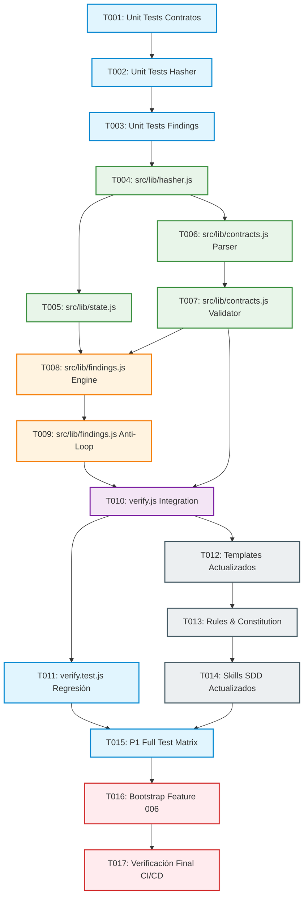

# Tareas de Implementación: Architecture Consistency Engine & Phase Freezing (Upgrade A)

**Feature Branch**: `006-architecture-consistency-engine`  
**Spec**: [`specs/006-architecture-consistency-engine/spec.md`](file:///c:/CODES/Gemstack/specs/006-architecture-consistency-engine/spec.md)  
**Plan**: [`specs/006-architecture-consistency-engine/plan.md`](file:///c:/CODES/Gemstack/specs/006-architecture-consistency-engine/plan.md)  
**Lifecycle Status**: `TASKS_COMPLETE`  
**Stop Reason**: `TASKS_COMPLETE_AWAITING_REVIEW`

---

## Contratos Congelados Heredados (Dogfooding)

```gemstack-contracts
[
  {
    "id": "zero-dependency-core",
    "type": "BOOLEAN_INVARIANT",
    "value": true,
    "description": "El runtime de Gemstack debe mantener cero dependencias externas de producción en Node.js."
  },
  {
    "id": "upgrade-a-contract-types",
    "type": "ENUM_SET",
    "values": [
      "ENUM_SET",
      "IDENTITY_TUPLE",
      "PROVENANCE_RULE",
      "BOOLEAN_INVARIANT",
      "BOUNDARY",
      "ROADMAP_LIMIT"
    ],
    "description": "Tipos de contrato deterministas soportados canónicamente en Upgrade A."
  },
  {
    "id": "verify-does-not-mutate-hashes",
    "type": "BOOLEAN_INVARIANT",
    "value": true,
    "description": "El comando gemstack verify valida contra hashes congelados pero nunca actualiza ni sobreescribe los hashes de fase."
  },
  {
    "id": "contract-amendment-requires-human-approval",
    "type": "BOOLEAN_INVARIANT",
    "value": true,
    "description": "Cualquier enmienda a un contrato congelado o artefacto inmutable requiere aprobación humana explícita."
  },
  {
    "id": "legacy-mode-supported",
    "type": "BOOLEAN_INVARIANT",
    "value": true,
    "description": "Features sin bloques de contratos operan en modo legacy sin romper compatibilidad ni generar falsos bloqueos."
  }
]
```

---

## Grafo de Dependencias de Tareas (6 Olas de Ejecución)



---

## Ola 1 — TDD Pre-Requisitos: Redacción de Suites de Prueba P1 (Fase Roja)

### [ ] T001 — Redacción de Pruebas Unitarias para Contratos (`tests/contracts.test.js`)
- **Objetivo**: Escribir los tests unitarios para parsing, ordenación, validación de los 6 tipos de contratos y resolución de herencia entre fases.
- **Archivos**: `tests/contracts.test.js`
- **Dependencias**: Ninguna.
- **Detalle de Pasos**:
  1. Crear archivo `tests/contracts.test.js` utilizando `node:test` y `node:assert/strict`.
  2. Implementar `TEST-CONSISTENCY-A01`: Parseo válido de array JSON en bloque ````gemstack-contracts.
  3. Implementar `TEST-CONSISTENCY-A02`: Rechazo con `CONTRACT_PARSE_ERROR` para JSON malformado o bloques múltiples.
  4. Implementar `TEST-CONSISTENCY-A03`: Emisión de `CONTRACT_DUPLICATE_ID` si dos contratos tienen id duplicado.
  5. Implementar `TEST-CONSISTENCY-B01`: `ENUM_SET` detecta miembro extra no aprobado ➔ `BLOCKED`.
  6. Implementar `TEST-CONSISTENCY-B02`: `ENUM_SET` ordenación canónica indiferente al orden (`[A,B]` == `[B,A]`) ➔ `PASS`.
  7. Implementar `TEST-CONSISTENCY-B03`: `IDENTITY_TUPLE` detecta dimensión omitida ➔ `BLOCKED`.
  8. Implementar `TEST-CONSISTENCY-B04`: `IDENTITY_TUPLE` permutación de dimensiones idénticas ➔ `PASS`.
  9. Implementar `TEST-CONSISTENCY-B05`: `PROVENANCE_RULE` detecta campo de procedencia eliminado ➔ `BLOCKED`.
  10. Implementar `TEST-CONSISTENCY-B06`: `BOOLEAN_INVARIANT` & `ROADMAP_LIMIT` contradicciones de valor ➔ `BLOCKED`.
  11. Implementar `TEST-CONSISTENCY-B07`: `BOUNDARY` estados estrictos `FORBIDDEN` vs `REQUIRED` (contradicción ➔ `BLOCKED`, equivalencia ➔ `PASS`).
  12. Implementar `TEST-CONSISTENCY-B08`: Herencia acumulativa (PLAN hereda SPEC y agrega compatibles sin requerir duplicación en TASKS) ➔ `PASS`.
- **Invariantes Congeladas**:
  - Cero dependencias npm externas.
  - Solo los 6 tipos de contrato canónicos.
  - Bloque canónico único o modo `LEGACY`.
- **P1 Tests Cubiertos**: `TEST-CONSISTENCY-A01`, `TEST-CONSISTENCY-A02`, `TEST-CONSISTENCY-A03`, `TEST-CONSISTENCY-B01`, `TEST-CONSISTENCY-B02`, `TEST-CONSISTENCY-B03`, `TEST-CONSISTENCY-B04`, `TEST-CONSISTENCY-B05`, `TEST-CONSISTENCY-B06`, `TEST-CONSISTENCY-B07`, `TEST-CONSISTENCY-B08`.
- **Validación Local**: `node --test tests/contracts.test.js` (debe fallar por módulos ausentes - Fase Roja).
- **Condición de Parada**: Tests creados y fallando limpiamente sin excepciones de sintaxis de tests.

---

### [ ] T002 — Redacción de Pruebas Unitarias para Hasher y Normalización (`tests/hasher.test.js`)
- **Objetivo**: Escribir los tests unitarios para hashing determinista SHA-256, rechazo de UTF-8 BOM emitiendo `CONTRACT_PARSE_ERROR` y normalización CRLF a LF.
- **Archivos**: `tests/hasher.test.js`
- **Dependencias**: T001.
- **Detalle de Pasos**:
  1. Crear `tests/hasher.test.js` utilizando `node:test` y `node:assert/strict`.
  2. Implementar `TEST-CONSISTENCY-C01`: Cálculo de digest SHA-256 en minúsculas de 64 caracteres.
  3. Implementar `TEST-CONSISTENCY-C02`: Detección de mutación no autorizada de artefacto congelado (`FROZEN_ARTIFACT_CHANGED`).
  4. Implementar `TEST-CONSISTENCY-C04`: Normalización determinista: `\r\n` y `\r` transformados a `\n` producen idéntico digest SHA-256; detección de UTF-8 BOM emite código congelado `CONTRACT_PARSE_ERROR` con mensaje descriptivo ("UTF-8 BOM is forbidden in phase artifacts").
  5. Implementar `TEST-CONSISTENCY-G01`: Normalización de rutas Windows (`\` convertido a `/`) para cálculo de fingerprints y paths de artefactos.
- **Invariantes Congeladas**:
  - SHA-256 completo de 64 caracteres en minúsculas.
  - Rechazo explícito de UTF-8 BOM (`0xEF, 0xBB, 0xBF`) bajo código estándar `CONTRACT_PARSE_ERROR`.
- **P1 Tests Cubiertos**: `TEST-CONSISTENCY-C01`, `TEST-CONSISTENCY-C02`, `TEST-CONSISTENCY-C04`, `TEST-CONSISTENCY-G01`.
- **Validación Local**: `node --test tests/hasher.test.js` (Fase Roja).
- **Condición de Parada**: Tests fallando por ausencia de `src/lib/hasher.js`.

---

### [ ] T003 — Redacción de Pruebas Unitarias para Findings, Anti-Loop y State (`tests/findings.test.js`)
- **Objetivo**: Escribir los tests unitarios para fingerprints SHA-256 canónicos, ciclo de vida de hallazgos, anti-loop, excepciones con contextHash completo y persistencia atómica.
- **Archivos**: `tests/findings.test.js`
- **Dependencias**: T002.
- **Detalle de Pasos**:
  1. Crear `tests/findings.test.js` con `node:test` y `node:assert/strict`.
  2. Implementar `TEST-CONSISTENCY-D01`: Generación canónica de fingerprint de 64 caracteres hex (`code`, `contractId`, `phase`, `location` relativa `/`) y verificación de visual display (`slice(0, 12)`).
  3. Implementar `TEST-CONSISTENCY-D02`: Anti-loop determinista: si el defecto persiste, no se suprime como `RESOLVED`; reabre si vuelve a ocurrir; deduplicación de 1 hallazgo por `(contractId, phase, violationType)`.
  4. Implementar `TEST-CONSISTENCY-E01`: Supresión de bloqueo si existe `ACCEPTED_EXCEPTION` con `contextHash` idéntico (SHA-256 de `upstreamAcceptedPhaseHash + currentComparedPhaseHash + normalizedContractRepresentation`).
  5. Implementar `TEST-CONSISTENCY-E02`: Reactivación de bloqueo de excepción si cualquier componente relevante muta (cambio en upstream accepted hash, cambio en current phase hash, o cambio en semántica normalizada del contrato recalculan `contextHash`, invalidando la excepción y retornando a estado bloqueante).
  6. Implementar `TEST-CONSISTENCY-F02`: Compatibilidad retroactiva de `state.json` versión 0.1 sin campos de Upgrade A.
  7. Implementar `TEST-CONSISTENCY-G02`: Escritura atómica de `state.json` (archivo temporal + rename) inmune a escrituras corruptas en Windows.
- **Invariantes Congeladas**:
  - Fingerprint canónico es un hash SHA-256 estricto de 64 caracteres (nunca truncado para indexación o persistencia).
  - ContextHash de excepciones engloba upstream hash + current phase hash + representación normalizada del contrato (nunca el hash de un solo archivo).
  - Escritura atómica vía `fs.writeFileSync` a archivo `.tmp` seguido de `fs.renameSync`.
- **P1 Tests Cubiertos**: `TEST-CONSISTENCY-D01`, `TEST-CONSISTENCY-D02`, `TEST-CONSISTENCY-E01`, `TEST-CONSISTENCY-E02`, `TEST-CONSISTENCY-F02`, `TEST-CONSISTENCY-G02`.
- **Validación Local**: `node --test tests/findings.test.js` (Fase Roja).
- **Condición de Parada**: Tests redactados y fallando limpiamente.

---

## Ola 2 — Core Libraries: Implementación de Módulos Base (Zero-Dependency)

### [ ] T004 — Implementación del Módulo Hasher (`src/lib/hasher.js`)
- **Objetivo**: Construir el módulo de hashing determinista, normalización de finales de línea, validación de BOM y normalización de rutas.
- **Archivos**: `src/lib/hasher.js`
- **Dependencias**: T002.
- **Detalle de Pasos**:
  1. Crear `src/lib/hasher.js` usando únicamente módulos nativos `node:crypto` y `node:fs`.
  2. Implementar `normalizeContent(content)`: comprobar si inicia con BOM (`content.charCodeAt(0) === 0xFEFF`) y lanzar error congelado `CONTRACT_PARSE_ERROR` con mensaje descriptivo ("UTF-8 BOM is forbidden in phase artifacts"); reemplazar `\r\n` y `\r` por `\n`.
  3. Implementar `hashContent(content)`: invocar `normalizeContent` y generar `createHash('sha256').update(normalized, 'utf8').digest('hex')`.
  4. Implementar `hashFile(filePath)`: leer buffer/utf8, validar existencia, calcular hash determinista.
  5. Implementar `normalizePath(filePath)`: reemplazar backslashes `\` por `/` y resolver relative path al workspace root.
  6. Exportar `{ normalizeContent, hashContent, hashFile, normalizePath }`.
- **Invariantes Congeladas**:
  - SHA-256 de 64 caracteres en minúsculas.
  - Rechazo de UTF-8 BOM usando el código de error congelado `CONTRACT_PARSE_ERROR`.
- **P1 Tests Cubiertos**: Hace pasar `TEST-CONSISTENCY-C01`, `TEST-CONSISTENCY-C04`, `TEST-CONSISTENCY-G01`.
- **Validación Local**: `node --test tests/hasher.test.js`.
- **Condición de Parada**: Los tests de hashing y normalización pasan al 100%.

---

### [ ] T005 — Implementación del Manejador de Estado Atómico (`src/lib/state.js`)
- **Objetivo**: Proveer lectura robusta con compatibilidad legacy y escritura atómica a prueba de fallos de `.gemstack/state.json` y sidecar `.gemstack.json`.
- **Archivos**: `src/lib/state.js`
- **Dependencias**: T003.
- **Detalle de Pasos**:
  1. Crear `src/lib/state.js` usando `node:fs` y `node:path`.
  2. Implementar `readState(rootPath)`: leer `.gemstack/state.json`, devolver defaults seguros si faltan campos de Upgrade A (`phase_hashes: null`, `findings: []`, `accepted_exceptions: []`).
  3. Implementar `writeStateAtomic(rootPath, stateObj)`: serializar a JSON formateado (2 espacios), escribir en `${filePath}.tmp.${Date.now()}`, y ejecutar `fs.renameSync` hacia `state.json`.
  4. Implementar `readSidecar(specDir)` y `writeSidecarAtomic(specDir, sidecarObj)` para el almacenamiento histórico en `specs/<feature>/.gemstack.json`.
  5. Exportar `{ readState, writeStateAtomic, readSidecar, writeSidecarAtomic }`.
- **Invariantes Congeladas**:
  - Cero corrupción de estado ante crash o en Windows.
  - Retrocompatibilidad transparente de schema 0.1.
- **P1 Tests Cubiertos**: Hace pasar `TEST-CONSISTENCY-F02`, `TEST-CONSISTENCY-G02`.
- **Validación Local**: `node --test tests/findings.test.js`.
- **Condición de Parada**: Tests de persistencia atómica y legacy state pasando.

---

### [ ] T006 — Parser y Normalizador de Contratos (`src/lib/contracts.js` - Fase 1)
- **Objetivo**: Extraer y parsear bloques canónicos `gemstack-contracts`, validar JSON, rechazar duplicados y normalizar los 6 tipos.
- **Archivos**: `src/lib/contracts.js`
- **Dependencias**: T001.
- **Detalle de Pasos**:
  1. Crear `src/lib/contracts.js` usando módulos nativos de Node.js.
  2. Implementar `extractContractsBlock(markdownContent)`:
     - Usar regex canónica `/```gemstack-contracts\s*\n([\s\S]*?)\n```/g`.
     - Si matches === 0: retornar `{ contracts: [], isLegacy: true }`.
     - Si matches > 1: lanzar `CONTRACT_PARSE_ERROR` ("Multiple gemstack-contracts blocks detected").
     - Si matches === 1: parsear JSON. Si falla sintaxis JSON: lanzar `CONTRACT_PARSE_ERROR`.
  3. Implementar `validateContractSchemas(contractsArray)`:
     - Validar que sea un array y cada elemento contenga `id`, `type`, `description`.
     - Comprobar duplicados de `id`; si existen, lanzar `CONTRACT_DUPLICATE_ID`.
     - Validar que `type` pertenezca exactamente a los 6 tipos canónicos (`ENUM_SET`, `IDENTITY_TUPLE`, `PROVENANCE_RULE`, `BOOLEAN_INVARIANT`, `BOUNDARY`, `ROADMAP_LIMIT`).
     - Para `BOUNDARY`: forzar que `value` sea estrictamente `'FORBIDDEN'` o `'REQUIRED'`.
     - Para `BOOLEAN_INVARIANT`: forzar que `value` sea booleano estricto (`typeof === 'boolean'`).
  4. Implementar `normalizeContract(contract)`:
     - Para `ENUM_SET`: ordenar array `values` léxicamente con `.slice().sort()`.
     - Para `IDENTITY_TUPLE`: ordenar array `dimensions` léxicamente con `.slice().sort()`.
     - Para `PROVENANCE_RULE`: ordenar array `provenanceFields` léxicamente con `.slice().sort()`.
  5. Exportar `{ extractContractsBlock, validateContractSchemas, normalizeContract }`.
- **Invariantes Congeladas**:
  - Exactamente un bloque canónico o modo `LEGACY`.
  - Ordenación determinista e insensible al orden en arrays de valores.
- **P1 Tests Cubiertos**: Hace pasar `TEST-CONSISTENCY-A01`, `TEST-CONSISTENCY-A02`, `TEST-CONSISTENCY-A03`.
- **Validación Local**: `node --test tests/contracts.test.js`.
- **Condición de Parada**: Tests de parseo y validación estructural pasan al 100%.

---

### [ ] T007 — Validador Semántico y Comparador de Herencia (`src/lib/contracts.js` - Fase 2)
- **Objetivo**: Implementar comparadores semánticos entre contratos para detectar contradicciones, miembros adicionales, omisiones y resolver herencia acumulativa entre fases.
- **Archivos**: `src/lib/contracts.js`
- **Dependencias**: T006.
- **Detalle de Pasos**:
  1. Implementar comparadores específicos por tipo en `src/lib/contracts.js`:
     - `compareEnumSet(base, derived)`: si `derived.values` contiene elementos no presentes en `base.values` (o viceversa si está cerrado), generar violación de contradicción.
     - `compareIdentityTuple(base, derived)`: si las dimensiones de `derived` no coinciden exactamente con `base` (después de ordenar), generar violación.
     - `compareProvenanceRule(base, derived)`: validar entidad y verificar que ningún campo de `base.provenanceFields` haya sido omitido en `derived`.
     - `compareBooleanInvariant(base, derived)`: verificar igualdad estricta `base.value === derived.value`.
     - `compareBoundary(base, derived)`: verificar si `derived.value !== base.value` (ej. `FORBIDDEN` vs `REQUIRED`) ➔ emitir violación.
     - `compareRoadmapLimit(base, derived)`: verificar igualdad escalar exacta sin coerción de tipos.
  2. Implementar `resolvePhaseInheritance(specContracts, planContracts, tasksContracts)`:
     - Consolidar contratos base de SPEC.
     - Agregar contratos nuevos válidos declarados en PLAN.
     - Resolver contratos heredados en TASKS. La omisión en TASKS de contratos ya declarados en SPEC/PLAN no constituye violación (herencia implícita segura).
  3. Implementar `comparePhaseContracts(sourceContracts, targetContracts, phase)`:
     - Devolver lista estructurada de discrepancias detectadas con `{ contractId, type, sourceValue, targetValue, delta }`.
  4. Exportar funciones comparadoras y de herencia.
- **Invariantes Congeladas**:
  - 1 hallazgo por `(contractId, phase, violationType)`.
  - Herencia acumulativa segura y aditiva.
- **P1 Tests Cubiertos**: Hace pasar `TEST-CONSISTENCY-B01`, `TEST-CONSISTENCY-B02`, `TEST-CONSISTENCY-B03`, `TEST-CONSISTENCY-B04`, `TEST-CONSISTENCY-B05`, `TEST-CONSISTENCY-B06`, `TEST-CONSISTENCY-B07`, `TEST-CONSISTENCY-B08`.
- **Validación Local**: `node --test tests/contracts.test.js`.
- **Condición de Parada**: La suite completa `tests/contracts.test.js` pasa con 11/11 aserciones.

---

## Ola 3 — Findings & Anti-Loop: Ciclo de Vida y Detección de Desviaciones

### [ ] T008 — Motor de Hallazgos y Fingerprints Canónicos (`src/lib/findings.js` - Fase 1)
- **Objetivo**: Generar fingerprints SHA-256 canónicos de 64 caracteres en minúsculas y construir el modelo unificado de hallazgo (`Finding`).
- **Archivos**: `src/lib/findings.js`
- **Dependencias**: T004, T007.
- **Detalle de Pasos**:
  1. Crear `src/lib/findings.js` usando `node:crypto` y `src/lib/hasher.js`.
  2. Implementar `computeFindingFingerprint({ code, contractId, phase, location })`:
     - Normalizar `location` a formato POSIX relativo (`hasher.normalizePath`).
     - Armar objeto canónico `{ code, contractId: contractId ?? null, phase, location }`.
     - Serializar a JSON ordenado determinista.
     - Calcular `createHash('sha256').update(serialized).digest('hex')` (64 caracteres hex).
  3. Implementar `formatDisplayFingerprint(fingerprint)`:
     - Retornar `fingerprint.slice(0, 12)` para salida visual por consola/logs, manteniendo el digest de 64 caracteres como identificador interno e inmutable de persistencia.
  4. Implementar función constructora `createFinding({ code, contractId, phase, location, delta, details })`:
     - Generar objeto `Finding` con `fingerprint`, `display_id`, `status: 'OPEN'`, `detected_at: new Date().toISOString()`, `delta`.
  5. Exportar `{ computeFindingFingerprint, formatDisplayFingerprint, createFinding }`.
- **Invariantes Congeladas**:
  - Fingerprint de persistencia y anti-loop es 64 caracteres hex SHA-256.
  - Display token es cosmético y de longitud fija (12 chars).
- **P1 Tests Cubiertos**: Hace pasar `TEST-CONSISTENCY-D01`.
- **Validación Local**: `node --test tests/findings.test.js`.
- **Condición de Parada**: Test de fingerprints pasa al 100%.

---

### [ ] T009 — Motor Anti-Loop, Excepciones Aceptadas y Ciclo de Vida (`src/lib/findings.js` - Fase 2)
- **Objetivo**: Gestionar transiciones de estado de hallazgos (`OPEN`, `RESOLVED`, `ACCEPTED_EXCEPTION`, `SUPERSEDED`), re-apertura automática y validación de contexto completo para excepciones aceptadas.
- **Archivos**: `src/lib/findings.js`
- **Dependencias**: T008.
- **Detalle de Pasos**:
  1. Implementar `reconcileFindings(existingFindings, currentViolations, currentArtifactHashes)`:
     - Deduplicar violaciones actuales para generar como máximo 1 hallazgo por `(contractId, phase, violationType)`.
     - Para cada hallazgo existente:
       - Si la violación ya no existe en el análisis actual: marcar como `RESOLVED`, actualizando `resolved_at`.
       - Si la violación persiste y estaba marcada como `RESOLVED`: reabrir como `OPEN` (anti-loop: previene auto-resolución falsa).
     - Incorporar nuevas violaciones como `OPEN`.
  2. Implementar `computeContextHash({ upstreamAcceptedPhaseHash, currentComparedPhaseHash, normalizedContractRepresentation })`:
     - Calcular SHA-256 canónico (64 caracteres hex) de la tupla determinista de contexto.
     - Garantizar que la identidad del contexto de la excepción no dependa únicamente del hash de un único archivo.
  3. Implementar `evaluateAcceptedExceptions(findings, acceptedExceptions, currentContext)`:
     - Para cada hallazgo con un registro en `acceptedExceptions`:
       - Calcular el `contextHash` actual a partir del hash de fase aceptado aguas arriba (`upstreamAcceptedPhaseHash`), el hash de la fase actual comparada (`currentComparedPhaseHash`) y la representación normalizada del contrato (`normalizedContractRepresentation`).
       - Si `exception.contextHash === currentContextHash`: marcar el hallazgo como `ACCEPTED_EXCEPTION` y suprimir el bloqueo (`is_blocking: false`).
       - Si el hash no coincide (mutó el contrato upstream, mutó la fase comparada o cambió la semántica del contrato): invalidar excepción, reactivar hallazgo como `OPEN` bloqueante y emitir advertencia de re-evaluación necesaria.
  4. Implementar `markSupersededFindings(findings, amendedContracts)`:
     - Marcar como `SUPERSEDED` aquellos hallazgos asociados a contratos que fueron formalmente enmendados o retirados por aprobación humana.
  5. Exportar `{ computeContextHash, reconcileFindings, evaluateAcceptedExceptions, markSupersededFindings }`.
- **Invariantes Congeladas**:
  - Anti-loop: Cero supresión ciega si el defecto físico persiste.
  - Excepción solo suprime si su `contextHash` completo coincide; cualquier cambio en upstream, fase actual o contrato normalizado invalida la supresión.
- **P1 Tests Cubiertos**: Hace pasar `TEST-CONSISTENCY-D02`, `TEST-CONSISTENCY-E01`, `TEST-CONSISTENCY-E02`.
- **Validación Local**: `node --test tests/findings.test.js`.
- **Condición de Parada**: La suite completa `tests/findings.test.js` pasa con 6/6 aserciones.

---

## Ola 4 — CLI & Integration: Integración en `gemstack verify` y Suite de Regresión

### [ ] T010 — Integración de Consistencia y Hashes en `src/commands/verify.js`
- **Objetivo**: Extender el pipeline de verificación incorporando el Paso 4: Consistencia de Arquitectura y Congelamiento de Fases, respetando modo Legacy e inmutabilidad de hashes.
- **Archivos**: `src/commands/verify.js`
- **Dependencias**: T004, T005, T007, T009.
- **Detalle de Pasos**:
  1. Importar `hasher.js`, `contracts.js`, `findings.js`, y `state.js` en `src/commands/verify.js`.
  2. Implementar Paso 4 dentro de `verify(options)`:
     - Leer `state.json` mediante `state.readState()`.
     - Si no hay `active_spec` configurado o no existe el directorio: omitir paso con mensaje informativo.
     - Determinar ruta de `spec.md`, `plan.md`, `tasks.md`.
     - Extraer contratos de `spec.md`: si no contiene bloques ````gemstack-contracts, declarar modo `[LEGACY]` y continuar sin error.
     - **Verificación de Congelamiento**: Si `state.phase_hashes?.spec` existe, calcular hash actual de `spec.md` con `hasher.hashFile`. Si difiere: emitir error bloqueante `FROZEN_ARTIFACT_CHANGED`.
     - Si `plan.md` existe:
       - Extraer contratos de `plan.md`.
       - Validar consistencia contra `spec.md` mediante `contracts.comparePhaseContracts`.
       - Si `state.phase_hashes?.plan` existe, verificar inmutabilidad del hash.
     - Si `tasks.md` existe:
       - Extraer contratos de `tasks.md`.
       - Validar herencia acumulativa (`spec` + `plan`).
       - Si `state.phase_hashes?.tasks` existe, verificar inmutabilidad del hash.
     - Reconciliar hallazgos con `findings.reconcileFindings` y evaluar excepciones con `findings.evaluateAcceptedExceptions`.
     - Contabilizar bloqueadores abiertos (`open_blockers`). Si `open_blockers > 0`: incrementar `totalErrors` y emitir resumen formateado con display fingerprints.
     - **Garantía Inmutable**: Asegurar que `verify.js` NUNCA escriba ni actualice `phase_hashes` en `state.json` (solo el comando explícito o aprobación de fase puede hacerlo).
- **Invariantes Congeladas**:
  - `VERIFY != FREEZE`: verificación estrictamente de solo lectura sobre hashes.
  - Modo `LEGACY` garantizado para proyectos/specs existentes.
- **P1 Tests Cubiertos**: Hace pasar `TEST-CONSISTENCY-C03`, `TEST-CONSISTENCY-F01`.
- **Validación Local**: `node src/cli.js verify`.
- **Condición de Parada**: El comando `verify` ejecuta el nuevo Paso 4 limpiamente.

---

### [ ] T011 — Suite de Integración y Regresión (`tests/verify.test.js`)
- **Objetivo**: Extender `tests/verify.test.js` para probar la integración completa del comando `verify` con contratos, hashes, modo legacy e invariancia de no mutación.
- **Archivos**: `tests/verify.test.js`
- **Dependencias**: T010.
- **Detalle de Pasos**:
  1. Abrir `tests/verify.test.js`.
  2. Implementar `TEST-CONSISTENCY-C03`: Probar que invocar `verify` sobre un repositorio con hashes congelados no altera los hashes almacenados en `state.json`.
  3. Implementar `TEST-CONSISTENCY-F01`: Probar que un repositorio con feature activa sin bloques `gemstack-contracts` finaliza exitosamente en modo `LEGACY`.
  4. Implementar `TEST-CONSISTENCY-H01`: Probar que `verify` ejecuta todas las comprobaciones preexistentes (Constitution, Rules, Spec, Plan, CI/CD) sin degradación.
  5. Implementar `TEST-CONSISTENCY-H02`: Ejecutar la suite completa preexistente (`tests/init.test.js`, `tests/verify.test.js`) certificando 100% de éxito.
- **Invariantes Congeladas**:
  - Cero regresión en funcionalidades existentes de Gemstack.
- **P1 Tests Cubiertos**: `TEST-CONSISTENCY-C03`, `TEST-CONSISTENCY-F01`, `TEST-CONSISTENCY-H01`, `TEST-CONSISTENCY-H02`.
- **Validación Local**: `node --test tests/verify.test.js`.
- **Condición de Parada**: Todos los tests de integración y regresión pasan al 100%.

---

## Ola 5 — Templates, Rules & Constitution: Estandarización de Contratos

### [ ] T012 — Actualización de Plantillas Markdown (`specs/templates/`)
- **Objetivo**: Incorporar la sección canónica de contratos congelados (`gemstack-contracts`) en las plantillas oficiales del framework.
- **Archivos**:
  - `specs/templates/spec.md`
  - `specs/templates/plan.md`
  - `specs/templates/tasks.md`
- **Dependencias**: T010.
- **Detalle de Pasos**:
  1. Actualizar `specs/templates/spec.md`:
     - Agregar bloque ````gemstack-contracts ```` como obligatorio para nuevas specs con instrucciones de uso de los 6 tipos canónicos.
     - Documentar los campos obligatorios: `id`, `type`, `description` y payloads por tipo (`values`, `dimensions`, `provenanceFields`, `value`, `limit`).
  2. Actualizar `specs/templates/plan.md`:
     - Agregar sección para declarar contratos derivados o adicionales respetando la herencia estricta de la spec.
  3. Actualizar `specs/templates/tasks.md`:
     - Agregar sección de contratos heredados y recordatorio de Test-First Imperative.
- **Invariantes Congeladas**:
  - Bloque canónico único por artefacto.
- **Validación Local**: Revisión visual y lint de formato en archivos de plantilla.
- **Condición de Parada**: Plantillas documentadas y con sintaxis JSON canónica válida.

---

### [ ] T013 — Actualización de Documentación Constitucional y Reglas del Framework
- **Objetivo**: Consagrar el congelamiento de fases, la inmutabilidad de contratos y la prohibición de enmiendas silenciosas en las reglas base.
- **Archivos**:
  - `.agents/rules/01-gemstack-core.md`
  - `.agents/rules/02-gemstack-constitution.md`
- **Dependencias**: T012.
- **Detalle de Pasos**:
  1. En `01-gemstack-core.md`:
     - Formalizar la regla de Phase Freezing: Al aprobar SPEC/PLAN/TASKS, el artefacto queda sellado criptográficamente vía SHA-256.
     - Establecer que las enmiendas requieren aprobación humana explícita.
  2. En `02-gemstack-constitution.md`:
     - Consagrar el "Article IX: Architecture Consistency & Immutability Gate".
     - Sancionar formalmente el "Architecture Drift" como fallo crítico bloqueante de CI/CD.
- **Invariantes Congeladas**:
  - Aprobación humana explícita requerida para modificar contratos congelados.
- **Validación Local**: `npm run gemstack:verify` para comprobar gates constitucionales.
- **Condición de Parada**: Reglas sincronizadas sin conflictos.

---

### [ ] T014 — Actualización de Skills de Gemstack (`.agents/skills/`)
- **Objetivo**: Entrenar y restringir los agentes de flujo para emitir, respetar y verificar contratos congelados.
- **Archivos**:
  - `.agents/skills/gemstack-spec/SKILL.md`
  - `.agents/skills/gemstack-plan/SKILL.md`
  - `.agents/skills/gemstack-tasks/SKILL.md`
  - `.agents/skills/gemstack-review/SKILL.md`
- **Dependencias**: T013.
- **Detalle de Pasos**:
  1. En `gemstack-spec`: Exigir la generación obligatoria del bloque `gemstack-contracts` con al menos los contratos arquitectónicos clave del feature.
  2. En `gemstack-plan`: Prohibir alteraciones no autorizadas a los contratos heredados de la spec y obligar a documentar extensiones compatibles.
  3. En `gemstack-tasks`: Recordar que TASKS debe traducir la validación de contratos en tareas de prueba explícitas previas a la implementación.
  4. En `gemstack-review`: Incorporar el chequeo mecánico de consistencia como paso mandatorio previo al veredicto de cierre.
- **Invariantes Congeladas**:
  - Zero Assumptions y flujo SDD preservado.
- **Validación Local**: Inspección de skills y coherencia con el framework.
- **Condición de Parada**: Skills alineados con las capacidades de Upgrade A.

---

## Ola 6 — Bootstrap Dogfooding, Certificación P1 y Cierre de Implementación

### [ ] T015 — Ejecución Integral de la Matriz P1 de 25 Tests
- **Objetivo**: Ejecutar la suite completa y certificar que los 25 tests P1 pasan con 100% de éxito de forma reproducible.
- **Archivos**:
  - `tests/contracts.test.js`
  - `tests/hasher.test.js`
  - `tests/findings.test.js`
  - `tests/verify.test.js`
- **Dependencias**: T001 a T014.
- **Detalle de Pasos**:
  1. Ejecutar `node --test tests/contracts.test.js` (11 tests: A01-A03, B01-B08).
  2. Ejecutar `node --test tests/hasher.test.js` (4 tests: C01, C02, C04, G01).
  3. Ejecutar `node --test tests/findings.test.js` (6 tests: D01, D02, E01, E02, F02, G02).
  4. Ejecutar `node --test tests/verify.test.js` (4 tests: C03, F01, H01, H02).
  5. Confirmar conteo total de aserciones: Exactamente 25/25 tests P1 aprobados.
- **Invariantes Congeladas**:
  - Exact mechanical total = 25 tests. Cero tests salteados o con mocks artificiales.
- **Validación Local**: `npm test`.
- **Condición de Parada**: Todos los 25 tests P1 pasan en verde.

---

### [ ] T016 — Sellado Criptográfico Dogfooding (Bootstrap Feature 006)
- **Objetivo**: Calcular y sellar formalmente los hashes de fase de `specs/006-architecture-consistency-engine/` en `.gemstack/state.json`.
- **Archivos**: `.gemstack/state.json`
- **Dependencias**: T015.
- **Detalle de Pasos**:
  1. Utilizar `src/lib/hasher.js` para calcular el SHA-256 canónico de `specs/006-architecture-consistency-engine/spec.md`, `plan.md` y `tasks.md`.
  2. Actualizar `.gemstack/state.json` incorporando:
     ```json
     "phase_hashes": {
       "spec": "<hash-sha256-spec>",
       "plan": "<hash-sha256-plan>",
       "tasks": "<hash-sha256-tasks>"
     }
     ```
  3. Ejecutar `writeStateAtomic` para persistir el estado actualizado de forma segura.
- **Invariantes Congeladas**:
  - El sellado es una operación explícita de fase, nunca un efecto colateral de `verify`.
- **Validación Local**: Comprobar persistencia correcta y estructura JSON de `.gemstack/state.json`.
- **Condición de Parada**: Hashes formalmente registrados en el estado activo.

---

### [ ] T017 — Verificación Global del Sistema y CI/CD Gate
- **Objetivo**: Certificar la salud absoluta del repositorio ejecutando la verificación unificada de Gemstack.
- **Archivos**: Todo el repositorio.
- **Dependencias**: T016.
- **Detalle de Pasos**:
  1. Ejecutar `npm run gemstack:verify`.
  2. Comprobar que el Paso 4 (Consistencia y Hashes de Fase) reporte:
     - Detección exitosa de `specs/006-architecture-consistency-engine/`.
     - Validación de los 5 contratos dogfood sin contradicciones (`zero-dependency-core`, `upgrade-a-contract-types`, etc.).
     - Verificación exitosa de los hashes congelados de `spec.md`, `plan.md` y `tasks.md`.
     - Cero bloqueadores abiertos (`0 open blockers`).
  3. Comprobar que `npm test` pase al 100%.
- **Invariantes Congeladas**:
  - Cero errores constitucionales, cero warnings bloqueantes.
- **Validación Local**: `npm run gemstack:verify && npm test`.
- **Condición de Parada**: CI/CD en estado VERDE absoluto.

---

## Matriz de Trazabilidad de Tests P1 por Tarea (Total = 25)

| Test ID | Categoría | Archivo de Prueba | Tarea TDD (Fase Roja) | Tarea de Implementación |
|---|---|---|---|---|
| `TEST-CONSISTENCY-A01` | Parsing | `tests/contracts.test.js` | T001 | T006 |
| `TEST-CONSISTENCY-A02` | Parsing | `tests/contracts.test.js` | T001 | T006 |
| `TEST-CONSISTENCY-A03` | Parsing | `tests/contracts.test.js` | T001 | T006 |
| `TEST-CONSISTENCY-B01` | Cross-Phase | `tests/contracts.test.js` | T001 | T007 |
| `TEST-CONSISTENCY-B02` | Cross-Phase | `tests/contracts.test.js` | T001 | T007 |
| `TEST-CONSISTENCY-B03` | Cross-Phase | `tests/contracts.test.js` | T001 | T007 |
| `TEST-CONSISTENCY-B04` | Cross-Phase | `tests/contracts.test.js` | T001 | T007 |
| `TEST-CONSISTENCY-B05` | Cross-Phase | `tests/contracts.test.js` | T001 | T007 |
| `TEST-CONSISTENCY-B06` | Cross-Phase | `tests/contracts.test.js` | T001 | T007 |
| `TEST-CONSISTENCY-B07` | Cross-Phase | `tests/contracts.test.js` | T001 | T007 |
| `TEST-CONSISTENCY-B08` | Cross-Phase | `tests/contracts.test.js` | T001 | T007 |
| `TEST-CONSISTENCY-C01` | Hashes | `tests/hasher.test.js` | T002 | T004 |
| `TEST-CONSISTENCY-C02` | Hashes | `tests/hasher.test.js` | T002 | T004 |
| `TEST-CONSISTENCY-C03` | Hashes | `tests/verify.test.js` | T011 | T010 |
| `TEST-CONSISTENCY-C04` | Hashes | `tests/hasher.test.js` | T002 | T004 |
| `TEST-CONSISTENCY-D01` | Fingerprints | `tests/findings.test.js` | T003 | T008 |
| `TEST-CONSISTENCY-D02` | Anti-Loop | `tests/findings.test.js` | T003 | T009 |
| `TEST-CONSISTENCY-E01` | Excepciones | `tests/findings.test.js` | T003 | T009 |
| `TEST-CONSISTENCY-E02` | Excepciones | `tests/findings.test.js` | T003 | T009 |
| `TEST-CONSISTENCY-F01` | Legacy | `tests/verify.test.js` | T011 | T010 |
| `TEST-CONSISTENCY-F02` | Legacy | `tests/findings.test.js` | T003 | T005 |
| `TEST-CONSISTENCY-G01` | Windows | `tests/hasher.test.js` | T002 | T004 |
| `TEST-CONSISTENCY-G02` | Windows | `tests/findings.test.js` | T003 | T005 |
| `TEST-CONSISTENCY-H01` | Regresión | `tests/verify.test.js` | T011 | T010 |
| `TEST-CONSISTENCY-H02` | Regresión | `tests/verify.test.js` | T011 | T011 |
