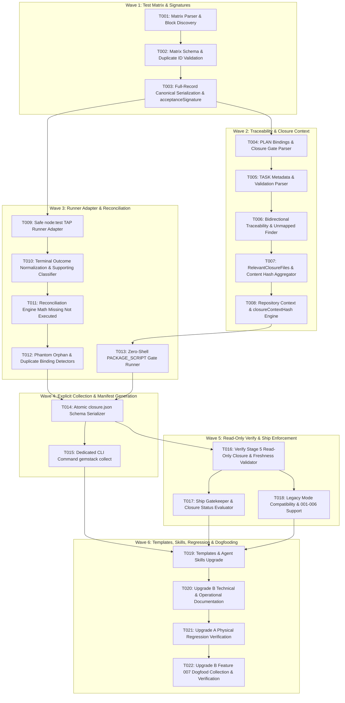

# Tareas de Implementación: Mechanical Test Matrix & Closure Evidence (Upgrade B)

**Feature Branch**: `007-mechanical-test-matrix-closure-evidence`  
**Spec**: [`specs/007-mechanical-test-matrix-closure-evidence/spec.md`](file:///c:/CODES/Gemstack/specs/007-mechanical-test-matrix-closure-evidence/spec.md)  
**Plan**: [`specs/007-mechanical-test-matrix-closure-evidence/plan.md`](file:///c:/CODES/Gemstack/specs/007-mechanical-test-matrix-closure-evidence/plan.md)  
**Lifecycle Status**: `TASKS_COMPLETE`  
**Stop Reason**: `TASKS_COMPLETE_AWAITING_IMPLEMENTATION`

---

## Contratos Congelados Heredados (Dogfooding)

```gemstack-contracts
[
  {
    "id": "zero-dependency-core",
    "type": "BOOLEAN_INVARIANT",
    "value": true,
    "description": "Upgrade B implementation must introduce zero external production npm dependencies, using Node.js built-ins exclusively."
  },
  {
    "id": "upgrade-b-taxonomy-types",
    "type": "ENUM_SET",
    "values": [
      "CANONICAL_TEST",
      "PHYSICAL_TEST",
      "SUPPORTING_TEST",
      "DECLARED_TEST",
      "EXECUTED_TEST",
      "PASSED_TEST",
      "FAILED_TEST",
      "SKIPPED_TEST",
      "PHANTOM_TEST",
      "ORPHAN_TEST"
    ],
    "description": "Canonical test taxonomy and state classifications in Upgrade B."
  },
  {
    "id": "upgrade-b-closure-gate-levels",
    "type": "ENUM_SET",
    "values": [
      "REQUIRED",
      "SUPPLEMENTAL"
    ],
    "description": "Strictness levels for mechanical closure gates."
  },
  {
    "id": "upgrade-b-closure-status-values",
    "type": "ENUM_SET",
    "values": [
      "NOT_EVALUATED",
      "BLOCKED",
      "VERIFIED",
      "VERIFIED_WITH_EXCEPTIONS",
      "STALE"
    ],
    "description": "Formal mechanical closure states."
  },
  {
    "id": "mechanical-reconciliation-exact",
    "type": "BOOLEAN_INVARIANT",
    "value": true,
    "description": "Total physical executed tests must exactly equal canonical executed tests plus supporting executed tests."
  },
  {
    "id": "closure-manifest-is-derived-only",
    "type": "BOOLEAN_INVARIANT",
    "value": true,
    "description": "closure.json is a derived mechanical evidence snapshot generated by collection, never hand-edited."
  },
  {
    "id": "verify-is-read-only",
    "type": "BOOLEAN_INVARIANT",
    "value": true,
    "description": "gemstack verify is strictly read-only: it validates evidence and never collects, mutates, or regenerates closure.json."
  },
  {
    "id": "git-is-optional-for-closure",
    "type": "BOOLEAN_INVARIANT",
    "value": true,
    "description": "Git metadata is optional enrichment; closure context resolution does not require git repository existence."
  },
  {
    "id": "no-generic-test-runner",
    "type": "BOOLEAN_INVARIANT",
    "value": true,
    "description": "Gemstack does not reimplement a test runner; it interfaces with native runners via standardized adapters."
  },
  {
    "id": "legacy-specs-preserve-compatibility",
    "type": "BOOLEAN_INVARIANT",
    "value": true,
    "description": "Specs without gemstack-test-matrix blocks operate in progressive legacy mode without blocking or breaking backward compatibility."
  }
]
```

---

## Grafo de Dependencias de Tareas (6 Olas de Ejecución)



---

## Inventario de Tareas de Implementación

### Wave 1: Test Matrix + Signatures

- [ ] **T001: Implement column-0 `gemstack-test-matrix` discovery and JSON block parser**
  <!-- gemstack:validation_required=true -->
  <!-- gemstack:tests=TEST-CLOSURE-A01,TEST-CLOSURE-A03 -->
  <!-- gemstack:files=src/lib/test-matrix.js,tests/test-matrix.test.js -->
  <!-- gemstack:depends= -->
  *Scope*:
  - Implement `extractTestMatrixBlock(content: string)` in `src/lib/test-matrix.js`.
  - Strictly identify column-0 ```gemstack-test-matrix code fences.
  - Return `{ matrix: null, isLegacy: true }` when 0 blocks exist.
  - Parse strict JSON when exactly 1 block exists.
  - Throw `TEST_MATRIX_PARSE_ERROR` when 2+ blocks exist or on JSON syntax error.
  - Ignore non-column-0 or differently-tagged blocks cleanly.
  *Completion Criteria*:
  - Physical tests for `TEST-CLOSURE-A01` and `TEST-CLOSURE-A03` pass in `tests/test-matrix.test.js`.
  - Zero external npm dependencies.

- [ ] **T002: Implement canonical test matrix schema and duplicate ID validator**
  <!-- gemstack:validation_required=true -->
  <!-- gemstack:tests=TEST-CLOSURE-A02 -->
  <!-- gemstack:files=src/lib/test-matrix.js,tests/test-matrix.test.js -->
  <!-- gemstack:depends=T001 -->
  *Scope*:
  - Implement `validateTestMatrix(matrix: any): object[]` in `src/lib/test-matrix.js`.
  - Validate array structure and item schema: `id`, `category`, `layer`, `description`, `pass_criteria`, `gate`.
  - Verify `id` matches `^TEST-[A-Z0-9]+-[A-Z0-9]+$`. Emit `TEST_MATRIX_INVALID_SHAPE` on failure.
  - Detect duplicate IDs and emit `TEST_MATRIX_DUPLICATE_ID`.
  - Validate enum values for `layer` (`UNIT`, `INTEGRATION`, `E2E`, `CLI`) and `gate` (`REQUIRED`, `SUPPLEMENTAL`).
  *Completion Criteria*:
  - Physical test for `TEST-CLOSURE-A02` passes with exact error codes.
  - Validation returns sanitized, validated CanonicalTest objects.

- [ ] **T003: Implement full-record canonical serialization and `acceptanceSignature` digest**
  <!-- gemstack:validation_required=true -->
  <!-- gemstack:tests=TEST-CLOSURE-B01,TEST-CLOSURE-B02 -->
  <!-- gemstack:files=src/lib/test-matrix.js,tests/test-matrix.test.js -->
  <!-- gemstack:depends=T002 -->
  *Scope*:
  - Implement `computeAcceptanceSignature(matrix: object[]): string` in `src/lib/test-matrix.js`.
  - Sort canonical records by `id` using ASCII/code-unit ordering `(a.id < b.id ? -1 : (a.id > b.id ? 1 : 0))`.
  - Reconstruct each object with ASCII-sorted keys `["category", "description", "gate", "id", "layer", "pass_criteria"]`.
  - Preserve exact semantic strings without trimming, case-folding, or whitespace modification.
  - Serialize to compact canonical JSON without indentation or superfluous spaces.
  - Compute SHA-256 lowercase 64-character hexadecimal digest over UTF-8 bytes.
  - Verify that altering `description`, `pass_criteria`, `category`, `layer`, or `gate` changes the digest.
  - Emit `ACCEPTANCE_SIGNATURE_MISMATCH` when structured matrix disagrees with approved signature.
  *Completion Criteria*:
  - Physical tests for `TEST-CLOSURE-B01` and `TEST-CLOSURE-B02` pass in `tests/test-matrix.test.js`.
  - Invariant to input JSON key order, strictly sensitive to semantic field values.

---

### Wave 2: Traceability & Closure Context

- [ ] **T004: Implement PLAN physical bindings (`gemstack-test-bindings`) and gate parser (`gemstack-closure-gates`)**
  <!-- gemstack:validation_required=true -->
  <!-- gemstack:tests=TEST-CLOSURE-C02,TEST-CLOSURE-G01 -->
  <!-- gemstack:files=src/lib/closure-context.js,tests/traceability.test.js -->
  <!-- gemstack:depends=T003 -->
  *Scope*:
  - Implement `parsePlanBindings(planContent: string)` and `parsePlanGates(planContent: string)` in `src/lib/closure-context.js`.
  - Parse column-0 fenced block `gemstack-test-bindings`: validate `test_id`, `runner`, and repository-relative POSIX `file`.
  - Verify every required canonical test has exactly one physical binding record.
  - Parse column-0 fenced block `gemstack-closure-gates`: validate `id`, `type`, `script`, `requirement`, and `waivable`.
  - Enforce `waivable: boolean` as mandatory for `REQUIRED` gates.
  *Completion Criteria*:
  - Validates and returns structured bindings and closure gates.
  - Throws or records finding on malformed bindings or invalid path separators.

- [ ] **T005: Implement TASK metadata parser and `validation_required` validator**
  <!-- gemstack:validation_required=true -->
  <!-- gemstack:tests=TEST-CLOSURE-E01 -->
  <!-- gemstack:files=src/lib/closure-context.js,tests/traceability.test.js -->
  <!-- gemstack:depends=T004 -->
  *Scope*:
  - Implement `parseTaskMetadata(tasksContent: string)` in `src/lib/closure-context.js`.
  - Extract tasks with HTML-comment properties: `validation_required`, `tests`, `files`, `depends`.
  - Ensure sequential task IDs (`T001`, `T002`, ...).
  - Enforce that if `validation_required=true`, non-empty canonical test IDs must be bound.
  - Emit `TASK_VALIDATION_MISSING` if `validation_required=true` has no tests.
  *Completion Criteria*:
  - Physical test for `TEST-CLOSURE-E01` passes in `tests/traceability.test.js`.
  - Accurate extraction of task metadata dictionary.

- [ ] **T006: Implement bidirectional task-test traceability and unmapped canonical test finder**
  <!-- gemstack:validation_required=true -->
  <!-- gemstack:tests=TEST-CLOSURE-E02 -->
  <!-- gemstack:files=src/lib/closure-context.js,tests/traceability.test.js -->
  <!-- gemstack:depends=T005 -->
  *Scope*:
  - Implement `reconcileTaskTraceability(canonicalMatrix: object[], taskList: object[])` in `src/lib/closure-context.js`.
  - Derive in-memory reverse mapping `TEST → TASKS` from forward bindings `TASK → TEST IDs`.
  - Verify that every REQUIRED canonical test is bound to at least one implementation task.
  - Emit `UNMAPPED_CANONICAL_TEST` if any canonical test lacks an implementation task.
  - Produce summary: `tasks_total`, `tasks_with_validation`, `tasks_documentation_only`, `unmapped_canonical_tests`.
  *Completion Criteria*:
  - Physical test for `TEST-CLOSURE-E02` passes in `tests/traceability.test.js`.
  - Zero unmapped canonical acceptance requirements.

- [ ] **T007: Implement `RelevantClosureFiles` derivation and deterministic content hash aggregator**
  <!-- gemstack:validation_required=true -->
  <!-- gemstack:tests=TEST-CLOSURE-F02 -->
  <!-- gemstack:files=src/lib/closure-context.js,tests/closure-manifest.test.js -->
  <!-- gemstack:depends=T006 -->
  *Scope*:
  - Implement `resolveRelevantFiles(featureDir: string, taskBindings: object, runnerFiles: string[], gateConfigs: object[])` in `src/lib/closure-context.js`.
  - Bounded scope: phase artifacts (`spec.md`, `plan.md`, `tasks.md`), test files from plan bindings, implementation files from task metadata, and `package.json` if PACKAGE_SCRIPT gates exist.
  - Strictly exclude entire-repository traversal, `node_modules`, `.git`, `coverage`, and `closure.json`.
  - Implement `computeContentAggregateHash(rootPath: string, filePaths: string[]): string` sorting paths in ASCII code-unit order.
  *Completion Criteria*:
  - Relevant files are derived without whole-repo scanning.
  - Produces stable SHA-256 digest over normalized POSIX file contents.

- [ ] **T008: Implement repository context resolver and `closureContextHash` engine**
  <!-- gemstack:validation_required=true -->
  <!-- gemstack:tests=TEST-CLOSURE-F02 -->
  <!-- gemstack:files=src/lib/closure-context.js,tests/closure-manifest.test.js -->
  <!-- gemstack:depends=T007 -->
  *Scope*:
  - Implement `resolveRepositoryContext(rootPath: string)` and `computeClosureContextHash(contextObj: object)` in `src/lib/closure-context.js`.
  - Support Git clean (`type=git, commit=HEAD, working_tree_clean=true`), Git dirty (`working_tree_clean=false`), and non-Git (`type=non-git, commit=null, working_tree_clean=null`).
  - Assemble `closureContext`: `version`, `repository`, `phase_hashes`, `acceptance_signature`, `test_files_hash`, `implementation_context_hash`, `required_gate_definition_hash`.
  - Canonicalize JSON with ASCII-sorted keys, compact format, UTF-8 bytes, and SHA-256 digest.
  *Completion Criteria*:
  - Physical test for `TEST-CLOSURE-F02` passes across clean Git, dirty Git, and non-Git environments.
  - Content hashes remain authoritative; Git metadata is strictly enrichment.

---

### Wave 3: Runner Adapter & Reconciliation

- [ ] **T009: Implement safe zero-shell `node:test` TAP runner adapter**
  <!-- gemstack:validation_required=true -->
  <!-- gemstack:tests=TEST-CLOSURE-D01,TEST-CLOSURE-D02,TEST-CLOSURE-D03 -->
  <!-- gemstack:files=src/lib/runner-adapters.js,tests/runner-adapter.test.js -->
  <!-- gemstack:depends=T003 -->
  *Scope*:
  - Implement `executeNodeTestRunner(rootPath: string, testFiles: string[], options: object)` in `src/lib/runner-adapters.js`.
  - Spawn `process.execPath` with explicit argv: `['--test', '--test-reporter=tap', ...testFiles]`.
  - Enforce `shell: false` and capture stdout/stderr via pipes.
  - Implement `parseNodeTestTap(tapOutput: string): object` extracting passed, failed, skipped, todo, and cancelled counts.
  - Extract canonical test IDs embedded in titles matching regex `\b(TEST-[A-Z0-9]+-[A-Z0-9]+)\b`.
  - Handle non-zero runner exit codes gracefully without crashing the Gemstack process.
  *Completion Criteria*:
  - Physical tests for `TEST-CLOSURE-D01`, `TEST-CLOSURE-D02`, and `TEST-CLOSURE-D03` pass in `tests/runner-adapter.test.js`.
  - Robust TAP parsing without shell execution.

- [ ] **T010: Implement terminal outcome normalizer and supporting test classifier**
  <!-- gemstack:validation_required=true -->
  <!-- gemstack:tests=TEST-CLOSURE-C01 -->
  <!-- gemstack:files=src/lib/runner-adapters.js,tests/reconciliation.test.js -->
  <!-- gemstack:depends=T009 -->
  *Scope*:
  - Implement `normalizeTestEvent(event: object): object` in `src/lib/runner-adapters.js`.
  - Preserve authoritative raw outcomes (`PASS`, `FAIL`, `SKIP`, `TODO`, `CANCELLED`).
  - Normalize findings: `FAIL → REQUIRED_TEST_FAILED`, `SKIP / TODO / CANCELLED → REQUIRED_TEST_SKIPPED`.
  - Classify tests without canonical ID token as `SUPPORTING_TEST`.
  - Ensure supporting tests contribute to physical count totals and propagate failures.
  *Completion Criteria*:
  - Exact event tracking preserving raw outcome and normalized finding type.
  - Clear separation between canonical acceptance events and supporting tests.

- [ ] **T011: Implement reconciliation engine (exact count math, missing tests, not executed tests)**
  <!-- gemstack:validation_required=true -->
  <!-- gemstack:tests=TEST-CLOSURE-C01,TEST-CLOSURE-C02 -->
  <!-- gemstack:files=src/lib/runner-adapters.js,tests/reconciliation.test.js -->
  <!-- gemstack:depends=T010 -->
  *Scope*:
  - Implement `reconcileTestRun(canonicalMatrix: object[], planBindings: object[], executedEvents: object[]): object` in `src/lib/runner-adapters.js`.
  - Validate exact arithmetic equations:
    1. `PASS + FAIL + SKIP + TODO + CANCELLED == TOTAL_PHYSICAL_TEST_EVENTS`
    2. `CANONICAL_PHYSICAL_EVENTS + SUPPORTING_PHYSICAL_EVENTS == TOTAL_PHYSICAL_TEST_EVENTS`
  - Emit `CLOSURE_RECONCILIATION_FAILURE` on any count mismatch.
  - Distinguish:
    - `REQUIRED_TEST_MISSING`: Required canonical ID has no entry in `gemstack-test-bindings`.
    - `REQUIRED_TEST_NOT_EXECUTED`: Required canonical ID is bound in plan, but absent from runner events.
  *Completion Criteria*:
  - Physical tests for `TEST-CLOSURE-C01` and `TEST-CLOSURE-C02` pass in `tests/reconciliation.test.js`.
  - Zero arithmetic ambiguity.

- [ ] **T012: Implement phantom test, orphan test, and duplicate binding detectors**
  <!-- gemstack:validation_required=true -->
  <!-- gemstack:tests=TEST-CLOSURE-C03,TEST-CLOSURE-C04 -->
  <!-- gemstack:files=src/lib/runner-adapters.js,tests/reconciliation.test.js -->
  <!-- gemstack:depends=T011 -->
  *Scope*:
  - Implement anomaly detectors in `src/lib/runner-adapters.js`:
    - `PHANTOM_TEST`: Detect claimed canonical tests that have no matching authoritative runner event.
    - `ORPHAN_TEST`: Detect executed physical tests whose title claims a canonical ID not in `spec.md`.
    - `DUPLICATE_TEST_BINDING`: Detect multiple executed physical tests claiming the same canonical ID.
  - Enforce `PHANTOM_TEST` as strictly non-waivable.
  *Completion Criteria*:
  - Physical tests for `TEST-CLOSURE-C03` and `TEST-CLOSURE-C04` pass in `tests/reconciliation.test.js`.
  - Anomalous test claims are blocked immediately.

- [ ] **T013: Implement zero-shell `PACKAGE_SCRIPT` gate runner**
  <!-- gemstack:validation_required=true -->
  <!-- gemstack:tests=TEST-CLOSURE-G01 -->
  <!-- gemstack:files=src/lib/runner-adapters.js,tests/closure-gates.test.js -->
  <!-- gemstack:depends=T008 -->
  *Scope*:
  - Implement `executePackageScriptGate(rootPath: string, gateConfig: object): Promise<{ exitCode: number, stdout: string, stderr: string }>` in `src/lib/runner-adapters.js`.
  - Read `package.json` to verify script existence; emit `REQUIRED_GATE_MISSING` if missing.
  - Resolve npm executable platform-safely: `npm.cmd` on Windows, `npm` on POSIX.
  - Execute via `child_process.spawn(npmCmd, ['run', gateConfig.script], { shell: false, cwd: rootPath, stdio: 'pipe' })`.
  - Emit `REQUIRED_GATE_FAILED` if process exits non-zero.
  *Completion Criteria*:
  - Safe package script execution without shell wrappers or arbitrary command string parsing.
  - Respects `waivable` attribute from gate configuration.

---

### Wave 4: Explicit Collection & Manifest Generation

- [ ] **T014: Implement atomic `closure.json` schema serializer and status evaluator**
  <!-- gemstack:validation_required=true -->
  <!-- gemstack:tests=TEST-CLOSURE-F01,TEST-CLOSURE-G02 -->
  <!-- gemstack:files=src/lib/runner-adapters.js,tests/closure-manifest.test.js -->
  <!-- gemstack:depends=T012,T013 -->
  *Scope*:
  - Implement `generateClosureManifest(params: object): object` in `src/lib/runner-adapters.js`.
  - Serialize schema `"gemstack-closure"`, version 1, feature directory, `generated_at`, `closure_context`, `acceptance_signature`.
  - Include `canonical_summary`, `physical_summary`, `reconciliation`, `task_traceability_summary`, `required_gates`, `supplemental_gates`, `exceptions`, `evidence_sources`, `blockers`, `warnings`.
  - Evaluate status precedence:
    - `CLOSURE_EVIDENCE_STALE` → `STALE`
    - Any non-waivable blocker or un-waived required failure → `BLOCKED`
    - Policy-waived deviations with human approval → `VERIFIED_WITH_EXCEPTIONS`
    - Clean pass without waivers → `VERIFIED`
  - Atomic file persistence to `specs/<feature>/closure.json` using `writeJsonAtomic()`.
  *Completion Criteria*:
  - Physical test for `TEST-CLOSURE-F01` passes in `tests/closure-manifest.test.js`.
  - Generates valid, complete, and reproducible `closure.json`.

- [ ] **T015: Implement dedicated mutating CLI command `gemstack collect`**
  <!-- gemstack:validation_required=true -->
  <!-- gemstack:tests=TEST-CLOSURE-F01,TEST-CLOSURE-F02 -->
  <!-- gemstack:files=src/commands/collect.js,src/cli.js,tests/closure-manifest.test.js -->
  <!-- gemstack:depends=T014 -->
  *Scope*:
  - Implement `src/commands/collect.js` and wire `collect` command into `src/cli.js`.
  - Resolve active feature directory from `.gemstack/state.json`.
  - Load SPEC matrix, PLAN bindings, PLAN gates, and TASK metadata.
  - Run test adapter and required project gates.
  - Reconcile counts, compute `closureContextHash`, evaluate gates, and atomically write `specs/<feature>/closure.json`.
  - Support flags: `--root <path>`, `--json`, `--dry-run`.
  *Completion Criteria*:
  - `gemstack collect` executes tests, produces `specs/<feature>/closure.json`, and outputs structured summary.
  - Verification confirmed that `gemstack verify` remains strictly read-only.

---

### Wave 5: Read-Only Verify & Ship Enforcement

- [ ] **T016: Implement Verify Stage 5: Read-only closure evidence and freshness validation**
  <!-- gemstack:validation_required=true -->
  <!-- gemstack:tests=TEST-CLOSURE-F03,TEST-CLOSURE-G01 -->
  <!-- gemstack:files=src/commands/verify.js,tests/closure-manifest.test.js,tests/closure-gates.test.js -->
  <!-- gemstack:depends=T014 -->
  *Scope*:
  - Extend `src/commands/verify.js` to 6 distinct stages:
    - 1/6: Structural Verification
    - 2/6: Memory & Handoff Integrity
    - 3/6: Local State Integrity
    - 4/6: Architecture Consistency & Phase Hashes
    - 5/6: Mechanical Closure Evidence Validation (read-only)
    - 6/6: Security and Test Runners
  - In Stage 5: read `specs/<active-feature>/closure.json`, recompute `closureContextHash` in-memory.
  - Emit `CLOSURE_EVIDENCE_STALE` if hash differs.
  - Check gates and report blockers. Strictly zero disk writes.
  *Completion Criteria*:
  - Physical test for `TEST-CLOSURE-F03` passes in `tests/closure-manifest.test.js`.
  - `gemstack verify` validates existing manifest without modifying disk state.

- [ ] **T017: Implement Ship closure gatekeeper and lifecycle transition enforcement**
  <!-- gemstack:validation_required=true -->
  <!-- gemstack:tests=TEST-CLOSURE-G01,TEST-CLOSURE-G02 -->
  <!-- gemstack:files=src/commands/ship.js,tests/closure-gates.test.js -->
  <!-- gemstack:depends=T016 -->
  *Scope*:
  - Update `src/commands/ship.js` to inspect feature-local `specs/<feature>/closure.json`.
  - Verify that status is `VERIFIED` or policy-permitted `VERIFIED_WITH_EXCEPTIONS`.
  - Block shipping if status is `NOT_EVALUATED`, `BLOCKED`, `STALE`, or if `closure.json` is missing.
  - Require explicit human confirmation before lifecycle transition to `SHIPPED`.
  *Completion Criteria*:
  - Physical tests for `TEST-CLOSURE-G01` and `TEST-CLOSURE-G02` pass in `tests/closure-gates.test.js`.
  - Prevents false closure and premature shipping.

- [ ] **T018: Implement progressive legacy mode support for specifications without test matrix**
  <!-- gemstack:validation_required=true -->
  <!-- gemstack:tests=TEST-CLOSURE-H01 -->
  <!-- gemstack:files=src/commands/verify.js,src/commands/ship.js,tests/closure-gates.test.js -->
  <!-- gemstack:depends=T016,T017 -->
  *Scope*:
  - In `verify.js` and `ship.js`, check if `spec.md` lacks a `gemstack-test-matrix` block.
  - If no matrix block exists: trigger `LEGACY` progressive adoption mode.
  - Output informational notice `[LEGACY] Spec opera en modo legacy sin matriz de pruebas.`
  - Skip Upgrade B mechanical gates with exit code 0 without blocking.
  *Completion Criteria*:
  - Physical test for `TEST-CLOSURE-H01` passes in `tests/closure-gates.test.js`.
  - Existing specs 001–006 remain 100% functional without regressions.

---

### Wave 6: Templates, Skills, Regression & Dogfooding

- [ ] **T019: Update Gemstack templates and agent skills for Upgrade B lifecycle**
  <!-- gemstack:validation_required=false -->
  <!-- gemstack:tests= -->
  <!-- gemstack:files=specs/templates/spec.md,specs/templates/plan.md,specs/templates/tasks.md,.agents/skills/gemstack-spec/SKILL.md,.agents/skills/gemstack-plan/SKILL.md,.agents/skills/gemstack-tasks/SKILL.md,.agents/skills/gemstack-qa/SKILL.md,.agents/skills/gemstack-ship/SKILL.md -->
  <!-- gemstack:depends=T015,T017,T018 -->
  *Scope*:
  - Update `specs/templates/spec.md` with column-0 `gemstack-test-matrix` template.
  - Update `specs/templates/plan.md` with `gemstack-test-bindings` and `gemstack-closure-gates` templates.
  - Update `specs/templates/tasks.md` with task metadata comment format.
  - Update agent skills (`gemstack-spec`, `gemstack-plan`, `gemstack-tasks`, `gemstack-qa`, `gemstack-ship`) to support `collect` and read-only `verify`.
  *Completion Criteria*:
  - New features automatically scaffold Upgrade B structured blocks.
  - Historical specs 001–006 are not retroactively modified.

- [ ] **T020: Update technical and operational documentation for Upgrade B**
  <!-- gemstack:validation_required=false -->
  <!-- gemstack:tests= -->
  <!-- gemstack:files=docs/spec-driven-development.md,docs/architecture-consistency.md,README.md -->
  <!-- gemstack:depends=T019 -->
  *Scope*:
  - Document Mechanical Test Matrix, `acceptanceSignature`, and physical bindings.
  - Document `TASK → TEST` unidirectional traceability and metadata syntax.
  - Document `gemstack collect` mutating action vs. `gemstack verify` read-only validation.
  - Document `closureContextHash`, feature-local `closure.json`, Git optionality, and legacy mode.
  *Completion Criteria*:
  - Clear, accurate, developer-ready documentation with zero out-of-scope mentions of Upgrade C/D functionality.

- [ ] **T021: Verify Upgrade A test regression suite across all 33 baseline physical tests**
  <!-- gemstack:validation_required=true -->
  <!-- gemstack:tests=TEST-CLOSURE-H01 -->
  <!-- gemstack:files=tests/contracts.test.js,tests/hasher.test.js,tests/findings.test.js,tests/init.test.js,tests/verify.test.js,package.json -->
  <!-- gemstack:depends=T020 -->
  *Scope*:
  - Update `package.json` test script to explicitly enumerate all 5 baseline test suites plus all 6 new Upgrade B test suites (11 files total, zero shell glob reliance).
  - Run full test suite: confirm that all 33 baseline physical tests pass with 0 regressions.
  - Confirm that all 25 Upgrade A canonical IDs (`TEST-CONSISTENCY-*`) remain valid.
  *Completion Criteria*:
  - 100% pass rate across baseline and new suites.
  - Zero regression in Upgrade A architectural consistency engine.

- [ ] **T022: Execute Upgrade B dogfooding on Feature 007 and verify mechanical closure**
  <!-- gemstack:validation_required=true -->
  <!-- gemstack:tests=TEST-CLOSURE-F01,TEST-CLOSURE-F02,TEST-CLOSURE-F03,TEST-CLOSURE-G01,TEST-CLOSURE-G02 -->
  <!-- gemstack:files=specs/007-mechanical-test-matrix-closure-evidence/closure.json,.gemstack/state.json -->
  <!-- gemstack:depends=T021 -->
  *Scope*:
  - Execute `gemstack collect` on `specs/007-mechanical-test-matrix-closure-evidence/`.
  - Verify that `specs/007-mechanical-test-matrix-closure-evidence/closure.json` is generated atomically.
  - Confirm 20/20 canonical tests pass and reconcile with physical counts.
  - Execute `gemstack verify` and confirm all 6 stages pass in read-only mode with status `VERIFIED`.
  *Completion Criteria*:
  - Fresh, valid `closure.json` with status `VERIFIED`.
  - Verified ready for explicit human review and shipping.

---

## Matriz de Cobertura Canónica (20 Tests P1)

| Canonical ID | Categoría | Suite Física Declarada | Tareas de Implementación Asignadas |
| :--- | :--- | :--- | :--- |
| **TEST-CLOSURE-A01** | PARSING | `tests/test-matrix.test.js` | T001 |
| **TEST-CLOSURE-A02** | PARSING | `tests/test-matrix.test.js` | T002 |
| **TEST-CLOSURE-A03** | PARSING | `tests/test-matrix.test.js` | T001 |
| **TEST-CLOSURE-B01** | SIGNATURE | `tests/test-matrix.test.js` | T003 |
| **TEST-CLOSURE-B02** | SIGNATURE | `tests/test-matrix.test.js` | T003 |
| **TEST-CLOSURE-C01** | RECONCILIATION | `tests/reconciliation.test.js` | T010, T011 |
| **TEST-CLOSURE-C02** | RECONCILIATION | `tests/reconciliation.test.js` | T004, T011 |
| **TEST-CLOSURE-C03** | RECONCILIATION | `tests/reconciliation.test.js` | T012 |
| **TEST-CLOSURE-C04** | RECONCILIATION | `tests/reconciliation.test.js` | T012 |
| **TEST-CLOSURE-D01** | RUNNER_ADAPTER | `tests/runner-adapter.test.js` | T009 |
| **TEST-CLOSURE-D02** | RUNNER_ADAPTER | `tests/runner-adapter.test.js` | T009 |
| **TEST-CLOSURE-D03** | RUNNER_ADAPTER | `tests/runner-adapter.test.js` | T009 |
| **TEST-CLOSURE-E01** | TRACEABILITY | `tests/traceability.test.js` | T005 |
| **TEST-CLOSURE-E02** | TRACEABILITY | `tests/traceability.test.js` | T006 |
| **TEST-CLOSURE-F01** | MANIFEST & CONTEXT | `tests/closure-manifest.test.js` | T014, T015, T022 |
| **TEST-CLOSURE-F02** | MANIFEST & CONTEXT | `tests/closure-manifest.test.js` | T007, T008, T015, T022 |
| **TEST-CLOSURE-F03** | MANIFEST & CONTEXT | `tests/closure-manifest.test.js` | T016, T022 |
| **TEST-CLOSURE-G01** | GATES | `tests/closure-gates.test.js` | T004, T013, T016, T017, T022 |
| **TEST-CLOSURE-G02** | GATES | `tests/closure-gates.test.js` | T014, T017, T022 |
| **TEST-CLOSURE-H01** | LEGACY | `tests/closure-gates.test.js` | T018, T021 |
