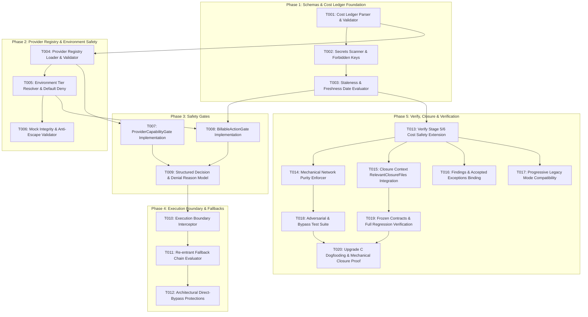

# Tareas de Implementación: Cost & Provider Safety Gates (Upgrade C)

**Feature Branch**: `008-cost-provider-safety-gates`  
**Feature Directory**: `specs/008-cost-provider-safety-gates/`  
**Spec**: [`specs/008-cost-provider-safety-gates/spec.md`](file:///c:/CODES/Gemstack/specs/008-cost-provider-safety-gates/spec.md)  
**Plan**: [`specs/008-cost-provider-safety-gates/plan.md`](file:///c:/CODES/Gemstack/specs/008-cost-provider-safety-gates/plan.md)  
**Lifecycle Status**: `IMPLEMENTATION_COMPLETE`  
**Stop Reason**: `AWAITING_CLOSURE_VERIFICATION`

---

## Contratos Congelados Heredados (Dogfooding)

```gemstack-contracts
[
  {
    "id": "zero-dependency-core",
    "type": "BOOLEAN_INVARIANT",
    "value": true,
    "description": "Upgrade C implementation must introduce zero external production npm dependencies, using Node.js built-ins exclusively."
  },
  {
    "id": "upgrade-c-cost-states",
    "type": "ENUM_SET",
    "values": [
      "FREE",
      "BILLABLE",
      "POTENTIALLY_BILLABLE",
      "UNKNOWN"
    ],
    "description": "Canonical cost-state classifications for provider actions."
  },
  {
    "id": "upgrade-c-environment-types",
    "type": "ENUM_SET",
    "values": [
      "test",
      "ci",
      "development",
      "staging",
      "production"
    ],
    "description": "Deterministic environment tiers recognized by provider safety gates."
  },
  {
    "id": "unknown-cost-never-free",
    "type": "BOOLEAN_INVARIANT",
    "value": true,
    "description": "Cost classification UNKNOWN must never evaluate or degrade silently to FREE."
  },
  {
    "id": "provider-gate-fail-closed",
    "type": "BOOLEAN_INVARIANT",
    "value": true,
    "description": "Any gate evaluation error, missing declaration, or ambiguous policy must result in DENY."
  },
  {
    "id": "verify-performs-zero-provider-calls",
    "type": "BOOLEAN_INVARIANT",
    "value": true,
    "description": "gemstack verify must never execute network requests or invoke remote providers during verification."
  },
  {
    "id": "fallback-requires-revalidation",
    "type": "BOOLEAN_INVARIANT",
    "value": true,
    "description": "Provider fallback chains must independently evaluate all capability and cost gates for each candidate."
  },
  {
    "id": "secrets-forbidden-in-safety-artifacts",
    "type": "BOOLEAN_INVARIANT",
    "value": true,
    "description": "API keys, tokens, or credential secrets must never be stored, hashed, or checked into safety manifests or ledgers."
  },
  {
    "id": "legacy-provider-compatibility",
    "type": "BOOLEAN_INVARIANT",
    "value": true,
    "description": "Features without declared provider blocks or provider-free repositories operate cleanly in legacy mode."
  }
]
```

---

## Task Execution Rules & Invariants

1. **Central Invariant**: `NO PROOF OF AUTHORIZATION = NO COMMERCIAL EXECUTION`.
2. **Fail-Closed Default**: Any missing configuration, unknown provider, unclassified cost, or policy ambiguity results in `DENY`.
3. **Ambient Credential Distrust**: The existence of API keys or tokens in developer/CI environments never constitutes spending authorization.
4. **Offline Purity**: Safety evaluation and verification operate 100% offline without live network queries, balance checks, or provider mutations.
5. **Re-entrant Fallbacks**: Fallback providers require independent capability and cost gate evaluations; authorization is never inherited.
6. **Zero Dependencies**: Core implementation relies strictly on Node.js built-ins (`node:fs`, `node:path`, `node:crypto`).

---

## Dependency Graph (5 Phased Waves)



---

## Tasks Inventory

### Phase 1 — Schemas & Cost Ledger Foundation

- [x] **T001: Implement canonical cost-ledger parser, schema validator, and code-unit serializer**
  <!-- gemstack:validation_required=true -->
  <!-- gemstack:tests=TEST-COST-E01 -->
  <!-- gemstack:files=src/lib/cost-ledger.js,tests/cost-ledger.test.js -->
  <!-- gemstack:depends= -->
  *Objective*: Create `src/lib/cost-ledger.js` to parse, validate, and serialize `cost-ledger.json`.  
  *Files*:
  - NEW: `src/lib/cost-ledger.js`
  - NEW: `tests/cost-ledger.test.js`
  *Prerequisites*: NONE  
  *Implementation requirements*:
  - Implement `loadCostLedger(filePath)` and `validateLedgerSchema(data)`.
  - Validate schema version 1, code-unit sorted provider and capability keys.
  - Enforce valid cost states: `FREE`, `BILLABLE`, `POTENTIALLY_BILLABLE`, `UNKNOWN`.
  - Reject malformed syntax or schema violations with `COST_LEDGER_INVALID`.
  *Must NOT*: Introduce external npm packages or perform live pricing network lookups.  
  *Tests*: `tests/cost-ledger.test.js`  
  *Acceptance IDs*: `TEST-COST-E01`  
  *Completion criteria*: `TEST-COST-E01` passes with invalid and valid ledger fixtures.  
  *Evidence*: Test assertions passing under `node:test`.

- [x] **T002: Implement secrets scanner and forbidden credential detector for safety artifacts**
  <!-- gemstack:validation_required=true -->
  <!-- gemstack:tests=TEST-COST-E03 -->
  <!-- gemstack:files=src/lib/cost-ledger.js,tests/cost-ledger.test.js -->
  <!-- gemstack:depends=T001 -->
  *Objective*: Ensure `cost-ledger.json` and safety configurations never store, hash, or leak secrets.  
  *Files*:
  - MODIFY: `src/lib/cost-ledger.js`
  - MODIFY: `tests/cost-ledger.test.js`
  *Prerequisites*: `T001`  
  *Implementation requirements*:
  - Implement `auditSecretsForbidden(data)` in `src/lib/cost-ledger.js`.
  - Scan for forbidden property names: `api_key`, `token`, `secret`, `authorization`, `private_key`, `passwd`.
  - Scan string values for common credential patterns (`sk-...`, `ghp_...`, `Bearer ...`).
  - Reject secret-bearing ledgers with non-waivable blocker `COST_LEDGER_INVALID`.
  *Must NOT*: Claim general repository secret scanning; restrict specifically to safety artifacts.  
  *Tests*: `tests/cost-ledger.test.js`  
  *Acceptance IDs*: `TEST-COST-E03`  
  *Completion criteria*: `TEST-COST-E03` passes fail-closed on secret-injected ledgers.  
  *Evidence*: Test assertion confirming rejection of credential fields.

- [x] **T003: Implement staleness evaluator for provider cost assumptions**
  <!-- gemstack:validation_required=true -->
  <!-- gemstack:tests=TEST-COST-E02 -->
  <!-- gemstack:files=src/lib/cost-ledger.js,tests/cost-ledger.test.js -->
  <!-- gemstack:depends=T001 -->
  *Objective*: Detect expired or stale pricing assumptions without halting evaluation.  
  *Files*:
  - MODIFY: `src/lib/cost-ledger.js`
  - MODIFY: `tests/cost-ledger.test.js`
  *Prerequisites*: `T001`  
  *Implementation requirements*:
  - Implement `checkStaleness(capabilityEntry, maxAgeDays, referenceDate)`.
  - Parse `freshness_date` (ISO 8601 YYYY-MM-DD). If older than threshold (default 90 days), emit warning `STALE_PROVIDER_COST_ASSUMPTION`.
  - Allow evaluation to proceed when flagged as a warning.
  *Must NOT*: Contact remote APIs to verify current pricing.  
  *Tests*: `tests/cost-ledger.test.js`  
  *Acceptance IDs*: `TEST-COST-E02`  
  *Completion criteria*: `TEST-COST-E02` passes, emitting `STALE_PROVIDER_COST_ASSUMPTION` without crashing.  
  *Evidence*: Unit test verifying warning emission for dates > 90 days old.

---

### Phase 2 — Provider Registry & Environment Safety

- [x] **T004: Implement provider registry loader and capability declaration validator**
  <!-- gemstack:validation_required=true -->
  <!-- gemstack:tests=TEST-COST-B01,TEST-COST-B03 -->
  <!-- gemstack:files=src/lib/provider-registry.js,tests/provider-capability-gate.test.js -->
  <!-- gemstack:depends=T001 -->
  *Objective*: Create `src/lib/provider-registry.js` to load provider identities and declared capabilities.  
  *Files*:
  - NEW: `src/lib/provider-registry.js`
  - NEW: `tests/provider-capability-gate.test.js`
  *Prerequisites*: `T001`  
  *Implementation requirements*:
  - Implement `loadProviderRegistry(rootPath, featureDir)`.
  - Validate provider identity format (`provider_id` matching canonical slug).
  - Verify `type` is one of `COMMERCIAL`, `LOCAL`, `MOCK`.
  - Index declared capabilities (e.g. `inference.generate_text`).
  - Emit `UNKNOWN_PROVIDER_IDENTITY` for unregistered providers and `PROVIDER_CAPABILITY_UNDECLARED` for undeclared capabilities.
  *Must NOT*: Conflate provider existence with authorization to spend.  
  *Tests*: `tests/provider-capability-gate.test.js`  
  *Acceptance IDs*: `TEST-COST-B01`, `TEST-COST-B03`  
  *Completion criteria*: Unit tests pass rejecting unregistered providers and undeclared capabilities.  
  *Evidence*: Deterministic rejection output with correct finding codes.

- [x] **T005: Implement environment tier resolution and commercial execution blocking in test/CI**
  <!-- gemstack:validation_required=true -->
  <!-- gemstack:tests=TEST-COST-C01,TEST-COST-C02 -->
  <!-- gemstack:files=src/lib/provider-registry.js,tests/environment-provider-safety.test.js -->
  <!-- gemstack:depends=T004 -->
  *Objective*: Resolve environment tier and strictly block commercial operations in test and CI environments.  
  *Files*:
  - MODIFY: `src/lib/provider-registry.js`
  - NEW: `tests/environment-provider-safety.test.js`
  *Prerequisites*: `T004`  
  *Implementation requirements*:
  - Implement `resolveEnvironmentTier(options)` resolving `test`, `ci`, `development`, `staging`, `production`.
  - Detect `test` via test runner runner context; detect `ci` via `process.env.CI`.
  - In `test` or `ci`, commercial provider actions are strictly blocked with `ENV_COMMERCIAL_DENIED` even when ambient API keys exist in `process.env`.
  *Must NOT*: Trust developer credentials in ambient environment variables to authorize commercial actions.  
  *Tests*: `tests/environment-provider-safety.test.js`  
  *Acceptance IDs*: `TEST-COST-C01`, `TEST-COST-C02`  
  *Completion criteria*: `TEST-COST-C01` and `TEST-COST-C02` pass, proving commercial denial in test/CI.  
  *Evidence*: Assertions passing with dummy credentials present in environment.

- [x] **T006: Implement mock provider verification and anti-escape validation**
  <!-- gemstack:validation_required=true -->
  <!-- gemstack:tests=TEST-COST-C03 -->
  <!-- gemstack:files=src/lib/provider-registry.js,tests/environment-provider-safety.test.js -->
  <!-- gemstack:depends=T005 -->
  *Objective*: Allow verified local mocks in `test` environment while preventing mock escape to real networks.  
  *Files*:
  - MODIFY: `src/lib/provider-registry.js`
  - MODIFY: `tests/environment-provider-safety.test.js`
  *Prerequisites*: `T005`  
  *Implementation requirements*:
  - Implement `validateMockIntegrity(providerConfig)`.
  - Providers declared with `type: "MOCK"` must prove local-only in-memory execution.
  - Return `authorized: true` for verified mocks in `test` environment.
  - Reject mock configurations with external URLs or remote endpoints with `MOCK_PROVIDER_ESCAPE_VIOLATION`.
  *Must NOT*: Trust a provider as a mock based solely on its string name.  
  *Tests*: `tests/environment-provider-safety.test.js`  
  *Acceptance IDs*: `TEST-COST-C03`  
  *Completion criteria*: `TEST-COST-C03` passes for legitimate in-memory mocks.  
  *Evidence*: Test execution confirms mock execution permitted in test mode.

---

### Phase 3 — Safety Gates

- [x] **T007: Implement canonical ProviderCapabilityGate**
  <!-- gemstack:validation_required=true -->
  <!-- gemstack:tests=TEST-COST-B02,TEST-COST-B04 -->
  <!-- gemstack:files=src/lib/safety-gates.js,tests/provider-capability-gate.test.js -->
  <!-- gemstack:depends=T004 -->
  *Objective*: Create `src/lib/safety-gates.js` with fail-closed `ProviderCapabilityGate`.  
  *Files*:
  - NEW: `src/lib/safety-gates.js`
  - MODIFY: `tests/provider-capability-gate.test.js`
  *Prerequisites*: `T004`  
  *Implementation requirements*:
  - Implement `evaluateProviderCapability(request, registry)`.
  - Evaluate in strict order: provider existence, environment permission, capability declaration, adapter support.
  - Emit `PROVIDER_CAPABILITY_UNSUPPORTED` if adapter lacks support.
  - Return deterministic decision object: `{ authorized, decision, reasonCode, message, context }`.
  *Must NOT*: Mutate provider state or perform network queries.  
  *Tests*: `tests/provider-capability-gate.test.js`  
  *Acceptance IDs*: `TEST-COST-B02`, `TEST-COST-B04`  
  *Completion criteria*: `TEST-COST-B02` and `TEST-COST-B04` pass.  
  *Evidence*: Test assertions validating allowed and unsupported capability outcomes.

- [x] **T008: Implement canonical BillableActionGate**
  <!-- gemstack:validation_required=true -->
  <!-- gemstack:tests=TEST-COST-A01,TEST-COST-A02,TEST-COST-A03,TEST-COST-A04,TEST-COST-G01 -->
  <!-- gemstack:files=src/lib/safety-gates.js,tests/billable-action-gate.test.js -->
  <!-- gemstack:depends=T007,T003 -->
  *Objective*: Implement `BillableActionGate` enforcing fail-closed spending authorization and budget limits.  
  *Files*:
  - MODIFY: `src/lib/safety-gates.js`
  - NEW: `tests/billable-action-gate.test.js`
  *Prerequisites*: `T007`, `T003`  
  *Implementation requirements*:
  - Implement `evaluateBillableAction(request, ledger, environmentTier)`.
  - Order of evaluation:
    1. Environment check (deny commercial in test/ci).
    2. Action declaration check (emit `UNDECLARED_BILLABLE_ACTION` if missing).
    3. Cost state resolution (emit `UNKNOWN_COST_CLASSIFICATION` if `UNKNOWN`; strictly fail closed).
    4. Free check (allow if `FREE` and local/mock).
    5. Authorization check (emit `BILLABLE_ACTION_UNAUTHORIZED` if token missing).
    6. Budget check (emit `BUDGET_THRESHOLD_EXCEEDED` if requested units > granted budget).
  *Must NOT*: Allow `UNKNOWN` to silently degrade to `FREE`.  
  *Tests*: `tests/billable-action-gate.test.js`  
  *Acceptance IDs*: `TEST-COST-A01`, `TEST-COST-A02`, `TEST-COST-A03`, `TEST-COST-A04`, `TEST-COST-G01`  
  *Completion criteria*: All 5 acceptance tests pass.  
  *Evidence*: Test assertions passing across all decision branches.

- [x] **T009: Implement structured decision and denial reason model**
  <!-- gemstack:validation_required=true -->
  <!-- gemstack:tests=TEST-COST-A02,TEST-COST-B02 -->
  <!-- gemstack:files=src/lib/safety-gates.js,tests/billable-action-gate.test.js -->
  <!-- gemstack:depends=T008 -->
  *Objective*: Standardize structured decision objects across both gates with explainable denial reasons.  
  *Files*:
  - MODIFY: `src/lib/safety-gates.js`
  - MODIFY: `tests/billable-action-gate.test.js`
  *Prerequisites*: `T008`  
  *Implementation requirements*:
  - Format output:
    ```json
    {
      "authorized": false,
      "decision": "DENY",
      "reasonCode": "BILLABLE_ACTION_UNAUTHORIZED",
      "message": "Human readable explanation",
      "context": { "provider_id": "...", "capability_id": "...", "cost_state": "...", "environment": "..." }
    }
    ```
  - Never expose secrets, credentials, or raw API keys in messages or context.
  *Must NOT*: Emit unstructured string errors that require regex parsing.  
  *Tests*: `tests/billable-action-gate.test.js`  
  *Acceptance IDs*: `TEST-COST-A02`, `TEST-COST-B02`  
  *Completion criteria*: Decision objects validate against expected JSON schema.  
  *Evidence*: Test assertions verifying structure and field types of gate decisions.

---

### Phase 4 — Execution Boundary & Fallback Chains

- [x] **T010: Implement provider execution boundary interceptor**
  <!-- gemstack:validation_required=true -->
  <!-- gemstack:tests=TEST-COST-A03,TEST-COST-B04 -->
  <!-- gemstack:files=src/lib/provider-boundary.js,tests/provider-fallback.test.js -->
  <!-- gemstack:depends=T009 -->
  *Objective*: Create `src/lib/provider-boundary.js` to intercept adapter invocations behind safety gates.  
  *Files*:
  - NEW: `src/lib/provider-boundary.js`
  - NEW: `tests/provider-fallback.test.js`
  *Prerequisites*: `T009`  
  *Implementation requirements*:
  - Implement `executeProviderAction(actionRequest, adapter, options)`.
  - Sequentially invoke `ProviderCapabilityGate` and `BillableActionGate`.
  - Halt with structured error if either gate denies.
  - Bind authorization token cryptographically to `provider_id` and `capability_id` before calling `adapter.execute()`.
  *Must NOT*: Allow adapter execution if either gate returns `authorized: false`.  
  *Tests*: `tests/provider-fallback.test.js`  
  *Acceptance IDs*: `TEST-COST-A03`, `TEST-COST-B04`  
  *Completion criteria*: Execution succeeds only when both gates approve.  
  *Evidence*: Mock adapter execution count is exactly 1 on ALLOW, 0 on DENY.

- [x] **T011: Implement re-entrant fallback chain validation**
  <!-- gemstack:validation_required=true -->
  <!-- gemstack:tests=TEST-COST-D01,TEST-COST-D02 -->
  <!-- gemstack:files=src/lib/provider-boundary.js,tests/provider-fallback.test.js -->
  <!-- gemstack:depends=T010 -->
  *Objective*: Guarantee that switching to fallback providers independently re-enters safety gates.  
  *Files*:
  - MODIFY: `src/lib/provider-boundary.js`
  - MODIFY: `tests/provider-fallback.test.js`
  *Prerequisites*: `T010`  
  *Implementation requirements*:
  - In `executeProviderAction`, handle primary adapter failure with fallback candidates.
  - For each fallback candidate, independently evaluate `ProviderCapabilityGate` and `BillableActionGate`.
  - If a fallback candidate lacks spending authorization, emit `PROVIDER_FALLBACK_UNAUTHORIZED` and halt.
  - Never transfer authorization from primary provider to secondary provider.
  *Must NOT*: Inherit spending authorization or bypass capability checks during fallback.  
  *Tests*: `tests/provider-fallback.test.js`  
  *Acceptance IDs*: `TEST-COST-D01`, `TEST-COST-D02`  
  *Completion criteria*: `TEST-COST-D01` and `TEST-COST-D02` pass.  
  *Evidence*: Test assertions confirming re-entrant gate calls and unauthorized fallback denial.

- [x] **T012: Implement architectural direct-bypass protections**
  <!-- gemstack:validation_required=true -->
  <!-- gemstack:tests=TEST-COST-D02 -->
  <!-- gemstack:files=src/lib/provider-boundary.js,tests/provider-fallback.test.js -->
  <!-- gemstack:depends=T011 -->
  *Objective*: Prevent alias bypass, wrapper bypass, and direct adapter execution outside boundary.  
  *Files*:
  - MODIFY: `src/lib/provider-boundary.js`
  - MODIFY: `tests/provider-fallback.test.js`
  *Prerequisites*: `T011`  
  *Implementation requirements*:
  - Enforce provider ID normalization preventing alias spoofing.
  - Reject execution requests missing explicit boundary invocation context.
  *Must NOT*: Rely on user-modifiable strings for boundary security.  
  *Tests*: `tests/provider-fallback.test.js`  
  *Acceptance IDs*: `TEST-COST-D02`  
  *Completion criteria*: Alias and wrapper bypass attempts fail closed.  
  *Evidence*: Unit tests proving denial on spoofed provider IDs.

---

### Phase 5 — Verify, Closure & Verification

- [x] **T013: Extend gemstack verify with cost ledger and provider safety audits**
  <!-- gemstack:validation_required=true -->
  <!-- gemstack:tests=TEST-COST-F02 -->
  <!-- gemstack:files=src/commands/verify.js,tests/verification-purity-cost.test.js -->
  <!-- gemstack:depends=T008,T002 -->
  *Objective*: Integrate cost ledger and provider safety verification into `gemstack verify` (Stage 5/6).  
  *Files*:
  - MODIFY: `src/commands/verify.js`
  - NEW: `tests/verification-purity-cost.test.js`
  *Prerequisites*: `T008`, `T002`  
  *Implementation requirements*:
  - Audit `cost-ledger.json` schema, integrity, and secret-free status in read-only mode.
  - Verify that declared commercial adapters implement safety gates.
  - Maintain 100% zero file mutations (before/after file hash snapshot matches).
  *Must NOT*: Write to disk, update ledger files, or call external APIs during verify.  
  *Tests*: `tests/verification-purity-cost.test.js`  
  *Acceptance IDs*: `TEST-COST-F02`  
  *Completion criteria*: `TEST-COST-F02` passes with 0 file mutations.  
  *Evidence*: SHA-256 tree diff comparison confirms zero modified bytes.

- [x] **T014: Implement mechanical network purity enforcer for gemstack verify**
  <!-- gemstack:validation_required=true -->
  <!-- gemstack:tests=TEST-COST-F01 -->
  <!-- gemstack:files=tests/verification-purity-cost.test.js -->
  <!-- gemstack:depends=T013 -->
  *Objective*: Mechanically prove that `gemstack verify` generates zero outbound network requests.  
  *Files*:
  - MODIFY: `tests/verification-purity-cost.test.js`
  *Prerequisites*: `T013`  
  *Implementation requirements*:
  - In `tests/verification-purity-cost.test.js`, wrap `node:net.Socket`, `node:http.request`, and `node:https.request` with throwing hooks.
  - Execute `verifyCommand({ target: tempDir })`.
  - Assert that verify completes with exit code 0 and zero network connection attempts.
  *Must NOT*: Rely on passive inspection; must actively intercept network primitives.  
  *Tests*: `tests/verification-purity-cost.test.js`  
  *Acceptance IDs*: `TEST-COST-F01`  
  *Completion criteria*: `TEST-COST-F01` passes cleanly with network sockets blocked.  
  *Evidence*: Test log confirming zero socket invocations during complete verify run.

- [x] **T015: Integrate cost ledger into closure context RelevantClosureFiles**
  <!-- gemstack:validation_required=true -->
  <!-- gemstack:tests=TEST-COST-F02 -->
  <!-- gemstack:files=src/lib/closure-context.js,tests/verification-purity-cost.test.js -->
  <!-- gemstack:depends=T013 -->
  *Objective*: Include `cost-ledger.json` in `RelevantClosureFiles` and `closureContextHash` when present.  
  *Files*:
  - MODIFY: `src/lib/closure-context.js`
  - MODIFY: `tests/verification-purity-cost.test.js`
  *Prerequisites*: `T013`  
  *Implementation requirements*:
  - In `resolveRelevantFiles` (`src/lib/closure-context.js`), check for `cost-ledger.json` in root and active feature directories.
  - If present, include path in aggregate hash computation.
  *Must NOT*: Change Upgrade B reconciliation math or make `closure.json` authoritative.  
  *Tests*: `tests/verification-purity-cost.test.js`  
  *Acceptance IDs*: `TEST-COST-F02`  
  *Completion criteria*: `closureContextHash` includes ledger digest when present.  
  *Evidence*: Test assertions confirming context hash sensitivity to ledger modifications.

- [x] **T016: Integrate Upgrade C findings with accepted exception bindings**
  <!-- gemstack:validation_required=true -->
  <!-- gemstack:tests=TEST-COST-E02 -->
  <!-- gemstack:files=src/commands/verify.js,tests/cost-ledger.test.js -->
  <!-- gemstack:depends=T013 -->
  *Objective*: Map Upgrade C findings into `src/lib/findings.js` and enforce strict non-waivable rules.  
  *Files*:
  - MODIFY: `src/commands/verify.js`
  - MODIFY: `tests/cost-ledger.test.js`
  *Prerequisites*: `T013`  
  *Implementation requirements*:
  - Generate canonical 64-char lowercase SHA-256 fingerprints for Upgrade C findings.
  - Enforce that only `STALE_PROVIDER_COST_ASSUMPTION` is waivable via `contextHash`.
  - All other Upgrade C findings remain non-waivable blockers.
  *Must NOT*: Introduce wildcard or global exception bypasses.  
  *Tests*: `tests/cost-ledger.test.js`  
  *Acceptance IDs*: `TEST-COST-E02`  
  *Completion criteria*: Non-waivable findings cannot be suppressed; stale warning waives cleanly.  
  *Evidence*: Test assertions validating exception suppression rules.

- [x] **T017: Implement progressive legacy mode for provider-free projects**
  <!-- gemstack:validation_required=true -->
  <!-- gemstack:tests=TEST-COST-H01 -->
  <!-- gemstack:files=src/commands/verify.js,tests/verification-purity-cost.test.js -->
  <!-- gemstack:depends=T013 -->
  *Objective*: Ensure existing projects without provider integrations operate without friction or errors.  
  *Files*:
  - MODIFY: `src/commands/verify.js`
  - MODIFY: `tests/verification-purity-cost.test.js`
  *Prerequisites*: `T013`  
  *Implementation requirements*:
  - If no `cost-ledger.json` or provider declarations are present, log informational notice `LEGACY_NO_PROVIDERS_DECLARED`.
  - Verification returns exit code 0 with 0 errors.
  *Must NOT*: Fail or emit blockers on repositories without providers.  
  *Tests*: `tests/verification-purity-cost.test.js`  
  *Acceptance IDs*: `TEST-COST-H01`  
  *Completion criteria*: `TEST-COST-H01` passes on a freshly initialized Gemstack repository.  
  *Evidence*: Verify exit code is 0 on legacy fixtures.

- [x] **T018: Implement adversarial attack and security bypass test suite**
  <!-- gemstack:validation_required=true -->
  <!-- gemstack:tests=TEST-COST-A04,TEST-COST-C01,TEST-COST-D02,TEST-COST-E03 -->
  <!-- gemstack:files=tests/environment-provider-safety.test.js,tests/provider-fallback.test.js,tests/cost-ledger.test.js -->
  <!-- gemstack:depends=T014,T011,T002 -->
  *Objective*: Validate resistance against ambient credentials, provider aliases, mock escapes, and secret injection.  
  *Files*:
  - MODIFY: `tests/environment-provider-safety.test.js`
  - MODIFY: `tests/provider-fallback.test.js`
  - MODIFY: `tests/cost-ledger.test.js`
  *Prerequisites*: `T014`, `T011`, `T002`  
  *Implementation requirements*:
  - Execute adversarial test matrix covering 17 required threat scenarios.
  - Assert that every attack scenario fails closed with specific canonical finding codes.
  *Must NOT*: Allow any bypass scenario to execute a mock or commercial target.  
  *Tests*: `tests/environment-provider-safety.test.js`, `tests/provider-fallback.test.js`  
  *Acceptance IDs*: `TEST-COST-A04`, `TEST-COST-C01`, `TEST-COST-D02`, `TEST-COST-E03`  
  *Completion criteria*: All adversarial test cases execute and pass.  
  *Evidence*: 100% pass rate across adversarial test cases.

- [x] **T019: Verify frozen contract integrity and execute full repository regression suite**
  <!-- gemstack:validation_required=true -->
  <!-- gemstack:tests=TEST-COST-H01 -->
  <!-- gemstack:files=tests/contracts.test.js,tests/closure-gates.test.js,package.json -->
  <!-- gemstack:depends=T018,T017 -->
  *Objective*: Prove zero regression in Upgrade A and Upgrade B baseline test suites.  
  *Files*:
  - MODIFY: `package.json` (test script enumeration)
  *Prerequisites*: `T018`, `T017`  
  *Implementation requirements*:
  - Update `package.json` test script to include the 6 new Upgrade C test suites (17 physical test files total, zero shell globs).
  - Run `npm test`: confirm 25/25 Upgrade A tests pass, 20/20 Upgrade B tests pass, and 20/20 Upgrade C tests pass.
  - Confirm 100% of historical physical tests pass without modification.
  *Must NOT*: Modify historical Upgrade A/B test assertions.  
  *Tests*: `npm test`  
  *Acceptance IDs*: `TEST-COST-H01`  
  *Completion criteria*: Full repository test suite passes with exit code 0.  
  *Evidence*: Complete TAP runner summary showing 0 failures.

- [x] **T020: Execute Upgrade C dogfood collection and verify mechanical closure readiness**
  <!-- gemstack:validation_required=true -->
  <!-- gemstack:tests=TEST-COST-A01,TEST-COST-B01,TEST-COST-C01,TEST-COST-D01,TEST-COST-E01,TEST-COST-F01,TEST-COST-G01,TEST-COST-H01 -->
  <!-- gemstack:files=specs/008-cost-provider-safety-gates/closure.json,.gemstack/state.json -->
  <!-- gemstack:depends=T019 -->
  *Objective*: Collect mechanical evidence on Feature 008 and verify closure readiness without version bump.  
  *Files*:
  - NEW: `specs/008-cost-provider-safety-gates/closure.json`
  - MODIFY: `.gemstack/state.json`
  *Prerequisites*: `T019`  
  *Implementation requirements*:
  - Run `gemstack collect` on `specs/008-cost-provider-safety-gates/`.
  - Validate that `closure.json` records status `VERIFIED` and reconciles all 20 canonical tests.
  - Run `gemstack verify`: confirm read-only verification passes with 0 blockers.
  *Must NOT*: Perform git tag, commit, push, version bump, or release operations.  
  *Tests*: All 20 canonical tests  
  *Acceptance IDs*: All 20 canonical acceptance IDs  
  *Completion criteria*: Fresh `closure.json` generated with status `VERIFIED` and 0 blockers.  
  *Evidence*: Verified `closure.json` in feature directory.

---

## Acceptance Traceability Table (20/20 Canonical Tests)

| Canonical Acceptance ID | Implementation Task(s) | Target Physical Test Suite | Planned Mechanical Proof |
| :--- | :--- | :--- | :--- |
| **TEST-COST-A01** | T008, T020 | `tests/billable-action-gate.test.js` | Undeclared action throws `UNDECLARED_BILLABLE_ACTION` |
| **TEST-COST-A02** | T008, T009, T020 | `tests/billable-action-gate.test.js` | Missing token throws `BILLABLE_ACTION_UNAUTHORIZED` |
| **TEST-COST-A03** | T008, T010, T020 | `tests/billable-action-gate.test.js` | Valid authorization token returns `authorized: true` |
| **TEST-COST-A04** | T008, T018, T020 | `tests/billable-action-gate.test.js` | `UNKNOWN` cost classification fails closed |
| **TEST-COST-B01** | T004, T007, T020 | `tests/provider-capability-gate.test.js` | Undeclared capability throws `PROVIDER_CAPABILITY_UNDECLARED` |
| **TEST-COST-B02** | T007, T009, T020 | `tests/provider-capability-gate.test.js` | Unsupported capability throws `PROVIDER_CAPABILITY_UNSUPPORTED` |
| **TEST-COST-B03** | T004, T007, T020 | `tests/provider-capability-gate.test.js` | Unregistered provider throws `UNKNOWN_PROVIDER_IDENTITY` |
| **TEST-COST-B04** | T007, T010, T020 | `tests/provider-capability-gate.test.js` | Declared and supported capability returns `authorized: true` |
| **TEST-COST-C01** | T005, T018, T020 | `tests/environment-provider-safety.test.js` | Commercial execution blocked in `test` mode with `ENV_COMMERCIAL_DENIED` |
| **TEST-COST-C02** | T005, T020 | `tests/environment-provider-safety.test.js` | Commercial execution blocked in `ci` environment |
| **TEST-COST-C03** | T006, T020 | `tests/environment-provider-safety.test.js` | Verified in-memory mock allowed in `test` mode |
| **TEST-COST-D01** | T011, T020 | `tests/provider-fallback.test.js` | Fallback triggers independent gate re-evaluation |
| **TEST-COST-D02** | T011, T012, T018, T020 | `tests/provider-fallback.test.js` | Unauthorized secondary provider emits `PROVIDER_FALLBACK_UNAUTHORIZED` |
| **TEST-COST-E01** | T001, T020 | `tests/cost-ledger.test.js` | Invalid ledger schema emits `COST_LEDGER_INVALID` |
| **TEST-COST-E02** | T003, T016, T020 | `tests/cost-ledger.test.js` | Stale pricing date emits `STALE_PROVIDER_COST_ASSUMPTION` warning |
| **TEST-COST-E03** | T002, T018, T020 | `tests/cost-ledger.test.js` | Secret-bearing ledger rejected with `COST_LEDGER_INVALID` |
| **TEST-COST-F01** | T014, T020 | `tests/verification-purity-cost.test.js` | `gemstack verify` completes with sockets mocked to throw (0 network calls) |
| **TEST-COST-F02** | T013, T015, T020 | `tests/verification-purity-cost.test.js` | `gemstack verify` completes with 0 file mutations on disk |
| **TEST-COST-G01** | T008, T020 | `tests/billable-action-gate.test.js` | Exceeded unit budget throws `BUDGET_THRESHOLD_EXCEEDED` |
| **TEST-COST-H01** | T017, T019, T020 | `tests/verification-purity-cost.test.js` | Provider-free legacy project passes verify with exit code 0 |

---

## Adversarial Coverage Matrix (17 Threat Vectors)

| # | Adversarial Threat Vector | Planned Test Suite | Assigned Task | Expected Defense Outcome |
| :- | :--- | :--- | :--- | :--- |
| 1 | Ambient credentials in CI environment | `tests/environment-provider-safety.test.js` | T005 | `ENV_COMMERCIAL_DENIED` fail-closed |
| 2 | Unknown provider string in execution request | `tests/provider-capability-gate.test.js` | T004 | `UNKNOWN_PROVIDER_IDENTITY` |
| 3 | Unknown capability requested | `tests/provider-capability-gate.test.js` | T007 | `PROVIDER_CAPABILITY_UNDECLARED` |
| 4 | Unknown cost status in ledger | `tests/billable-action-gate.test.js` | T008 | `UNKNOWN_COST_CLASSIFICATION` |
| 5 | Unauthorized billable action execution | `tests/billable-action-gate.test.js` | T008 | `BILLABLE_ACTION_UNAUTHORIZED` |
| 6 | Provider alias bypass attempt | `tests/provider-fallback.test.js` | T012 | Alias canonicalization & rejection |
| 7 | Fallback provider authorization bypass | `tests/provider-fallback.test.js` | T011 | `PROVIDER_FALLBACK_UNAUTHORIZED` |
| 8 | Fake "mock" provider with external URL | `tests/environment-provider-safety.test.js` | T006 | `MOCK_PROVIDER_ESCAPE_VIOLATION` |
| 9 | Mock provider forwarding to real network | `tests/environment-provider-safety.test.js` | T006 | Socket throw assertion |
| 10 | Direct adapter path missing safety boundary | `tests/provider-fallback.test.js` | T010 | Boundary check throws on ungated call |
| 11 | Invalid ledger provider reference | `tests/cost-ledger.test.js` | T001 | `COST_LEDGER_INVALID` |
| 12 | Invalid action reference in request | `tests/billable-action-gate.test.js` | T008 | `UNDECLARED_BILLABLE_ACTION` |
| 13 | Secret token inserted into ledger | `tests/cost-ledger.test.js` | T002 | `COST_LEDGER_INVALID` |
| 14 | Conflicting policy declarations | `tests/environment-provider-safety.test.js` | T005 | Strict fail-closed default-deny |
| 15 | Stale pricing assumption (> 90 days) | `tests/cost-ledger.test.js` | T003 | `STALE_PROVIDER_COST_ASSUMPTION` |
| 16 | Verify attempting outbound network sockets | `tests/verification-purity-cost.test.js` | T014 | Sockets blocked; 0 network attempts |
| 17 | Primary failure followed by unvetted fallback | `tests/provider-fallback.test.js` | T011 | Re-entrant gate check blocks fallback |

---

## Explicit Deferred Items

- Live real-time provider credit balance queries (out of scope, non-goal).
- Payment provider webhook integration (out of scope, non-goal).
- Context compression algorithms (strictly reserved for Upgrade D).
- Package version bumping, release tagging, and npm publishing (handled strictly post-closure).
