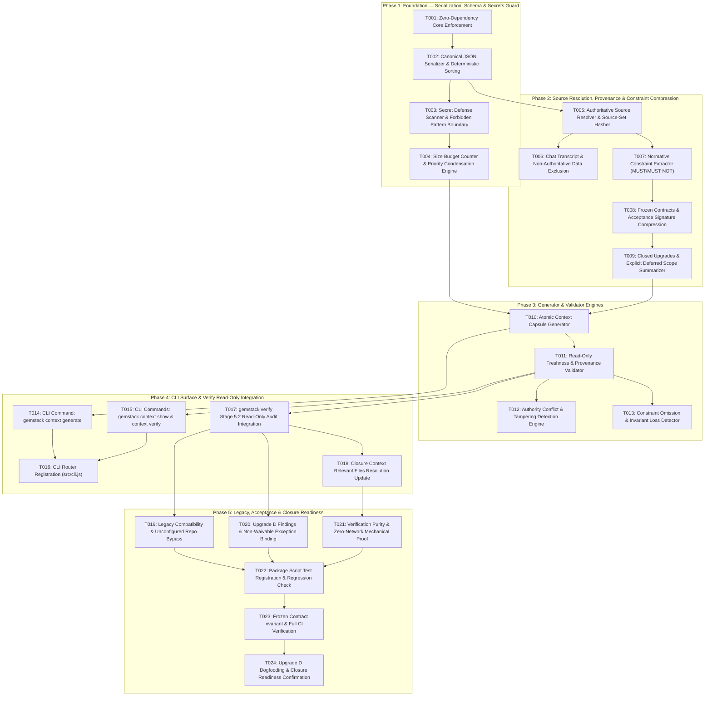

# Tareas de Implementación: Context Capsule / Context Compression (Upgrade D)

**Feature Branch**: `009-context-capsule`  
**Feature Directory**: `specs/009-context-capsule/`  
**Spec**: [`specs/009-context-capsule/spec.md`](file:///c:/CODES/Gemstack/specs/009-context-capsule/spec.md)  
**Plan**: [`specs/009-context-capsule/plan.md`](file:///c:/CODES/Gemstack/specs/009-context-capsule/plan.md)  
**Lifecycle Status**: `TASKS_COMPLETE`  
**Stop Reason**: `TASKS_COMPLETE_AWAITING_REVIEW`

---

## Contratos Congelados Heredados & Bootstrap (`gemstack-contracts`)

```gemstack-contracts
[
  {
    "id": "zero-dependency-core",
    "type": "BOOLEAN_INVARIANT",
    "value": true,
    "description": "Upgrade D implementation must introduce zero external production npm dependencies, using Node.js built-ins exclusively."
  },
  {
    "id": "capsule-is-derived-not-authority",
    "type": "BOOLEAN_INVARIANT",
    "value": true,
    "description": "The context capsule is strictly a derived projection; authoritative artifacts always override capsule content in case of divergence."
  },
  {
    "id": "compression-preserves-semantic-constraints",
    "type": "BOOLEAN_INVARIANT",
    "value": true,
    "description": "Context compression must never drop, weaken, or generalize normative MUST/MUST NOT behavioral constraints or frozen contracts."
  },
  {
    "id": "verify-never-regenerates-capsule",
    "type": "BOOLEAN_INVARIANT",
    "value": true,
    "description": "gemstack verify must operate in read-only mode, validating capsule freshness without silently regenerating or mutating files on disk."
  },
  {
    "id": "capsule-secrets-forbidden",
    "type": "BOOLEAN_INVARIANT",
    "value": true,
    "description": "Context capsules must never contain credential tokens, private keys, API secrets, or ambient environment variable values."
  },
  {
    "id": "capsule-offline-deterministic",
    "type": "BOOLEAN_INVARIANT",
    "value": true,
    "description": "Canonical context capsule generation and validation must execute completely offline with deterministic output given identical inputs."
  },
  {
    "id": "capsule-size-budget-fail-closed",
    "type": "BOOLEAN_INVARIANT",
    "value": true,
    "description": "Exceeding the maximum capsule byte budget must fail closed with an explicit finding rather than silently dropping constraints."
  },
  {
    "id": "legacy-capsule-compatibility",
    "type": "BOOLEAN_INVARIANT",
    "value": true,
    "description": "Existing repositories and features lacking context capsules operate cleanly with informational notices and zero false blockers."
  }
]
```

---

## Task Execution Rules & Safety Invariants

1. **Central Invariant**: `CONTEXT CAPSULE = DERIVED CONTINUATION CONTEXT, NOT CANONICAL PROJECT AUTHORITY`.
2. **Precedence Hierarchy**: Authoritative artifacts (`spec.md`, `plan.md`, `tasks.md`, `contracts`, `closure.json`) unconditionally govern over `context-capsule.json`.
3. **Semantic Constraint Losslessness**: `LESS TEXT ≠ LESS CONSTRAINT`. All `MUST` and `MUST NOT` normative statements and frozen contracts are preserved verbatim in structured format.
4. **Chat Transcript Exclusion**: `chat transcript ≠ project authority`. Conversational memory and raw git logs are strictly excluded from capsule inputs.
5. **Verification Purity (`VERIFY = VALIDATE`)**: `gemstack verify` inspects schema, provenance, and freshness in read-only mode. It **NEVER** regenerates or mutates capsules on disk.
6. **Zero External Runtime Dependencies**: Standard Node.js library exclusively (`node:fs`, `node:path`, `node:crypto`). Zero new npm production dependencies.
7. **Fail-Closed Size Budget**: Exceeding the 64 KB hard limit halts fail-closed with `CONTEXT_CAPSULE_TOO_LARGE` rather than silently dropping rules.
8. **Secrets Barrier**: Credential properties and token patterns are strictly blocked fail-closed with `CONTEXT_CAPSULE_SECRET_DETECTED`.

---

## Dependency Graph (5 Phased Waves)



---

## Tasks Inventory

### Phase 1 — Foundation: Serialization, Schema & Secrets Guard

- [x] **T001: Enforce zero-dependency core architecture for Upgrade D**
  <!-- gemstack:validation_required=true -->
  <!-- gemstack:tests=TEST-CONTEXT-F02 -->
  <!-- gemstack:files=package.json,src/lib/context-capsule.js -->
  <!-- gemstack:depends= -->
  *Objective*: Ensure Upgrade D relies strictly on Node.js built-ins (`node:fs`, `node:path`, `node:crypto`) and existing Gemstack zero-dependency helpers.  
  *Files*:
  - NEW: `src/lib/context-capsule.js`
  *Prerequisites*: NONE  
  *Implementation requirements*:
  - Initialize `src/lib/context-capsule.js` with standard library imports only.
  - Assert zero additions to `dependencies` in `package.json`.
  *Must NOT*: Add any external npm production dependencies.  
  *Tests*: `tests/context-purity.test.js`  
  *Acceptance IDs*: `TEST-CONTEXT-F02`  
  *Bootstrap Contracts*: `zero-dependency-core`  
  *Completion criteria*: `package.json` contains 0 runtime dependencies; scripts run purely on Node.js standard library.  
  *Evidence*: `check-package-contents.js` and tests passing without extra packages.

- [x] **T002: Implement canonical JSON serializer with stable UTF-16 sorting and normalization**
  <!-- gemstack:validation_required=true -->
  <!-- gemstack:tests=TEST-CONTEXT-A01,TEST-CONTEXT-A02,TEST-CONTEXT-A03,TEST-CONTEXT-A04 -->
  <!-- gemstack:files=src/lib/context-capsule.js,tests/context-determinism.test.js -->
  <!-- gemstack:depends=T001 -->
  *Objective*: Create deterministic JSON serialization utility ensuring byte-for-byte identical output across platforms.  
  *Files*:
  - MODIFY: `src/lib/context-capsule.js`
  - NEW: `tests/context-determinism.test.js`
  *Prerequisites*: `T001`  
  *Implementation requirements*:
  - Implement `serializeCanonicalJson(data)` in `src/lib/context-capsule.js`.
  - Sort object keys recursively by UTF-16 code units (`(a < b ? -1 : (a > b ? 1 : 0))`).
  - Sort array elements with identifiers deterministically (`sources`, `canonical_invariants`, `frozen_contracts`, `canonical_ids`).
  - Normalize paths to POSIX repository-relative forward slashes using `hasher.normalizePath`.
  - Exclude volatile timestamps (`generated_at`) from semantic content hash computations.
  - Output with 2-space indentation and POSIX newline (`\n`).
  *Must NOT*: Allow platform-dependent key order or Windows backslashes (`\`) in paths.  
  *Tests*: `tests/context-determinism.test.js`  
  *Acceptance IDs*: `TEST-CONTEXT-A01`, `TEST-CONTEXT-A02`, `TEST-CONTEXT-A03`, `TEST-CONTEXT-A04`  
  *Bootstrap Contracts*: `capsule-offline-deterministic`  
  *Completion criteria*: Repeated generation from identical inputs yields byte-identical output (100% SHA-256 match).  
  *Evidence*: `tests/context-determinism.test.js` passes.

- [x] **T003: Implement secrets scanner and forbidden credential boundary**
  <!-- gemstack:validation_required=true -->
  <!-- gemstack:tests=TEST-CONTEXT-E01,TEST-CONTEXT-E02,TEST-CONTEXT-E03 -->
  <!-- gemstack:files=src/lib/context-capsule.js,tests/context-secrets.test.js -->
  <!-- gemstack:depends=T002 -->
  *Objective*: Prevent credentials, private keys, API secrets, and `.env` variables from being ingested into context capsules.  
  *Files*:
  - MODIFY: `src/lib/context-capsule.js`
  - NEW: `tests/context-secrets.test.js`
  *Prerequisites*: `T002`  
  *Implementation requirements*:
  - Implement `assertSecretsForbidden(capsuleObj)` in `src/lib/context-capsule.js`.
  - Check property keys against forbidden list: `apiKey`, `api_key`, `token`, `accessToken`, `access_token`, `secret`, `clientSecret`, `password`, `credentials`.
  - Scan string values against token patterns: AWS (`AKIA...`), GitHub (`ghp_...`), OpenAI (`sk-...`), Google (`AIza...`), Bearer tokens, private key headers (`-----BEGIN ... PRIVATE KEY-----`).
  - Throw `CONTEXT_CAPSULE_SECRET_DETECTED` fail-closed on match without exposing secret text in message.
  - Assert that `.env` files are never opened or ingested.
  *Must NOT*: Log or embed detected secret values into error findings or fingerprints.  
  *Tests*: `tests/context-secrets.test.js`  
  *Acceptance IDs*: `TEST-CONTEXT-E01`, `TEST-CONTEXT-E02`, `TEST-CONTEXT-E03`  
  *Bootstrap Contracts*: `capsule-secrets-forbidden`  
  *Completion criteria*: Synthetic secret patterns trigger fail-closed halt with `CONTEXT_CAPSULE_SECRET_DETECTED`.  
  *Evidence*: `tests/context-secrets.test.js` passes all synthetic credential injection cases.

- [x] **T004: Implement size budget counter, priority condensation, and fail-closed overflow**
  <!-- gemstack:validation_required=true -->
  <!-- gemstack:tests=TEST-CONTEXT-G01 -->
  <!-- gemstack:files=src/lib/context-capsule.js,tests/context-size-budget.test.js -->
  <!-- gemstack:depends=T003 -->
  *Objective*: Enforce deterministic size budget (32 KB target, 64 KB hard limit) without silent constraint dropping.  
  *Files*:
  - MODIFY: `src/lib/context-capsule.js`
  - NEW: `tests/context-size-budget.test.js`
  *Prerequisites*: `T003`  
  *Implementation requirements*:
  - Implement `enforceSizeBudget(capsuleObj)` in `src/lib/context-capsule.js`.
  - Target budget: `32,768 bytes`; Hard limit: `65,536 bytes`.
  - If serialized size exceeds 32 KB, condense non-normative Priority 3 and Priority 2 fields deterministically.
  - Priority 1 (Authority model, safety invariants, contracts, lifecycle state) is NEVER dropped.
  - If serialized size exceeds 64 KB, throw fail-closed error `CONTEXT_CAPSULE_TOO_LARGE`.
  *Must NOT*: Silently drop or truncate any normative `MUST`/`MUST NOT` rule or frozen contract.  
  *Tests*: `tests/context-size-budget.test.js`  
  *Acceptance IDs*: `TEST-CONTEXT-G01`  
  *Bootstrap Contracts*: `capsule-size-budget-fail-closed`  
  *Completion criteria*: Exceeding 64 KB halts with `CONTEXT_CAPSULE_TOO_LARGE` fail-closed.  
  *Evidence*: `tests/context-size-budget.test.js` passes.

---

### Phase 2 — Source Resolution, Provenance & Constraint Compression

- [x] **T005: Implement authoritative source resolver and source-set hasher**
  <!-- gemstack:validation_required=true -->
  <!-- gemstack:tests=TEST-CONTEXT-C03 -->
  <!-- gemstack:files=src/lib/context-capsule.js,tests/context-freshness.test.js -->
  <!-- gemstack:depends=T002 -->
  *Objective*: Resolve authoritative project files according to lifecycle phase and compute cryptographic provenance digest.  
  *Files*:
  - MODIFY: `src/lib/context-capsule.js`
  - NEW: `tests/context-freshness.test.js`
  *Prerequisites*: `T002`  
  *Implementation requirements*:
  - Implement `resolveAuthoritativeSources(rootPath, featureDir, currentPhase)`.
  - Ingest strictly: `spec.md`, `plan.md`, `tasks.md`, `.gemstack/state.json`, `closure.json` (if present), `cost-ledger.json` (if present).
  - Compute individual SHA-256 hashes via `hasher.hashFile`.
  - Compute aggregate `source_set_hash` by hashing the UTF-16 code-unit sorted JSON of `{ path, hash }` records.
  *Must NOT*: Ingest chat transcripts, git commit logs, raw test runner output, or source tree dumps.  
  *Tests*: `tests/context-freshness.test.js`  
  *Acceptance IDs*: `TEST-CONTEXT-C03`  
  *Bootstrap Contracts*: `capsule-is-derived-not-authority`  
  *Completion criteria*: Correct `source_set_hash` computed over normalized input sources.  
  *Evidence*: Provenance digest verification in unit tests.

- [x] **T006: Enforce strict exclusion of chat transcripts and conversational logs**
  <!-- gemstack:validation_required=true -->
  <!-- gemstack:tests=TEST-CONTEXT-B04 -->
  <!-- gemstack:files=src/lib/context-capsule.js,tests/context-authority.test.js -->
  <!-- gemstack:depends=T005 -->
  *Objective*: Guarantee that conversational transcripts and ambient developer notes carry zero authority.  
  *Files*:
  - MODIFY: `src/lib/context-capsule.js`
  - NEW: `tests/context-authority.test.js`
  *Prerequisites*: `T005`  
  *Implementation requirements*:
  - Restrict capsule source whitelist to structured markdown and JSON files.
  - Verify generator ignores conversation logs, prompt history, and IDE session state.
  *Must NOT*: Ingest `.gemini/antigravity` transcript logs or ambient chat archives.  
  *Tests*: `tests/context-authority.test.js`  
  *Acceptance IDs*: `TEST-CONTEXT-B04`  
  *Bootstrap Contracts*: `capsule-is-derived-not-authority`  
  *Completion criteria*: Capsule sources list contains 0 conversational or transcript files.  
  *Evidence*: `TEST-CONTEXT-B04` passes.

- [x] **T007: Implement normative constraint extractor (MUST / MUST NOT)**
  <!-- gemstack:validation_required=true -->
  <!-- gemstack:tests=TEST-CONTEXT-D01 -->
  <!-- gemstack:files=src/lib/context-capsule.js,tests/context-constraints.test.js -->
  <!-- gemstack:depends=T005 -->
  *Objective*: Extract 100% of normative behavioral rules from `spec.md` into `canonical_invariants`.  
  *Files*:
  - MODIFY: `src/lib/context-capsule.js`
  - NEW: `tests/context-constraints.test.js`
  *Prerequisites*: `T005`  
  *Implementation requirements*:
  - Implement `extractNormativeConstraints(specContent)` in `src/lib/context-capsule.js`.
  - Scan markdown for statements containing `MUST`, `MUST NOT`, `REQUIRED`, `FORBIDDEN`.
  - Assign deterministic IDs (`INV-001`, `INV-002`, ...), tag with normative modality (`MUST` vs `MUST_NOT`), and preserve source line/section reference.
  - Omit rhetorical prose, tutorials, and historical background.
  *Must NOT*: Soften, summarize, or generalize normative requirements.  
  *Tests*: `tests/context-constraints.test.js`  
  *Acceptance IDs*: `TEST-CONTEXT-D01`  
  *Bootstrap Contracts*: `compression-preserves-semantic-constraints`  
  *Completion criteria*: 100% of normative constraints from source spec are retained in `canonical_invariants`.  
  *Evidence*: `TEST-CONTEXT-D01` passes.

- [x] **T008: Implement frozen contracts and acceptance signature compressor**
  <!-- gemstack:validation_required=true -->
  <!-- gemstack:tests=TEST-CONTEXT-D02 -->
  <!-- gemstack:files=src/lib/context-capsule.js,tests/context-constraints.test.js -->
  <!-- gemstack:depends=T007 -->
  *Objective*: Preserve active frozen contracts and test matrix signatures across compression.  
  *Files*:
  - MODIFY: `src/lib/context-capsule.js`
  - MODIFY: `tests/context-constraints.test.js`
  *Prerequisites*: `T007`  
  *Implementation requirements*:
  - Re-use `extractContractsBlock` from `src/lib/contracts.js` to extract contract IDs and types.
  - Re-use `extractTestMatrixBlock` and `computeAcceptanceSignature` from `src/lib/test-matrix.js` to extract canonical IDs and signature.
  - Re-use `parseTaskMetadata` from `src/lib/closure-context.js` to extract task summary counts.
  *Must NOT*: Modify existing contract structures or drop acceptance IDs.  
  *Tests*: `tests/context-constraints.test.js`  
  *Acceptance IDs*: `TEST-CONTEXT-D02`  
  *Bootstrap Contracts*: `compression-preserves-semantic-constraints`  
  *Completion criteria*: Contract IDs and acceptance signature match source blocks 100%.  
  *Evidence*: `TEST-CONTEXT-D02` passes.

- [x] **T009: Implement closed upgrades and explicit deferred scope summarizer**
  <!-- gemstack:validation_required=true -->
  <!-- gemstack:tests=TEST-CONTEXT-D01,TEST-CONTEXT-D02 -->
  <!-- gemstack:files=src/lib/context-capsule.js,tests/context-constraints.test.js -->
  <!-- gemstack:depends=T008 -->
  *Objective*: Condense completed upgrades and record explicit deferred items to prevent architectural drift.  
  *Files*:
  - MODIFY: `src/lib/context-capsule.js`
  - MODIFY: `tests/context-constraints.test.js`
  *Prerequisites*: `T008`  
  *Implementation requirements*:
  - Summarize shipped features (`006`, `007`, `008`) into compact records with key guarantees.
  - Extract `deferred_items` from `spec.md` to prevent downstream agents from assuming omitted scope is forgotten.
  - Record `unresolved_blockers` (empty array if none).
  *Must NOT*: Represent settled decisions as open questions.  
  *Tests*: `tests/context-constraints.test.js`  
  *Acceptance IDs*: `TEST-CONTEXT-D01`, `TEST-CONTEXT-D02`  
  *Bootstrap Contracts*: `compression-preserves-semantic-constraints`  
  *Completion criteria*: Closed features and explicit deferrals are structured cleanly without narrative bloat.  
  *Evidence*: Test assertions verifying structured representation of historical context.

---

### Phase 3 — Generator & Validator Engines

- [x] **T010: Implement atomic context capsule generator**
  <!-- gemstack:validation_required=true -->
  <!-- gemstack:tests=TEST-CONTEXT-A01 -->
  <!-- gemstack:files=src/lib/context-capsule.js,tests/context-determinism.test.js -->
  <!-- gemstack:depends=T004,T009 -->
  *Objective*: Orchestrate full generation pipeline and write `context-capsule.json` atomically.  
  *Files*:
  - MODIFY: `src/lib/context-capsule.js`
  - MODIFY: `tests/context-determinism.test.js`
  *Prerequisites*: `T004`, `T009`  
  *Implementation requirements*:
  - Implement `generateContextCapsule(rootPath, featureDir, options)`.
  - Assemble canonical JSON payload from source resolver, constraint extractor, contracts, and matrix.
  - Run secrets audit and size budget checks before serialization.
  - Write atomically via temporary file with Windows-safe retry (reusing `writeJsonAtomic` pattern).
  *Must NOT*: Leave partial or corrupted files on disk if generation fails.  
  *Tests*: `tests/context-determinism.test.js`  
  *Acceptance IDs*: `TEST-CONTEXT-A01`  
  *Bootstrap Contracts*: `capsule-offline-deterministic`  
  *Completion criteria*: Generates valid `context-capsule.json` atomically with matching hash.  
  *Evidence*: File generated and verified byte-for-byte in tests.

- [x] **T011: Implement read-only freshness and provenance validator**
  <!-- gemstack:validation_required=true -->
  <!-- gemstack:tests=TEST-CONTEXT-C01,TEST-CONTEXT-C02,TEST-CONTEXT-C03 -->
  <!-- gemstack:files=src/lib/context-capsule.js,tests/context-freshness.test.js -->
  <!-- gemstack:depends=T010 -->
  *Objective*: Create read-only validator evaluating capsule schema, provenance hashes, and source freshness.  
  *Files*:
  - MODIFY: `src/lib/context-capsule.js`
  - MODIFY: `tests/context-freshness.test.js`
  *Prerequisites*: `T010`  
  *Implementation requirements*:
  - Implement `validateContextCapsule(rootPath, featureDir)` returning `{ valid, state, findings }`.
  - States: `VALID`, `STALE`, `INVALID`, `MISSING`.
  - Re-compute live SHA-256 hashes of recorded source files; if any hash differs, mark `STALE` with `CONTEXT_CAPSULE_STALE`.
  - Ensure zero file writes, modifications, or touch operations occur during validation.
  *Must NOT*: Regenerate or mutate the capsule when staleness is detected.  
  *Tests*: `tests/context-freshness.test.js`  
  *Acceptance IDs*: `TEST-CONTEXT-C01`, `TEST-CONTEXT-C02`, `TEST-CONTEXT-C03`  
  *Bootstrap Contracts*: `verify-never-regenerates-capsule`  
  *Completion criteria*: Touching `spec.md` or checking a box in `tasks.md` causes validator to return `STALE`.  
  *Evidence*: `TEST-CONTEXT-C01` and `TEST-CONTEXT-C02` pass.

- [x] **T012: Implement authority conflict and tampering detection engine**
  <!-- gemstack:validation_required=true -->
  <!-- gemstack:tests=TEST-CONTEXT-B01,TEST-CONTEXT-B02,TEST-CONTEXT-B03 -->
  <!-- gemstack:files=src/lib/context-capsule.js,tests/context-authority.test.js -->
  <!-- gemstack:depends=T011 -->
  *Objective*: Reject capsules asserting claims contrary to authoritative source files and enforce source precedence.  
  *Files*:
  - MODIFY: `src/lib/context-capsule.js`
  - MODIFY: `tests/context-authority.test.js`
  *Prerequisites*: `T011`  
  *Implementation requirements*:
  - Detect manual tampering with task status, contracts, or source hashes.
  - Emit `CONTEXT_CAPSULE_AUTHORITY_CONFLICT` if capsule claims diverge from source.
  - Implement consumer resolver helper proving source artifact unconditionally wins.
  *Must NOT*: Allow manual capsule edits to override authoritative specifications or plans.  
  *Tests*: `tests/context-authority.test.js`  
  *Acceptance IDs*: `TEST-CONTEXT-B01`, `TEST-CONTEXT-B02`, `TEST-CONTEXT-B03`  
  *Bootstrap Contracts*: `capsule-is-derived-not-authority`  
  *Completion criteria*: Tampered capsule is rejected; resolver returns source artifact value.  
  *Evidence*: `TEST-CONTEXT-B01`, `B02`, and `B03` pass.

- [x] **T013: Implement invariant omission and constraint loss detector**
  <!-- gemstack:validation_required=true -->
  <!-- gemstack:tests=TEST-CONTEXT-D01 -->
  <!-- gemstack:files=src/lib/context-capsule.js,tests/context-constraints.test.js -->
  <!-- gemstack:depends=T011 -->
  *Objective*: Ensure validation fails if a required normative invariant is omitted from the capsule.  
  *Files*:
  - MODIFY: `src/lib/context-capsule.js`
  - MODIFY: `tests/context-constraints.test.js`
  *Prerequisites*: `T011`  
  *Implementation requirements*:
  - Compare `canonical_invariants` in capsule against live spec extraction.
  - Emit blocker `CONTEXT_CAPSULE_INVARIANT_DROPPED` if any normative rule is missing.
  *Must NOT*: Pass validation solely on matching source hashes if semantic coverage is incomplete.  
  *Tests*: `tests/context-constraints.test.js`  
  *Acceptance IDs*: `TEST-CONTEXT-D01`  
  *Bootstrap Contracts*: `compression-preserves-semantic-constraints`  
  *Completion criteria*: Capsule with a stripped invariant fails validation with `CONTEXT_CAPSULE_INVARIANT_DROPPED`.  
  *Evidence*: Adversarial invariant omission test passes.

---

### Phase 4 — CLI Surface & Verify Read-Only Integration

- [x] **T014: Implement CLI command: gemstack context generate**
  <!-- gemstack:validation_required=true -->
  <!-- gemstack:tests=TEST-CONTEXT-A01 -->
  <!-- gemstack:files=src/commands/context.js -->
  <!-- gemstack:depends=T010 -->
  *Objective*: Create CLI command to explicitly compile authoritative sources into `context-capsule.json`.  
  *Files*:
  - NEW: `src/commands/context.js`
  *Prerequisites*: `T010`  
  *Implementation requirements*:
  - Parse `--target` and `--feature` flags.
  - Invoke `generateContextCapsule` and report generation summary (size, source count, invariant count).
  - Exit code 0 on success; exit code 1 on validation/size/secret failure.
  *Must NOT*: Mutate source markdown files or invoke remote AI APIs.  
  *Tests*: `tests/context-determinism.test.js`  
  *Acceptance IDs*: `TEST-CONTEXT-A01`  
  *Bootstrap Contracts*: `capsule-offline-deterministic`  
  *Completion criteria*: Running `gemstack context generate` produces valid capsule file on disk.  
  *Evidence*: CLI invocation test passes.

- [x] **T015: Implement CLI commands: gemstack context show and context verify**
  <!-- gemstack:validation_required=true -->
  <!-- gemstack:tests=TEST-CONTEXT-C03 -->
  <!-- gemstack:files=src/commands/context.js -->
  <!-- gemstack:depends=T014 -->
  *Objective*: Provide read-only inspection and standalone validation commands for context capsules.  
  *Files*:
  - MODIFY: `src/commands/context.js`
  *Prerequisites*: `T014`  
  *Implementation requirements*:
  - `show`: Display formatted summary or raw JSON (`--json`). Strictly read-only.
  - `verify`: Invoke `validateContextCapsule` and report status (`VALID`, `STALE`, `INVALID`, `MISSING`).
  *Must NOT*: Regenerate capsule during `show` or `verify` operations.  
  *Tests*: `tests/context-freshness.test.js`  
  *Acceptance IDs*: `TEST-CONTEXT-C03`  
  *Bootstrap Contracts*: `verify-never-regenerates-capsule`  
  *Completion criteria*: Commands inspect and validate capsules without touching filesystem.  
  *Evidence*: Unit/CLI tests confirming zero side effects.

- [x] **T016: Register context command routing and help text in src/cli.js**
  <!-- gemstack:validation_required=true -->
  <!-- gemstack:tests=TEST-CONTEXT-A01 -->
  <!-- gemstack:files=src/cli.js -->
  <!-- gemstack:depends=T015 -->
  *Objective*: Integrate `context` command into main Gemstack CLI router.  
  *Files*:
  - MODIFY: `src/cli.js`
  *Prerequisites*: `T015`  
  *Implementation requirements*:
  - Add `context` command to help text and switch statement.
  - Route subcommands (`generate`, `show`, `verify`) to `src/commands/context.js`.
  *Must NOT*: Alter routing or behavior of existing commands (`verify`, `collect`, `ship`).  
  *Tests*: `tests/context-determinism.test.js`  
  *Acceptance IDs*: `TEST-CONTEXT-A01`  
  *Completion criteria*: `gemstack context` is recognized and callable via CLI.  
  *Evidence*: CLI help output includes `context`.

- [x] **T017: Integrate Stage 5.2 Context Capsule read-only audit into src/commands/verify.js**
  <!-- gemstack:validation_required=true -->
  <!-- gemstack:tests=TEST-CONTEXT-F01,TEST-CONTEXT-H01 -->
  <!-- gemstack:files=src/commands/verify.js -->
  <!-- gemstack:depends=T011 -->
  *Objective*: Embed read-only Context Capsule audit into `gemstack verify` without mutating disk.  
  *Files*:
  - MODIFY: `src/commands/verify.js`
  *Prerequisites*: `T011`  
  *Implementation requirements*:
  - Add Stage 5.2 in `src/commands/verify.js` auditing `active_spec` capsule.
  - Check schema validity and freshness.
  - Emit blocker findings if `STALE`, `INVALID`, `TOO_LARGE`, or `SECRET_DETECTED`.
  - Log informational legacy notice if capsule absent in legacy feature.
  *Must NOT*: Write, touch, or regenerate `context-capsule.json` during verify.  
  *Tests*: `tests/context-purity.test.js`, `tests/context-legacy.test.js`  
  *Acceptance IDs*: `TEST-CONTEXT-F01`, `TEST-CONTEXT-H01`  
  *Bootstrap Contracts*: `verify-never-regenerates-capsule`  
  *Completion criteria*: `gemstack verify` reports capsule state; 0 file modifications occur.  
  *Evidence*: `TEST-CONTEXT-F01` passes.

- [x] **T018: Include context-capsule.json in RelevantClosureFiles resolution**
  <!-- gemstack:validation_required=true -->
  <!-- gemstack:tests=TEST-CONTEXT-F01 -->
  <!-- gemstack:files=src/lib/closure-context.js -->
  <!-- gemstack:depends=T017 -->
  *Objective*: Ensure `context-capsule.json` is factored into closure context hash when present.  
  *Files*:
  - MODIFY: `src/lib/closure-context.js`
  *Prerequisites*: `T017`  
  *Implementation requirements*:
  - In `resolveRelevantFiles`, check if `context-capsule.json` exists in active feature directory; add to relevant files set if present.
  *Must NOT*: Require `context-capsule.json` in legacy features that do not declare Upgrade D contracts.  
  *Tests*: `tests/context-purity.test.js`  
  *Acceptance IDs*: `TEST-CONTEXT-F01`  
  *Completion criteria*: `resolveRelevantFiles` returns `context-capsule.json` when present on disk.  
  *Evidence*: Unit test verifying relevant files output.

---

### Phase 5 — Legacy, Acceptance & Closure Readiness

- [x] **T019: Implement progressive legacy mode compatibility**
  <!-- gemstack:validation_required=true -->
  <!-- gemstack:tests=TEST-CONTEXT-H01 -->
  <!-- gemstack:files=src/lib/context-capsule.js,src/commands/verify.js,tests/context-legacy.test.js -->
  <!-- gemstack:depends=T017 -->
  *Objective*: Ensure legacy projects lacking context capsules operate cleanly with zero false blockers.  
  *Files*:
  - MODIFY: `src/commands/verify.js`
  - NEW: `tests/context-legacy.test.js`
  *Prerequisites*: `T017`  
  *Implementation requirements*:
  - In legacy features (lacking Upgrade D contracts), missing capsule emits informational notice only:  
    `[INFO] [LEGACY] No se detectó context-capsule.json (Modo Legacy Context-Free).`
  - `gemstack verify` exits with code 0 and 0 errors on legacy repositories.
  *Must NOT*: Block legacy projects or historical features.  
  *Tests*: `tests/context-legacy.test.js`  
  *Acceptance IDs*: `TEST-CONTEXT-H01`  
  *Bootstrap Contracts*: `legacy-capsule-compatibility`  
  *Completion criteria*: Legacy fixture passes `gemstack verify` with exit code 0.  
  *Evidence*: `TEST-CONTEXT-H01` passes.

- [x] **T020: Bind Upgrade D findings to findings engine with non-waivable exceptions policy**
  <!-- gemstack:validation_required=true -->
  <!-- gemstack:tests=TEST-CONTEXT-B01,TEST-CONTEXT-E01 -->
  <!-- gemstack:files=src/lib/context-capsule.js,src/lib/findings.js -->
  <!-- gemstack:depends=T017 -->
  *Objective*: Standardize findings codes and enforce non-waivable policy for capsule safety blockers.  
  *Files*:
  - MODIFY: `src/lib/context-capsule.js`
  *Prerequisites*: `T017`  
  *Implementation requirements*:
  - Generate canonical 64-char lowercase hex fingerprints via `computeFindingFingerprint`.
  - Enforce that `CONTEXT_CAPSULE_STALE`, `CONTEXT_CAPSULE_INVALID`, `CONTEXT_CAPSULE_SECRET_DETECTED`, `CONTEXT_CAPSULE_TOO_LARGE`, and `CONTEXT_CAPSULE_AUTHORITY_CONFLICT` are strictly non-waivable.
  *Must NOT*: Permit waiving stale, secret-bearing, or conflicting capsules with exceptions.  
  *Tests*: `tests/context-authority.test.js`, `tests/context-secrets.test.js`  
  *Acceptance IDs*: `TEST-CONTEXT-B01`, `TEST-CONTEXT-E01`  
  *Completion criteria*: Safety blockers cannot be suppressed by `.gemstack.json` exceptions.  
  *Evidence*: Findings test assertions confirming rejection of waivers.

- [x] **T021: Verify verification purity and zero-network mechanical proof**
  <!-- gemstack:validation_required=true -->
  <!-- gemstack:tests=TEST-CONTEXT-F01,TEST-CONTEXT-F02 -->
  <!-- gemstack:files=tests/context-purity.test.js -->
  <!-- gemstack:depends=T017 -->
  *Objective*: Mechanically prove that verify performs zero file mutations and zero network socket queries.  
  *Files*:
  - NEW: `tests/context-purity.test.js`
  *Prerequisites*: `T017`  
  *Implementation requirements*:
  - Test 1: Snapshot filesystem before and after `gemstack verify`; verify 100% hash tree match (0 bytes modified).
  - Test 2: Mock Node's `net.Socket` and `http/https.request` to throw; assert verify exits 0 without network attempts.
  *Must NOT*: Allow any background socket or file touch in verify.  
  *Tests*: `tests/context-purity.test.js`  
  *Acceptance IDs*: `TEST-CONTEXT-F01`, `TEST-CONTEXT-F02`  
  *Bootstrap Contracts*: `verify-never-regenerates-capsule`, `capsule-offline-deterministic`  
  *Completion criteria*: `TEST-CONTEXT-F01` and `TEST-CONTEXT-F02` pass.  
  *Evidence*: Both purity assertions pass.

- [x] **T022: Register 8 new test suites in package.json and verify complete regression pass**
  <!-- gemstack:validation_required=true -->
  <!-- gemstack:tests=TEST-CONTEXT-A01 -->
  <!-- gemstack:files=package.json -->
  <!-- gemstack:depends=T019,T020,T021 -->
  *Objective*: Add all 8 new test files to `npm test` and assert 0 regressions across all historical suites.  
  *Files*:
  - MODIFY: `package.json`
  *Prerequisites*: `T019`, `T020`, `T021`  
  *Implementation requirements*:
  - Append 8 test files to `scripts.test` in `package.json`:
    `tests/context-determinism.test.js`, `tests/context-authority.test.js`, `tests/context-freshness.test.js`, `tests/context-constraints.test.js`, `tests/context-secrets.test.js`, `tests/context-purity.test.js`, `tests/context-size-budget.test.js`, `tests/context-legacy.test.js`.
  - Run `npm test` and assert 100% pass across all 25 test suites.
  *Must NOT*: Introduce silent error masks (`2>nul`) or break existing test runners.  
  *Tests*: All 25 suites  
  *Acceptance IDs*: `TEST-CONTEXT-A01`..`TEST-CONTEXT-H01`  
  *Completion criteria*: Full test suite passes with 0 failures.  
  *Evidence*: `npm test` output showing all suites green.

- [x] **T023: Verify frozen contract invariants and execute complete CI validation suite**
  <!-- gemstack:validation_required=true -->
  <!-- gemstack:tests=TEST-CONTEXT-A01 -->
  <!-- gemstack:files=package.json -->
  <!-- gemstack:depends=T022 -->
  *Objective*: Mechanically prove that zero frozen contracts were affected and run full project CI.  
  *Files*:
  - UNCHANGED
  *Prerequisites*: `T022`  
  *Implementation requirements*:
  - Re-verify Upgrade A contracts (`zero-dependency-core`, `upgrade-a-contract-types`, etc.).
  - Re-verify Upgrade B closure mechanics and Upgrade C provider safety gates.
  - Run `npm run ci:all` (frontmatter, mojibake, package contents, smoke).
  *Must NOT*: Alter or weaken any frozen contract.  
  *Tests*: `npm run ci:all`  
  *Acceptance IDs*: `TEST-CONTEXT-A01`..`TEST-CONTEXT-H01`  
  *Completion criteria*: `ci:all` exits 0 with 0 errors.  
  *Evidence*: Terminal output showing clean CI execution.

- [x] **T024: Perform Upgrade D dogfooding and confirm closure readiness**
  <!-- gemstack:validation_required=true -->
  <!-- gemstack:tests=TEST-CONTEXT-A01..TEST-CONTEXT-H01 -->
  <!-- gemstack:files=specs/009-context-capsule/context-capsule.json -->
  <!-- gemstack:depends=T023 -->
  *Objective*: Generate dogfooding `specs/009-context-capsule/context-capsule.json` and verify closure readiness without closing feature.  
  *Files*:
  - NEW: `specs/009-context-capsule/context-capsule.json`
  *Prerequisites*: `T023`  
  *Implementation requirements*:
  - Run `gemstack context generate` for `specs/009-context-capsule`.
  - Validate capsule passes `gemstack verify` in Stage 5.2.
  - Confirm 20/20 acceptance tests pass, 8/8 bootstrap contracts covered, 0 blockers.
  *Must NOT*: Mark Upgrade D closed or transition status to SHIPPED.  
  *Tests*: Full acceptance matrix  
  *Acceptance IDs*: `TEST-CONTEXT-A01`..`TEST-CONTEXT-H01`  
  *Completion criteria*: Capsule generated, valid, and verified. State remains `IMPLEMENTED — NOT YET CLOSED`.  
  *Evidence*: Dogfooding capsule on disk and clean audit report.

---

## Canonical Acceptance Traceability Matrix (20/20 Mapped)

| Acceptance ID | Category | Layer | Task ID(s) | Target Test File | Mechanical Proof |
| :--- | :--- | :--- | :--- | :--- | :--- |
| `TEST-CONTEXT-A01` | DETERMINISM | UNIT | `T002`, `T010`, `T014` | `tests/context-determinism.test.js` | 2 independent runs yield identical SHA-256 |
| `TEST-CONTEXT-A02` | DETERMINISM | UNIT | `T002` | `tests/context-determinism.test.js` | Object keys match UTF-16 code-unit sorted order |
| `TEST-CONTEXT-A03` | DETERMINISM | UNIT | `T002` | `tests/context-determinism.test.js` | Modifying `generated_at` leaves content hash intact |
| `TEST-CONTEXT-A04` | DETERMINISM | UNIT | `T002` | `tests/context-determinism.test.js` | Path strings contain zero backslashes or drive prefixes |
| `TEST-CONTEXT-B01` | AUTHORITY | UNIT | `T012`, `T020` | `tests/context-authority.test.js` | Divergent capsule emits `CONTEXT_CAPSULE_AUTHORITY_CONFLICT` |
| `TEST-CONTEXT-B02` | AUTHORITY | UNIT | `T012` | `tests/context-authority.test.js` | Consumer resolver returns source value on conflict |
| `TEST-CONTEXT-B03` | AUTHORITY | UNIT | `T012` | `tests/context-authority.test.js` | Tampered capsule content hash emits `CONTEXT_CAPSULE_STALE` |
| `TEST-CONTEXT-B04` | AUTHORITY | UNIT | `T006` | `tests/context-authority.test.js` | Capsule sources list contains zero transcript files |
| `TEST-CONTEXT-C01` | FRESHNESS | INTEGRATION | `T011` | `tests/context-freshness.test.js` | Mutating `spec.md` causes verify to fail with `STALE` |
| `TEST-CONTEXT-C02` | FRESHNESS | INTEGRATION | `T011` | `tests/context-freshness.test.js` | Checking task in `tasks.md` causes verify to fail with `STALE` |
| `TEST-CONTEXT-C03` | FRESHNESS | UNIT | `T005`, `T011`, `T015` | `tests/context-freshness.test.js` | Untouched sources pass verification with `VALID` |
| `TEST-CONTEXT-D01` | CONSTRAINTS | UNIT | `T007`, `T009`, `T013` | `tests/context-constraints.test.js` | 100% of MUST/MUST NOT rules extracted into capsule |
| `TEST-CONTEXT-D02` | CONSTRAINTS | UNIT | `T008`, `T009` | `tests/context-constraints.test.js` | Contract IDs and acceptance signature preserved exactly |
| `TEST-CONTEXT-E01` | SECURITY | UNIT | `T003`, `T020` | `tests/context-secrets.test.js` | Forbidden credential key triggers fail-closed halt |
| `TEST-CONTEXT-E02` | SECURITY | UNIT | `T003` | `tests/context-secrets.test.js` | Injected token patterns (`sk-...`, `AIza...`) rejected |
| `TEST-CONTEXT-E03` | SECURITY | UNIT | `T003` | `tests/context-secrets.test.js` | Capsule contains zero references or values from `.env` |
| `TEST-CONTEXT-F01` | VERIFICATION_PURITY | INTEGRATION | `T017`, `T018`, `T021` | `tests/context-purity.test.js` | File hash tree before and after verify matches 100% |
| `TEST-CONTEXT-F02` | VERIFICATION_PURITY | INTEGRATION | `T001`, `T021` | `tests/context-purity.test.js` | Verify passes with all network sockets throwing mocks |
| `TEST-CONTEXT-G01` | SIZE_SAFETY | UNIT | `T004` | `tests/context-size-budget.test.js` | Exceeding 64 KB fails closed with `CONTEXT_CAPSULE_TOO_LARGE` |
| `TEST-CONTEXT-H01` | LEGACY | UNIT | `T017`, `T019` | `tests/context-legacy.test.js` | Unconfigured repo passes verify with exit code 0 and info note |

---

## Bootstrap Contracts Traceability (8/8 Mapped)

| Bootstrap Contract | Task ID(s) | Implementation Surface | Test File | Mechanical Proof |
| :--- | :--- | :--- | :--- | :--- |
| `zero-dependency-core` | `T001` | `package.json`, `src/lib/context-capsule.js` | `tests/context-purity.test.js` | 0 runtime deps in `package.json`; stdlib only |
| `capsule-is-derived-not-authority` | `T005`, `T006`, `T012` | `src/lib/context-capsule.js` | `tests/context-authority.test.js` | Authoritative source unconditionally overrides capsule |
| `compression-preserves-semantic-constraints` | `T007`, `T008`, `T009`, `T013` | `src/lib/context-capsule.js` | `tests/context-constraints.test.js` | 100% of MUST/MUST NOT rules and contracts retained |
| `verify-never-regenerates-capsule` | `T011`, `T015`, `T017`, `T021` | `src/commands/verify.js` | `tests/context-purity.test.js` | Zero disk writes; filesystem hash before/after matches |
| `capsule-secrets-forbidden` | `T003`, `T020` | `src/lib/context-capsule.js` | `tests/context-secrets.test.js` | Fail-closed halt on secret property or regex pattern |
| `capsule-offline-deterministic` | `T002`, `T010`, `T014`, `T021` | `src/lib/context-capsule.js` | `tests/context-determinism.test.js` | Repeated generation yields byte-identical SHA-256 |
| `capsule-size-budget-fail-closed` | `T004` | `src/lib/context-capsule.js` | `tests/context-size-budget.test.js` | Content > 64 KB halts with `CONTEXT_CAPSULE_TOO_LARGE` |
| `legacy-capsule-compatibility` | `T017`, `T019` | `src/commands/verify.js` | `tests/context-legacy.test.js` | Legacy repo passes verify with exit code 0 |

---

## Adversarial Coverage Matrix (22 Vector Scenarios)

| # | Adversarial Scenario | Task ID | Target Test File | Expected Outcome |
| :--- | :--- | :--- | :--- | :--- |
| 1 | Capsule overrides source task completion claim | `T012` | `tests/context-authority.test.js` | Source `tasks.md` unconditionally wins; conflict flagged |
| 2 | Authoritative source mutated after capsule generation | `T011` | `tests/context-freshness.test.js` | Verify flags `CONTEXT_CAPSULE_STALE` blocker |
| 3 | Manual alteration of source hash inside capsule JSON | `T012` | `tests/context-authority.test.js` | Re-hash reconciles against disk; flags `STALE` |
| 4 | Manual deletion of a required normative invariant | `T013` | `tests/context-constraints.test.js` | Flags `CONTEXT_CAPSULE_INVARIANT_DROPPED` blocker |
| 5 | Closed upgrade represented as open question | `T009` | `tests/context-constraints.test.js` | Replaced with closed status token and key guarantees |
| 6 | Explicit deferred work omitted or treated as forgotten | `T009` | `tests/context-constraints.test.js` | Retained verbatim in `deferred_items` array |
| 7 | Secret-shaped property injected (`apiKey: "xyz"`) | `T003` | `tests/context-secrets.test.js` | Halts with `CONTEXT_CAPSULE_SECRET_DETECTED` |
| 8 | Synthetic token value injected (`sk-live123...`) | `T003` | `tests/context-secrets.test.js` | Regex scanner fails closed; zero secret in error |
| 9 | Private key block injected (`BEGIN RSA PRIVATE KEY`) | `T003` | `tests/context-secrets.test.js` | Scanner halts generation fail-closed |
| 10 | Local `.env` file present in project root | `T003` | `tests/context-secrets.test.js` | Whitelist ignores `.env`; zero content in capsule |
| 11 | Filesystem traversal returns unordered keys | `T002` | `tests/context-determinism.test.js` | Strict UTF-16 code-unit sort produces identical bytes |
| 12 | Absolute machine drive paths (`C:\CODES\...`) injected | `T002` | `tests/context-determinism.test.js` | Normalized to POSIX repository-relative forward slashes |
| 13 | Environment variable permutation between runs | `T002` | `tests/context-determinism.test.js` | Content hash completely unaffected by environment |
| 14 | Execution timestamp varies across generation runs | `T002` | `tests/context-determinism.test.js` | `generated_at` excluded from semantic content hash |
| 15 | Priority 1 constraints exceed 64 KB hard limit | `T004` | `tests/context-size-budget.test.js` | Halts with `CONTEXT_CAPSULE_TOO_LARGE` fail-closed |
| 16 | Attempt to silently truncate invariants to fit budget | `T004` | `tests/context-size-budget.test.js` | Truncation forbidden; generator halts with error |
| 17 | `gemstack verify` executed against stale capsule | `T017` | `tests/context-purity.test.js` | Verify reports STALE; NEVER rewrites capsule file |
| 18 | `gemstack verify` executed against valid capsule | `T021` | `tests/context-purity.test.js` | Filesystem hash tree before/after matches 100% |
| 19 | Network socket connection attempted during verify | `T021` | `tests/context-purity.test.js` | Throwing socket mock asserts zero network traffic |
| 20 | Chat transcript file injected into directory | `T006` | `tests/context-authority.test.js` | Generator strictly excludes transcript from sources |
| 21 | Unsupported schema version (`schema_version: 99`) | `T011` | `tests/context-freshness.test.js` | Flags `CONTEXT_CAPSULE_INVALID` blocker |
| 22 | Failure during atomic write before rename completes | `T010` | `tests/context-determinism.test.js` | Temp file unlinked; original destination preserved |

---

## Explicit Deferred Items

- Cross-repository capsule federation (non-goal).
- Semantic vector embeddings or vector database indexing (non-goal).
- Autonomous agent swarms and multi-worker work queues (non-goal).
- Visual QA and automated browser screenshot diffing (non-goal).
- Package version bumping and npm publishing (handled strictly post-closure).
