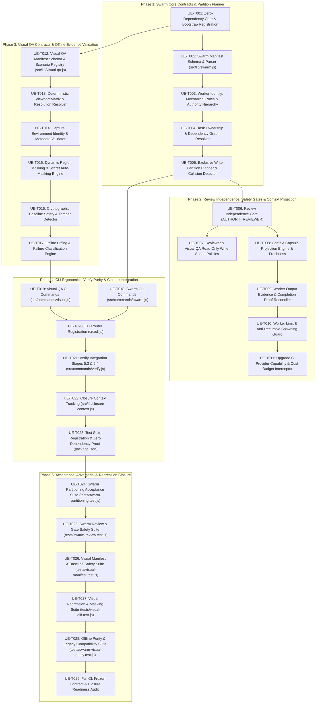

# Tareas de Implementación: Agent Swarm & Visual QA (Upgrade E)

**Feature Branch**: `010-agent-swarm-visual-qa`  
**Feature Directory**: `specs/010-agent-swarm-visual-qa/`  
**Spec**: [`specs/010-agent-swarm-visual-qa/spec.md`](file:///c:/CODES/Gemstack/specs/010-agent-swarm-visual-qa/spec.md)  
**Plan**: [`specs/010-agent-swarm-visual-qa/plan.md`](file:///c:/CODES/Gemstack/specs/010-agent-swarm-visual-qa/plan.md)  
**Lifecycle Status**: `TASKS_COMPLETE`  
**Stop Reason**: `TASKS_COMPLETE_AWAITING_REVIEW`

---

## Contratos Congelados Heredados & Bootstrap (`gemstack-contracts`)

```gemstack-contracts
[
  {
    "id": "swarm-authority-subordinate",
    "type": "BOOLEAN_INVARIANT",
    "value": true,
    "description": "Agent swarm orchestrators and workers are strictly subordinate to repository specifications, plans, tasks, and frozen contracts."
  },
  {
    "id": "author-not-reviewer",
    "type": "BOOLEAN_INVARIANT",
    "value": true,
    "description": "Separation of duties requires that the author of a code or task change cannot review or approve their own work."
  },
  {
    "id": "exclusive-task-write-ownership",
    "type": "BOOLEAN_INVARIANT",
    "value": true,
    "description": "Concurrent swarm tasks must declare disjoint, non-overlapping file write sets to prevent write collisions."
  },
  {
    "id": "swarm-provider-safety-gated",
    "type": "BOOLEAN_INVARIANT",
    "value": true,
    "description": "All worker operations must pass Upgrade C capability and billable action gates."
  },
  {
    "id": "swarm-context-projected",
    "type": "BOOLEAN_INVARIANT",
    "value": true,
    "description": "Worker contexts must be deterministically projected from Upgrade D context capsule without chat history leakage."
  },
  {
    "id": "visual-evidence-subordinate",
    "type": "BOOLEAN_INVARIANT",
    "value": true,
    "description": "Visual artifacts and screenshots are verification evidence only and cannot alter specifications or override gates."
  },
  {
    "id": "deterministic-viewports",
    "type": "BOOLEAN_INVARIANT",
    "value": true,
    "description": "All visual QA scenarios must specify explicit width, height, and device scale factor."
  },
  {
    "id": "baseline-explicit-update-only",
    "type": "BOOLEAN_INVARIANT",
    "value": true,
    "description": "Visual reference baselines may only be modified through explicit, recorded update operations."
  },
  {
    "id": "verify-swarm-visual-offline",
    "type": "BOOLEAN_INVARIANT",
    "value": true,
    "description": "gemstack verify validates swarm manifests and visual evidence offline with zero network and zero browser spawns."
  },
  {
    "id": "legacy-swarm-visual-compatibility",
    "type": "BOOLEAN_INVARIANT",
    "value": true,
    "description": "Repositories lacking swarm schedules or visual QA manifests operate cleanly without error."
  }
]
```

---

## Task Execution Rules & Safety Invariants

1. **Central Authority Invariant**: `SPEC / PLAN / TASKS / FROZEN CONTRACTS = SOLE AUTHORITY`. Agent outputs are proposed work; visual screenshots are verification evidence; neither can alter specifications or waive frozen contracts.
2. **Separation of Duties (`AUTHOR != REVIEWER`)**: The entity/worker ID that implements code or changes cannot act as the reviewer, security auditor, or closure approver for that task.
3. **Exclusive Task Write Ownership**: Concurrent tasks in the same wave must have strictly disjoint write sets (`write_set(T1) ∩ write_set(T2) = ∅`). Overlaps produce fail-closed rejection.
4. **Offline Purity & Zero Runtime Dependencies**: Gemstack core maintains runtime dependency delta = 0. Swarm coordination and visual QA verification rely strictly on Node.js built-ins.
5. **Verify Purity (`VERIFY = VALIDATE`)**: `gemstack verify` operates strictly in read-only mode, with zero worker execution, zero browser spawns, and zero file mutations.
6. **Explicit Baseline Lifecycle**: Baselines are NEVER auto-updated or healed during verification. Updates require explicit promotion (`gemstack vqa promote`).
7. **Deterministic Projections**: Swarm worker context derives strictly from Upgrade D `context-capsule.json` with chat logs and environment secrets excluded.
8. **Provider & Cost Safety**: Swarm model invocations are intercepted by Upgrade C `ProviderCapabilityGate` and `BillableActionGate`.

---

## Dependency Graph (5 Phased Waves)



---

## Detailed Task Inventory (29 Tasks)

### Phase 1: Swarm Core Contracts & Partition Planner

- [x] **UE-T001: Zero-Dependency Core & Bootstrap Registration**
  <!-- gemstack:validation_required=true -->
  <!-- gemstack:tests=TEST-SWARM-A01,TEST-VISUAL-A01 -->
  <!-- gemstack:files=src/lib/contracts.js -->
  <!-- gemstack:depends= -->
- **Phase**: Phase 1 — Swarm Core Contracts & Partition Planner
- **Objective**: Register Upgrade E bootstrap contracts in `src/lib/contracts.js` and ensure runtime dependency delta = 0.
- **Files**: `src/lib/contracts.js`
- **Prerequisites**: None
- **Implementation Requirements**:
  - Add 10 bootstrap contracts: `swarm-authority-subordinate`, `author-not-reviewer`, `exclusive-task-write-ownership`, `swarm-provider-safety-gated`, `swarm-context-projected`, `visual-evidence-subordinate`, `deterministic-viewports`, `baseline-explicit-update-only`, `verify-swarm-visual-offline`, `legacy-swarm-visual-compatibility`.
  - Validate all values are `BOOLEAN_INVARIANT: true`.
- **Must NOT**: Add external npm packages or modify frozen contracts from Upgrades A, B, C, D.
- **Tests**: `tests/contracts.test.js`
- **Acceptance IDs**: `TEST-SWARM-A01`, `TEST-VISUAL-A01`
- **Bootstrap Contracts**: All 10 contracts
- **Adversarial Cases**: Attempting to alter invariant values or inject external dependencies.
- **Completion Criteria**: Contracts extract cleanly without affecting legacy tests.
- **Evidence**: Unit test pass in `tests/contracts.test.js`.

- [x] **UE-T002: Swarm Manifest Schema & Parser (`src/lib/swarm.js`)**
  <!-- gemstack:validation_required=true -->
  <!-- gemstack:tests=TEST-SWARM-A01 -->
  <!-- gemstack:files=src/lib/swarm.js -->
  <!-- gemstack:depends=UE-T001 -->
- **Phase**: Phase 1
- **Objective**: Implement canonical JSON schema parsing and structural validation for `swarm.json`.
- **Files**: `src/lib/swarm.js` [NEW]
- **Prerequisites**: UE-T001
- **Implementation Requirements**:
  - Implement `parseSwarmManifest(manifestJson)` and `validateSwarmSchema(manifest)`.
  - Validate schema version `1.0.0`, required top-level fields: `feature_id`, `source_capsule_hash`, `waves`.
  - Implement deterministic key sorting using UTF-16 code units.
- **Must NOT**: Execute worker agents or spawn child processes.
- **Tests**: `tests/swarm-partitioning.test.js`
- **Acceptance IDs**: `TEST-SWARM-A01`
- **Bootstrap Contracts**: `swarm-authority-subordinate`
- **Adversarial Cases**: Missing schema version, malformed JSON, missing wave blocks.
- **Completion Criteria**: Rejects invalid schemas fail-closed; parses valid schemas deterministically.
- **Evidence**: Unit test assertions on schema validation.

- [x] **UE-T003: Worker Identity, Mechanical Roles & Authority Hierarchy**
  <!-- gemstack:validation_required=true -->
  <!-- gemstack:tests=TEST-SWARM-A01 -->
  <!-- gemstack:files=src/lib/swarm.js -->
  <!-- gemstack:depends=UE-T002 -->
- **Phase**: Phase 1
- **Objective**: Implement worker ID validation, mechanical role enforcement, and authority subordination.
- **Files**: `src/lib/swarm.js`
- **Prerequisites**: UE-T002
- **Implementation Requirements**:
  - Validate worker IDs are non-empty strings matching explicit naming format (no random UUIDs/PIDs).
  - Enforce mechanical roles: `implementer`, `reviewer`, `security-auditor`, `coordinator`.
  - Implement `validateSwarmAuthority(manifest, authoritativeSources)` ensuring swarm manifests cannot alter specifications or bypass tasks.
- **Must NOT**: Introduce fuzzy role personas or allow worker consensus to override spec.
- **Tests**: `tests/swarm-partitioning.test.js`
- **Acceptance IDs**: `TEST-SWARM-A01`
- **Bootstrap Contracts**: `swarm-authority-subordinate`
- **Adversarial Cases**: Dynamic UUID worker identity, undeclared role string, worker attempting to override `spec.md`.
- **Completion Criteria**: Emits `SWARM_AUTHORITY_CONFLICT` on override attempts.
- **Evidence**: Unit tests in `tests/swarm-partitioning.test.js`.

- [x] **UE-T004: Task Ownership & Dependency Graph Resolver**
  <!-- gemstack:validation_required=true -->
  <!-- gemstack:tests=TEST-SWARM-A01 -->
  <!-- gemstack:files=src/lib/swarm.js -->
  <!-- gemstack:depends=UE-T003 -->
- **Phase**: Phase 1
- **Objective**: Reconcile swarm task assignments against `tasks.md` and enforce dependency wave ordering.
- **Files**: `src/lib/swarm.js`
- **Prerequisites**: UE-T003
- **Implementation Requirements**:
  - Implement `resolveTaskOwnership(tasksContent, manifest)`.
  - Ensure every task in `swarm.json` maps to an accepted `task_id` in `tasks.md`.
  - Detect circular dependencies and ensure prerequisite tasks reside in strictly earlier waves.
- **Must NOT**: Allow orphan tasks or tasks outside the active feature.
- **Tests**: `tests/swarm-partitioning.test.js`
- **Acceptance IDs**: `TEST-SWARM-A01`
- **Bootstrap Contracts**: `swarm-authority-subordinate`
- **Adversarial Cases**: Assigning unlisted task ID, circular task prerequisites (`A -> B -> A`).
- **Completion Criteria**: Emits `SWARM_TASK_ORPHANED` or `SWARM_DEPENDENCY_CYCLE`.
- **Evidence**: Unit tests asserting dependency ordering and orphan detection.

- [x] **UE-T005: Exclusive Write Partition Planner & Collision Detector**
  <!-- gemstack:validation_required=true -->
  <!-- gemstack:tests=TEST-SWARM-A01,TEST-SWARM-A02 -->
  <!-- gemstack:files=src/lib/swarm.js -->
  <!-- gemstack:depends=UE-T004 -->
- **Phase**: Phase 1
- **Objective**: Implement disjoint write-set partition planning and collision detection for concurrent waves.
- **Files**: `src/lib/swarm.js`
- **Prerequisites**: UE-T004
- **Implementation Requirements**:
  - Implement `planSwarmWaves(tasksList)` and `validateWritePartitions(wave)`.
  - Enforce that for concurrent tasks ( T_1, T_2 in W ), `write_set(T1) ∩ write_set(T2) = ∅`.
  - If overlapping paths exist, serialize conflicting tasks into wave ( W+1 ) with warning `SWARM_WRITE_COLLISION_PREVENTED`.
  - In manifest audit, fail closed with `SWARM_WRITE_COLLISION` if concurrent tasks share write paths.
- **Must NOT**: Allow silent last-writer-wins or concurrent writes to identical files.
- **Tests**: `tests/swarm-partitioning.test.js`
- **Acceptance IDs**: `TEST-SWARM-A01`, `TEST-SWARM-A02`
- **Bootstrap Contracts**: `exclusive-task-write-ownership`
- **Adversarial Cases**: Two workers in wave 1 declaring write lease on `src/foo.js`.
- **Completion Criteria**: Emits `SWARM_WRITE_COLLISION` and blocks concurrent execution.
- **Evidence**: Passing tests for `TEST-SWARM-A01` and `TEST-SWARM-A02`.

---

### Phase 2: Review Independence, Safety Gates & Context Projection

- [x] **UE-T006: Review Independence Gate (`AUTHOR != REVIEWER`)**
  <!-- gemstack:validation_required=true -->
  <!-- gemstack:tests=TEST-SWARM-B01,TEST-SWARM-B02 -->
  <!-- gemstack:files=src/lib/swarm.js -->
  <!-- gemstack:depends=UE-T005 -->
- **Phase**: Phase 2 — Review Independence, Safety Gates & Context Projection
- **Objective**: Implement non-waivable separation of duties checking worker IDs on review attestations.
- **Files**: `src/lib/swarm.js`
- **Prerequisites**: UE-T005
- **Implementation Requirements**:
  - Implement `validateReviewSeparation(taskAssignment)`.
  - Compare `worker_id` of implementer with `reviewer_id` of reviewer.
  - Fail closed with `SWARM_SELF_REVIEW_DETECTED` if `implementer == reviewer`.
- **Must NOT**: Allow role-switching bypass within the same session/identity.
- **Tests**: `tests/swarm-review.test.js` [NEW]
- **Acceptance IDs**: `TEST-SWARM-B01`, `TEST-SWARM-B02`
- **Bootstrap Contracts**: `author-not-reviewer`
- **Adversarial Cases**: Worker implements task then changes role to `reviewer` to approve own work.
- **Completion Criteria**: Self-review attempts halt fail-closed with error.
- **Evidence**: Passing `TEST-SWARM-B01` and `TEST-SWARM-B02`.

- [x] **UE-T007: Reviewer & Visual QA Read-Only Write Scope Policies**
  <!-- gemstack:validation_required=true -->
  <!-- gemstack:tests=TEST-SWARM-B01 -->
  <!-- gemstack:files=src/lib/swarm.js -->
  <!-- gemstack:depends=UE-T006 -->
- **Phase**: Phase 2
- **Objective**: Enforce architectural read-only restrictions for reviewer and visual QA roles.
- **Files**: `src/lib/swarm.js`
- **Prerequisites**: UE-T006
- **Implementation Requirements**:
  - Implement `validateRoleWriteScope(workerRole, modifiedFiles)`.
  - For `reviewer` and `security-auditor`: `modifiedFiles` must be empty.
  - For `visual-qa`: `modifiedFiles` must be strictly confined to `specs/<feature>/evidence/`.
- **Must NOT**: Allow reviewers to "fix code while reviewing".
- **Tests**: `tests/swarm-review.test.js`
- **Acceptance IDs**: `TEST-SWARM-B01`
- **Bootstrap Contracts**: `author-not-reviewer`, `exclusive-task-write-ownership`
- **Adversarial Cases**: Reviewer commits bugfix directly to implementation file under review.
- **Completion Criteria**: Emits `SWARM_WRITE_SET_VIOLATION` if reviewer modifies code.
- **Evidence**: Unit test assertions verifying write boundary violations.

- [x] **UE-T008: Context Capsule Projection Engine & Freshness**
  <!-- gemstack:validation_required=true -->
  <!-- gemstack:tests=TEST-SWARM-D01,TEST-SWARM-D02 -->
  <!-- gemstack:files=src/lib/swarm.js -->
  <!-- gemstack:depends=UE-T006 -->
- **Phase**: Phase 2
- **Objective**: Implement task-scoped context projection derived from `context-capsule.json` with cryptographic freshness checking.
- **Files**: `src/lib/swarm.js`
- **Prerequisites**: UE-T006
- **Implementation Requirements**:
  - Implement `projectWorkerContext(capsule, taskId)`.
  - Extract only relevant task description, write scope, frozen contracts, and acceptance IDs.
  - Embed `source_capsule_hash`; check live hash against disk state during validation.
  - Fail closed with `SWARM_CONTEXT_STALE` if capsule on disk has drifted.
  - Exclude conversational chat transcripts and raw developer logs.
- **Must NOT**: Build a new memory store; reuse Upgrade D `context-capsule.json`.
- **Tests**: `tests/swarm-review.test.js`
- **Acceptance IDs**: `TEST-SWARM-D01`, `TEST-SWARM-D02`
- **Bootstrap Contracts**: `swarm-context-projected`
- **Adversarial Cases**: Modifying `spec.md` causing capsule hash drift; injecting chat history.
- **Completion Criteria**: Validates provenance hash; detects stale projection immediately.
- **Evidence**: Passing `TEST-SWARM-D01` and `TEST-SWARM-D02`.

- [x] **UE-T009: Worker Output Evidence & Completion Proof Reconciler**
  <!-- gemstack:validation_required=true -->
  <!-- gemstack:tests=TEST-SWARM-B02 -->
  <!-- gemstack:files=src/lib/swarm.js -->
  <!-- gemstack:depends=UE-T008 -->
- **Phase**: Phase 2
- **Objective**: Enforce that task completion requires structured evidence and independent review proof.
- **Files**: `src/lib/swarm.js`
- **Prerequisites**: UE-T008
- **Implementation Requirements**:
  - Implement `validateTaskCompletionProof(taskAssignment)`.
  - Require structured fields: `files_modified`, `tests_executed`, `review` block.
  - Validate that `review.status == "APPROVED"` and `review.reviewer_role == "reviewer"`.
- **Must NOT**: Accept agent prose claims ("I'm done") as authoritative completion.
- **Tests**: `tests/swarm-review.test.js`
- **Acceptance IDs**: `TEST-SWARM-B02`
- **Bootstrap Contracts**: `swarm-authority-subordinate`, `author-not-reviewer`
- **Adversarial Cases**: Worker marks status `COMPLETED` with no review attestation.
- **Completion Criteria**: Emits `SWARM_MISSING_REVIEW` and rejects closure.
- **Evidence**: Unit tests proving unreviewed claims fail validation.

- [x] **UE-T010: Worker Limit & Anti-Recursive Spawning Guard**
  <!-- gemstack:validation_required=true -->
  <!-- gemstack:tests=TEST-SWARM-A01 -->
  <!-- gemstack:files=src/lib/swarm.js -->
  <!-- gemstack:depends=UE-T009 -->
- **Phase**: Phase 2
- **Objective**: Enforce declared worker count limits and prohibit undeclared recursive child worker spawning.
- **Files**: `src/lib/swarm.js`
- **Prerequisites**: UE-T009
- **Implementation Requirements**:
  - Implement `validateWorkerLimits(manifest)`.
  - Enforce `workers.length <= max_workers` (default: 4, hard cap: 8).
  - Reject undeclared child worker claims or subagent hierarchy blocks with `SWARM_RECURSIVE_SPAWN_DENIED`.
- **Must NOT**: Allow dynamic unbounded agent spawning.
- **Tests**: `tests/swarm-review.test.js`
- **Acceptance IDs**: `TEST-SWARM-A01`
- **Bootstrap Contracts**: `swarm-authority-subordinate`
- **Adversarial Cases**: Manifest declaring 12 parallel workers or worker claiming spawned child.
- **Completion Criteria**: Fail-closed rejection on limit breach.
- **Evidence**: Unit test assertions on worker limits.

- [x] **UE-T011: Upgrade C Provider Capability & Cost Budget Interceptor**
  <!-- gemstack:validation_required=true -->
  <!-- gemstack:tests=TEST-SWARM-C01,TEST-SWARM-C02 -->
  <!-- gemstack:files=src/lib/swarm.js -->
  <!-- gemstack:depends=UE-T010 -->
- **Phase**: Phase 2
- **Objective**: Intercept worker external actions through Upgrade C `ProviderCapabilityGate` and `BillableActionGate`.
- **Files**: `src/lib/swarm.js`
- **Prerequisites**: UE-T010
- **Implementation Requirements**:
  - Implement `validateSwarmProviderSafety(workerAction, featureDir)`.
  - Invoke `evaluateCapabilityGate` from `src/lib/provider/capability-gate.js`.
  - Track wave token limits; halt with `SWARM_COST_LIMIT_EXCEEDED` if cumulative tokens exceed budget.
- **Must NOT**: Make live network calls or incur commercial API spend in core tests.
- **Tests**: `tests/swarm-review.test.js`
- **Acceptance IDs**: `TEST-SWARM-C01`, `TEST-SWARM-C02`
- **Bootstrap Contracts**: `swarm-provider-safety-gated`
- **Adversarial Cases**: Undeclared provider invocation; wave token sum exceeding limit.
- **Completion Criteria**: Emits `SWARM_PROVIDER_UNAUTHORIZED` or `SWARM_COST_LIMIT_EXCEEDED`.
- **Evidence**: Passing `TEST-SWARM-C01` and `TEST-SWARM-C02`.

---

### Phase 3: Visual QA Contracts & Offline Evidence Validation

- [x] **UE-T012: Visual QA Manifest Schema & Scenario Registry (`src/lib/visual-qa.js`)**
  <!-- gemstack:validation_required=true -->
  <!-- gemstack:tests=TEST-VISUAL-A01 -->
  <!-- gemstack:files=src/lib/visual-qa.js -->
  <!-- gemstack:depends=UE-T001 -->
- **Phase**: Phase 3 — Visual QA Contracts & Offline Evidence Validation
- **Objective**: Implement canonical JSON schema validation for `visual-qa.json` and scenario registry.
- **Files**: `src/lib/visual-qa.js` [NEW]
- **Prerequisites**: UE-T001
- **Implementation Requirements**:
  - Implement `parseVisualManifest(manifestJson)` and `validateVisualSchema(manifest)`.
  - Validate schema version `1.0.0`, `target_base_url`, and `scenarios` array.
  - Require unique `scenario_id` and non-empty `acceptance_ids` per scenario.
- **Must NOT**: Spawn headless browsers or require Puppeteer/Playwright packages.
- **Tests**: `tests/visual-manifest.test.js` [NEW]
- **Acceptance IDs**: `TEST-VISUAL-A01`
- **Bootstrap Contracts**: `visual-evidence-subordinate`
- **Adversarial Cases**: Duplicate scenario IDs, missing acceptance IDs, invalid JSON syntax.
- **Completion Criteria**: Rejects invalid manifests fail-closed with `VQA_INVALID_MANIFEST`.
- **Evidence**: Unit tests in `tests/visual-manifest.test.js`.

- [x] **UE-T013: Deterministic Viewport Matrix & Resolution Resolver**
  <!-- gemstack:validation_required=true -->
  <!-- gemstack:tests=TEST-VISUAL-A02 -->
  <!-- gemstack:files=src/lib/visual-qa.js -->
  <!-- gemstack:depends=UE-T012 -->
- **Phase**: Phase 3
- **Objective**: Enforce deterministic viewport dimensions and validate canonical profile configurations.
- **Files**: `src/lib/visual-qa.js`
- **Prerequisites**: UE-T012
- **Implementation Requirements**:
  - Implement `validateViewport(viewport)`.
  - Support canonical profiles: `desktop-standard` (1920x1080), `desktop-compact` (1280x800), `tablet-portrait` (768x1024), `mobile-portrait` (375x667).
  - Enforce positive integers for `width`, `height`, and `device_scale_factor`.
- **Must NOT**: Allow unquantified display labels or zero/negative dimensions.
- **Tests**: `tests/visual-manifest.test.js`
- **Acceptance IDs**: `TEST-VISUAL-A02`
- **Bootstrap Contracts**: `deterministic-viewports`
- **Adversarial Cases**: Negative height, non-integer scale factor, missing viewport object.
- **Completion Criteria**: Emits `VQA_INVALID_VIEWPORT` on non-conforming configurations.
- **Evidence**: Passing `TEST-VISUAL-A02`.

- [x] **UE-T014: Capture Environment Identity & Metadata Validator**
  <!-- gemstack:validation_required=true -->
  <!-- gemstack:tests=TEST-VISUAL-A01 -->
  <!-- gemstack:files=src/lib/visual-qa.js -->
  <!-- gemstack:depends=UE-T013 -->
- **Phase**: Phase 3
- **Objective**: Validate capture environment descriptors in submitted visual evidence.
- **Files**: `src/lib/visual-qa.js`
- **Prerequisites**: UE-T013
- **Implementation Requirements**:
  - Implement `validateEnvironmentMetadata(scenario, evidenceMetadata)`.
  - Check browser engine family, OS profile, and color scheme match scenario declarations.
- **Must NOT**: Overfit to a specific developer workstation hostname or OS kernel patch.
- **Tests**: `tests/visual-manifest.test.js`
- **Acceptance IDs**: `TEST-VISUAL-A01`
- **Bootstrap Contracts**: `deterministic-viewports`
- **Adversarial Cases**: Evidence captured in `dark` mode when scenario requires `light`.
- **Completion Criteria**: Flags environment mismatch fail-closed.
- **Evidence**: Unit test assertions on metadata compatibility.

- [x] **UE-T015: Dynamic Region Masking & Secret Auto-Masking Engine**
  <!-- gemstack:validation_required=true -->
  <!-- gemstack:tests=TEST-VISUAL-D01,TEST-VISUAL-D02 -->
  <!-- gemstack:files=src/lib/visual-qa.js -->
  <!-- gemstack:depends=UE-T014 -->
- **Phase**: Phase 3
- **Objective**: Implement deterministic solid masking rules for dynamic elements and sensitive input fields.
- **Files**: `src/lib/visual-qa.js`
- **Prerequisites**: UE-T014
- **Implementation Requirements**:
  - Implement `applySelectorMasks(domTree, maskSelectors)`.
  - Replace content of declared mask elements with neutral solid fill (`#808080`).
  - Automatically mask password inputs (`type="password"`) and `data-sensitive="true"` elements.
- **Must NOT**: Allow credentials or auth tokens to appear in visual evidence digests.
- **Tests**: `tests/visual-diff.test.js` [NEW]
- **Acceptance IDs**: `TEST-VISUAL-D01`, `TEST-VISUAL-D02`
- **Bootstrap Contracts**: `visual-evidence-subordinate`
- **Adversarial Cases**: Password input unmasked; live timestamp causing diff noise.
- **Completion Criteria**: Neutral mask eliminates dynamic noise; password inputs masked 100%.
- **Evidence**: Passing `TEST-VISUAL-D01` and `TEST-VISUAL-D02`.

- [x] **UE-T016: Cryptographic Baseline Safety & Tamper Detector**
  <!-- gemstack:validation_required=true -->
  <!-- gemstack:tests=TEST-VISUAL-B01,TEST-VISUAL-B02 -->
  <!-- gemstack:files=src/lib/visual-qa.js -->
  <!-- gemstack:depends=UE-T015 -->
- **Phase**: Phase 3
- **Objective**: Verify baseline image files against pinned SHA-256 hashes and enforce explicit promotion semantics.
- **Files**: `src/lib/visual-qa.js`
- **Prerequisites**: UE-T015
- **Implementation Requirements**:
  - Implement `validateBaselineIntegrity(scenario, baseDir)`.
  - Hash baseline image file on disk using SHA-256; compare against `baseline.image_sha256`.
  - Fail closed with `VQA_BASELINE_TAMPERED` if image was modified without explicit promotion.
  - Enforce that verification never overwrites or mutates baseline files.
- **Must NOT**: Auto-heal or silently overwrite baselines on test failure.
- **Tests**: `tests/visual-manifest.test.js`
- **Acceptance IDs**: `TEST-VISUAL-B01`, `TEST-VISUAL-B02`
- **Bootstrap Contracts**: `baseline-explicit-update-only`
- **Adversarial Cases**: Manually editing PNG on disk; verify attempting to update baseline.
- **Completion Criteria**: Emits `VQA_BASELINE_TAMPERED` upon hash mismatch.
- **Evidence**: Passing `TEST-VISUAL-B01` and `TEST-VISUAL-B02`.

- [x] **UE-T017: Offline Diffing & Failure Classification Engine**
  <!-- gemstack:validation_required=true -->
  <!-- gemstack:tests=TEST-VISUAL-C01,TEST-VISUAL-C02 -->
  <!-- gemstack:files=src/lib/visual-qa.js -->
  <!-- gemstack:depends=UE-T016 -->
- **Phase**: Phase 3
- **Objective**: Implement fast-path hash matching, tolerance evaluation, and deterministic failure classification.
- **Files**: `src/lib/visual-qa.js`
- **Prerequisites**: UE-T016
- **Implementation Requirements**:
  - Implement `compareVisualEvidence(evidence, baseline, tolerances)`.
  - Fast path: if live screenshot SHA-256 matches baseline `image_sha256`, pass immediately.
  - Classify failures: `VISUAL_REGRESSION`, `BASELINE_MISSING`, `BASELINE_TAMPERED`, `EVIDENCE_MISSING`.
- **Must NOT**: Require bundled native C++ image processing addons; use Node.js built-ins and digests.
- **Tests**: `tests/visual-diff.test.js`
- **Acceptance IDs**: `TEST-VISUAL-C01`, `TEST-VISUAL-C02`
- **Bootstrap Contracts**: `visual-evidence-subordinate`
- **Adversarial Cases**: Live image deviating beyond allowed `max_diff_percentage`.
- **Completion Criteria**: Emits `VQA_VISUAL_REGRESSION_DETECTED` on mismatch; fast passes on identical hash.
- **Evidence**: Passing `TEST-VISUAL-C01` and `TEST-VISUAL-C02`.

---

### Phase 4: CLI Ergonomics, Verify Purity & Closure Integration

- [x] **UE-T018: Swarm CLI Commands (`src/commands/swarm.js`)**
  <!-- gemstack:validation_required=true -->
  <!-- gemstack:tests=TEST-SWARM-A01,TEST-SWARM-E01 -->
  <!-- gemstack:files=src/commands/swarm.js -->
  <!-- gemstack:depends=UE-T005, UE-T011 -->
- **Phase**: Phase 4 — CLI Ergonomics, Verify Purity & Closure Integration
- **Objective**: Implement `gemstack swarm plan` and `gemstack swarm validate` subcommands.
- **Files**: `src/commands/swarm.js` [NEW]
- **Prerequisites**: UE-T005, UE-T011
- **Implementation Requirements**:
  - `gemstack swarm plan`: Reads `tasks.md`, computes waves and disjoint write sets, writes `swarm.json`.
  - `gemstack swarm validate`: Strictly read-only; checks write partitions, review attestations, context freshness.
  - Support `--json` flag for structured machine output.
- **Must NOT**: Implement a live worker execution daemon (`swarm run`).
- **Tests**: `tests/swarm-review.test.js`
- **Acceptance IDs**: `TEST-SWARM-A01`, `TEST-SWARM-E01`
- **Bootstrap Contracts**: `swarm-authority-subordinate`
- **Adversarial Cases**: Invoking validate with invalid manifest or overlapping writes.
- **Completion Criteria**: CLI commands execute cleanly; validate operates in read-only mode.
- **Evidence**: CLI functional tests in `tests/swarm-review.test.js`.

- [x] **UE-T019: Visual QA CLI Commands (`src/commands/visual.js`)**
  <!-- gemstack:validation_required=true -->
  <!-- gemstack:tests=TEST-VISUAL-B01,TEST-VISUAL-E01 -->
  <!-- gemstack:files=src/commands/visual.js -->
  <!-- gemstack:depends=UE-T017 -->
- **Phase**: Phase 4
- **Objective**: Implement `gemstack vqa validate` and `gemstack vqa promote` subcommands.
- **Files**: `src/commands/visual.js` [NEW]
- **Prerequisites**: UE-T017
- **Implementation Requirements**:
  - `gemstack vqa validate`: Strictly read-only offline audit of `visual-qa.json`, baselines, and evidence.
  - `gemstack vqa promote <scenario-id>`: Explicitly promotes live evidence to canonical baseline with updated SHA-256 and audit metadata.
- **Must NOT**: Launch browser processes or perform automated capture.
- **Tests**: `tests/visual-manifest.test.js`, `tests/swarm-visual-purity.test.js` [NEW]
- **Acceptance IDs**: `TEST-VISUAL-B01`, `TEST-VISUAL-E01`
- **Bootstrap Contracts**: `baseline-explicit-update-only`
- **Adversarial Cases**: Promoting without live evidence; validate mutating baseline image.
- **Completion Criteria**: Explicit promotion succeeds; validate never mutates files.
- **Evidence**: Passing tests verifying promote updates manifest and validate remains read-only.

- [x] **UE-T020: CLI Router Registration (`src/cli.js`)**
  <!-- gemstack:validation_required=true -->
  <!-- gemstack:tests=TEST-SWARM-E01,TEST-VISUAL-E01 -->
  <!-- gemstack:files=src/cli.js -->
  <!-- gemstack:depends=UE-T018, UE-T019 -->
- **Phase**: Phase 4
- **Objective**: Register `swarm` and `vqa` commands in the main Gemstack CLI router.
- **Files**: `src/cli.js` [MODIFY]
- **Prerequisites**: UE-T018, UE-T019
- **Implementation Requirements**:
  - Add `swarm` and `vqa` command routes in `src/cli.js`.
  - Update CLI help text displaying usage for `gemstack swarm` and `gemstack vqa`.
- **Must NOT**: Break existing command routing or alter flags for other commands.
- **Tests**: `tests/runner-adapter.test.js`, `scripts/ci/smoke-cli.js`
- **Acceptance IDs**: `TEST-SWARM-E01`, `TEST-VISUAL-E01`
- **Bootstrap Contracts**: `verify-swarm-visual-offline`
- **Adversarial Cases**: Unrecognized subcommand arguments under `swarm` and `vqa`.
- **Completion Criteria**: Commands invoke corresponding handlers; help text renders accurately.
- **Evidence**: Smoke test verification via `node scripts/ci/smoke-cli.js`.

- [x] **UE-T021: Verify Integration Stages 5.3 & 5.4 (`src/commands/verify.js`)**
  <!-- gemstack:validation_required=true -->
  <!-- gemstack:tests=TEST-SWARM-E01,TEST-SWARM-E02,TEST-VISUAL-E01,TEST-VISUAL-E02 -->
  <!-- gemstack:files=src/commands/verify.js -->
  <!-- gemstack:depends=UE-T020 -->
- **Phase**: Phase 4
- **Objective**: Add Stage 5.3 (Swarm Audit) and Stage 5.4 (Visual QA Audit) to `gemstack verify` in pure read-only mode.
- **Files**: `src/commands/verify.js` [MODIFY]
- **Prerequisites**: UE-T020
- **Implementation Requirements**:
  - **Stage 5.3**: Validates `swarm.json` write partitions, `author != reviewer`, and context freshness.
  - **Stage 5.4**: Validates `visual-qa.json` viewports, baseline SHA-256 integrity, and evidence completeness.
  - Preserves legacy mode: if `swarm.json` or `visual-qa.json` is absent, logs informational notice and exits 0.
  - Enforces `VERIFY = VALIDATE`: 0 file writes, 0 process launches, 0 network calls.
- **Must NOT**: Mutate files, update baselines, or spawn browsers during verify.
- **Tests**: `tests/swarm-visual-purity.test.js`
- **Acceptance IDs**: `TEST-SWARM-E01`, `TEST-SWARM-E02`, `TEST-VISUAL-E01`, `TEST-VISUAL-E02`
- **Bootstrap Contracts**: `verify-swarm-visual-offline`, `legacy-swarm-visual-compatibility`
- **Adversarial Cases**: Running verify on legacy project; running verify with mocked throwing sockets.
- **Completion Criteria**: Verify passes offline with 0 errors; legacy projects exit 0.
- **Evidence**: Passing `TEST-SWARM-E01..E02` and `TEST-VISUAL-E01..E02`.

- [x] **UE-T022: Closure Context Tracking (`src/lib/closure-context.js`)**
  <!-- gemstack:validation_required=true -->
  <!-- gemstack:tests=TEST-SWARM-E01,TEST-VISUAL-E01 -->
  <!-- gemstack:files=src/lib/closure-context.js -->
  <!-- gemstack:depends=UE-T021 -->
- **Phase**: Phase 4
- **Objective**: Incorporate `swarm.json` and `visual-qa.json` into mechanical closure context when present.
- **Files**: `src/lib/closure-context.js` [MODIFY]
- **Prerequisites**: UE-T021
- **Implementation Requirements**:
  - Include `swarm.json` and `visual-qa.json` in implementation context file list when resolving closure state.
  - Preserve Upgrade B closure context hashing and acceptance signature reconciliation.
- **Must NOT**: Alter closure manifest semantics or create new closure authorities.
- **Tests**: `tests/closure-manifest.test.js`, `tests/closure-gates.test.js`
- **Acceptance IDs**: `TEST-SWARM-E01`, `TEST-VISUAL-E01`
- **Bootstrap Contracts**: `swarm-authority-subordinate`, `visual-evidence-subordinate`
- **Adversarial Cases**: Modifying `swarm.json` after collect triggers stale closure evidence.
- **Completion Criteria**: Closure context digest accurately incorporates active manifests.
- **Evidence**: Unit test assertions in closure test suite.

- [x] **UE-T023: Test Suite Registration & Zero Dependency Proof (`package.json`)**
  <!-- gemstack:validation_required=true -->
  <!-- gemstack:tests=TEST-SWARM-A01,TEST-SWARM-A02,TEST-SWARM-B01,TEST-SWARM-B02,TEST-SWARM-C01,TEST-SWARM-C02,TEST-SWARM-D01,TEST-SWARM-D02,TEST-SWARM-E01,TEST-SWARM-E02,TEST-VISUAL-A01,TEST-VISUAL-A02,TEST-VISUAL-B01,TEST-VISUAL-B02,TEST-VISUAL-C01,TEST-VISUAL-C02,TEST-VISUAL-D01,TEST-VISUAL-D02,TEST-VISUAL-E01,TEST-VISUAL-E02 -->
  <!-- gemstack:files=package.json -->
  <!-- gemstack:depends=UE-T022 -->
- **Phase**: Phase 4
- **Objective**: Register the 5 new test suites into `package.json` test script and verify zero dependency delta.
- **Files**: `package.json` [MODIFY]
- **Prerequisites**: UE-T022
- **Implementation Requirements**:
  - Add `tests/swarm-partitioning.test.js`, `tests/swarm-review.test.js`, `tests/visual-manifest.test.js`, `tests/visual-diff.test.js`, `tests/swarm-visual-purity.test.js` to `npm test` script.
  - Verify `dependencies` and `devDependencies` remain completely empty (0 added).
- **Must NOT**: Add any runtime or development npm dependencies.
- **Tests**: `scripts/ci/check-package-contents.js`
- **Acceptance IDs**: All 20 acceptance criteria
- **Bootstrap Contracts**: All 10 contracts
- **Adversarial Cases**: Injecting an external npm package; omitting test files from runner.
- **Completion Criteria**: `package.json` scripts execute clean test runner; package contents check passes.
- **Evidence**: Clean output from `npm run ci:package`.

---

### Phase 5: Acceptance, Adversarial & Regression Closure

- [x] **UE-T024: Swarm Partitioning Acceptance Suite (`tests/swarm-partitioning.test.js`)**
  <!-- gemstack:validation_required=true -->
  <!-- gemstack:tests=TEST-SWARM-A01,TEST-SWARM-A02 -->
  <!-- gemstack:files=tests/swarm-partitioning.test.js -->
  <!-- gemstack:depends=UE-T023 -->
- **Phase**: Phase 5 — Acceptance, Adversarial & Regression Closure
- **Objective**: Implement mechanical unit tests for swarm partitioning, wave planning, and write collisions.
- **Files**: `tests/swarm-partitioning.test.js` [NEW]
- **Prerequisites**: UE-T023
- **Implementation Requirements**:
  - Implement `TEST-SWARM-A01`: Proves parallel tasks with disjoint write sets schedule concurrently.
  - Implement `TEST-SWARM-A02`: Proves overlapping write sets serialize and trigger collision prevention.
- **Must NOT**: Spawn actual parallel worker processes.
- **Tests**: `tests/swarm-partitioning.test.js`
- **Acceptance IDs**: `TEST-SWARM-A01`, `TEST-SWARM-A02`
- **Bootstrap Contracts**: `exclusive-task-write-ownership`
- **Adversarial Cases**: Concurrent tasks declaring identical files; circular prerequisite chains.
- **Completion Criteria**: Both tests pass 100% with exit code 0.
- **Evidence**: Passing test execution output.

- [x] **UE-T025: Swarm Review & Gate Safety Suite (`tests/swarm-review.test.js`)**
  <!-- gemstack:validation_required=true -->
  <!-- gemstack:tests=TEST-SWARM-B01,TEST-SWARM-B02,TEST-SWARM-C01,TEST-SWARM-C02,TEST-SWARM-D01,TEST-SWARM-D02 -->
  <!-- gemstack:files=tests/swarm-review.test.js -->
  <!-- gemstack:depends=UE-T024 -->
- **Phase**: Phase 5
- **Objective**: Implement mechanical unit tests for separation of duties, provider gates, and context projection.
- **Files**: `tests/swarm-review.test.js` [NEW]
- **Prerequisites**: UE-T024
- **Implementation Requirements**:
  - Implement `TEST-SWARM-B01`: Proves author == reviewer fails closed with self-review error.
  - Implement `TEST-SWARM-B02`: Proves distinct reviewer role validates review attestation.
  - Implement `TEST-SWARM-C01`: Proves model invocation intercepted by ProviderCapabilityGate.
  - Implement `TEST-SWARM-C02`: Proves token limit budget enforcement across wave tasks.
  - Implement `TEST-SWARM-D01`: Proves context projection matches capsule hash.
  - Implement `TEST-SWARM-D02`: Proves raw chat history excluded from worker context.
- **Must NOT**: Call live external model APIs; use local gate fixtures.
- **Tests**: `tests/swarm-review.test.js`
- **Acceptance IDs**: `TEST-SWARM-B01`, `TEST-SWARM-B02`, `TEST-SWARM-C01`, `TEST-SWARM-C02`, `TEST-SWARM-D01`, `TEST-SWARM-D02`
- **Bootstrap Contracts**: `author-not-reviewer`, `swarm-provider-safety-gated`, `swarm-context-projected`
- **Adversarial Cases**: Role-switching bypass; budget breach; stale context hash drift.
- **Completion Criteria**: All 6 tests pass 100% with exit code 0.
- **Evidence**: Passing test execution output.

- [x] **UE-T026: Visual Manifest & Baseline Safety Suite (`tests/visual-manifest.test.js`)**
  <!-- gemstack:validation_required=true -->
  <!-- gemstack:tests=TEST-VISUAL-A01,TEST-VISUAL-A02,TEST-VISUAL-B01,TEST-VISUAL-B02 -->
  <!-- gemstack:files=tests/visual-manifest.test.js -->
  <!-- gemstack:depends=UE-T025 -->
- **Phase**: Phase 5
- **Objective**: Implement mechanical unit tests for visual-qa.json schema, viewports, and baseline safety.
- **Files**: `tests/visual-manifest.test.js` [NEW]
- **Prerequisites**: UE-T025
- **Implementation Requirements**:
  - Implement `TEST-VISUAL-A01`: Proves schema validation rejects missing route, viewport, or baseline.
  - Implement `TEST-VISUAL-A02`: Proves deterministic viewport specifications across profiles.
  - Implement `TEST-VISUAL-B01`: Proves baseline image file hash mismatch triggers tampered error.
  - Implement `TEST-VISUAL-B02`: Proves baseline files are never silently modified during test run.
- **Must NOT**: Spawn browser binaries.
- **Tests**: `tests/visual-manifest.test.js`
- **Acceptance IDs**: `TEST-VISUAL-A01`, `TEST-VISUAL-A02`, `TEST-VISUAL-B01`, `TEST-VISUAL-B02`
- **Bootstrap Contracts**: `visual-evidence-subordinate`, `deterministic-viewports`, `baseline-explicit-update-only`
- **Adversarial Cases**: Negative viewport height; tampered PNG on disk; silent baseline rewrite.
- **Completion Criteria**: All 4 tests pass 100% with exit code 0.
- **Evidence**: Passing test execution output.

- [x] **UE-T027: Visual Regression & Masking Suite (`tests/visual-diff.test.js`)**
  <!-- gemstack:validation_required=true -->
  <!-- gemstack:tests=TEST-VISUAL-C01,TEST-VISUAL-C02,TEST-VISUAL-D01,TEST-VISUAL-D02 -->
  <!-- gemstack:files=tests/visual-diff.test.js -->
  <!-- gemstack:depends=UE-T026 -->
- **Phase**: Phase 5
- **Objective**: Implement mechanical tests for visual regression detection and dynamic region masking.
- **Files**: `tests/visual-diff.test.js` [NEW]
- **Prerequisites**: UE-T026
- **Implementation Requirements**:
  - Implement `TEST-VISUAL-C01`: Proves screenshot deviating beyond threshold triggers regression.
  - Implement `TEST-VISUAL-C02`: Proves identical SHA-256 hashes pass comparison immediately.
  - Implement `TEST-VISUAL-D01`: Proves dynamic text variation in masked selector does not fail.
  - Implement `TEST-VISUAL-D02`: Proves automatic masking of password and sensitive credential fields.
- **Must NOT**: Rely on live browser rendering; use deterministic image and DOM fixtures.
- **Tests**: `tests/visual-diff.test.js`
- **Acceptance IDs**: `TEST-VISUAL-C01`, `TEST-VISUAL-C02`, `TEST-VISUAL-D01`, `TEST-VISUAL-D02`
- **Bootstrap Contracts**: `visual-evidence-subordinate`
- **Adversarial Cases**: Unmasked password leak; live clock causing diff failure.
- **Completion Criteria**: All 4 tests pass 100% with exit code 0.
- **Evidence**: Passing test execution output.

- [x] **UE-T028: Offline Purity & Legacy Compatibility Suite (`tests/swarm-visual-purity.test.js`)**
  <!-- gemstack:validation_required=true -->
  <!-- gemstack:tests=TEST-SWARM-E01,TEST-SWARM-E02,TEST-VISUAL-E01,TEST-VISUAL-E02 -->
  <!-- gemstack:files=tests/swarm-visual-purity.test.js -->
  <!-- gemstack:depends=UE-T027 -->
- **Phase**: Phase 5
- **Objective**: Implement integration tests proving verify purity and backward compatibility.
- **Files**: `tests/swarm-visual-purity.test.js` [NEW]
- **Prerequisites**: UE-T027
- **Implementation Requirements**:
  - Implement `TEST-SWARM-E01` & `TEST-VISUAL-E01`: Proves `gemstack verify` runs offline with 0 process spawns, 0 file mutations, and sockets mocked to throw.
  - Implement `TEST-SWARM-E02` & `TEST-VISUAL-E02`: Proves legacy projects lacking `swarm.json` or `visual-qa.json` pass with exit code 0.
- **Must NOT**: Open live network connections or mutate disk files.
- **Tests**: `tests/swarm-visual-purity.test.js`
- **Acceptance IDs**: `TEST-SWARM-E01`, `TEST-SWARM-E02`, `TEST-VISUAL-E01`, `TEST-VISUAL-E02`
- **Bootstrap Contracts**: `verify-swarm-visual-offline`, `legacy-swarm-visual-compatibility`
- **Adversarial Cases**: Verify attempting network connection or mutating baseline file.
- **Completion Criteria**: All purity and legacy tests pass 100% with exit code 0.
- **Evidence**: Passing test execution output.

- [x] **UE-T029: Full CI, Frozen Contract & Closure Readiness Audit**
  <!-- gemstack:validation_required=true -->
  <!-- gemstack:tests=TEST-SWARM-A01,TEST-SWARM-A02,TEST-SWARM-B01,TEST-SWARM-B02,TEST-SWARM-C01,TEST-SWARM-C02,TEST-SWARM-D01,TEST-SWARM-D02,TEST-SWARM-E01,TEST-SWARM-E02,TEST-VISUAL-A01,TEST-VISUAL-A02,TEST-VISUAL-B01,TEST-VISUAL-B02,TEST-VISUAL-C01,TEST-VISUAL-C02,TEST-VISUAL-D01,TEST-VISUAL-D02,TEST-VISUAL-E01,TEST-VISUAL-E02 -->
  <!-- gemstack:files=All repository files -->
  <!-- gemstack:depends=UE-T024 through UE-T028 -->
- **Phase**: Phase 5
- **Objective**: Run full test regression, CI gate scripts, and prove frozen contracts remain 100% intact.
- **Files**: All repository files
- **Prerequisites**: UE-T024 through UE-T028
- **Implementation Requirements**:
  - Execute `npm test` proving all legacy (100) + Upgrade E (20+) tests pass with 0 failures.
  - Execute `npm run ci:all` proving all frontmatter, template, mojibake, package, and demo checks pass.
  - Execute `node src/cli.js verify` confirming 0 errors and 0 blockers.
  - Verify frozen contracts from Upgrades A, B, C, D are untouched.
- **Must NOT**: Bump package version, publish to npm, or declare closure prematurely.
- **Tests**: Full CI pipeline (`npm run ci:all`)
- **Acceptance IDs**: All 20 acceptance criteria
- **Bootstrap Contracts**: All 10 contracts
- **Adversarial Cases**: Regressions in Upgrades A/B/C/D; package content leaks.
- **Completion Criteria**: 100% clean CI run; zero regressions; ready for closure review.
- **Evidence**: Full terminal logs from `npm run ci:all` and `gemstack verify`.

---

## Bootstrap Contract Traceability (10 / 10 Mapped)

| Bootstrap Contract | Task ID(s) | Test File | Mechanical Proof |
| :--- | :--- | :--- | :--- |
| **`swarm-authority-subordinate`** | UE-T001, UE-T002, UE-T003 | `tests/swarm-partitioning.test.js` | Rejects manifest attempting to override spec or bypass tasks |
| **`author-not-reviewer`** | UE-T006, UE-T007, UE-T009 | `tests/swarm-review.test.js` | Fails closed with self-review error when author == reviewer |
| **`exclusive-task-write-ownership`**| UE-T005, UE-T007, UE-T024 | `tests/swarm-partitioning.test.js` | Rejects concurrent tasks with overlapping write sets |
| **`swarm-provider-safety-gated`** | UE-T011, UE-T025 | `tests/swarm-review.test.js` | Intercepts model calls via ProviderCapabilityGate |
| **`swarm-context-projected`** | UE-T008, UE-T025 | `tests/swarm-review.test.js` | Rejects stale projections and chat transcript ingestion |
| **`visual-evidence-subordinate`** | UE-T012, UE-T015, UE-T017 | `tests/visual-diff.test.js` | Screenshot evidence cannot alter spec or waive gates |
| **`deterministic-viewports`** | UE-T013, UE-T014, UE-T026 | `tests/visual-manifest.test.js` | Rejects negative or unquantified viewport dimensions |
| **`baseline-explicit-update-only`**| UE-T016, UE-T019, UE-T026 | `tests/visual-manifest.test.js` | Rejects silent baseline mutation; requires explicit promote |
| **`verify-swarm-visual-offline`** | UE-T021, UE-T028 | `tests/swarm-visual-purity.test.js` | Verify passes offline with mocked network and 0 spawns |
| **`legacy-swarm-visual-compatibility`**| UE-T021, UE-T028 | `tests/swarm-visual-purity.test.js` | Legacy projects without manifests pass verify exit 0 |

---

## Canonical Acceptance Traceability (20 / 20 Mapped)

| Acceptance ID | Task ID(s) | Test File | Mechanical Proof |
| :--- | :--- | :--- | :--- |
| **`TEST-SWARM-A01`** | UE-T001..T005, UE-T024 | `tests/swarm-partitioning.test.js` | Disjoint write sets schedule cleanly in concurrent waves |
| **`TEST-SWARM-A02`** | UE-T005, UE-T024 | `tests/swarm-partitioning.test.js` | Overlapping write sets serialize into sequential waves |
| **`TEST-SWARM-B01`** | UE-T006, UE-T007, UE-T025 | `tests/swarm-review.test.js` | Self-review by author triggers fail-closed rejection |
| **`TEST-SWARM-B02`** | UE-T006, UE-T009, UE-T025 | `tests/swarm-review.test.js` | Review attestation by distinct reviewer passes validation |
| **`TEST-SWARM-C01`** | UE-T011, UE-T025 | `tests/swarm-review.test.js` | Intercepts undeclared provider invocation fail-closed |
| **`TEST-SWARM-C02`** | UE-T011, UE-T025 | `tests/swarm-review.test.js` | Halts execution when wave tokens exceed allocated budget |
| **`TEST-SWARM-D01`** | UE-T008, UE-T025 | `tests/swarm-review.test.js` | Projection hash matches active context-capsule digest |
| **`TEST-SWARM-D02`** | UE-T008, UE-T025 | `tests/swarm-review.test.js` | Chat transcripts are strictly excluded from worker payloads |
| **`TEST-SWARM-E01`** | UE-T018, UE-T021, UE-T028 | `tests/swarm-visual-purity.test.js` | Verify audits swarm manifest with 0 writes and 0 spawns |
| **`TEST-SWARM-E02`** | UE-T021, UE-T028 | `tests/swarm-visual-purity.test.js` | Absent swarm manifest passes verify in legacy mode (exit 0) |
| **`TEST-VISUAL-A01`** | UE-T012, UE-T026 | `tests/visual-manifest.test.js` | Rejects manifest missing route, viewport, or baseline |
| **`TEST-VISUAL-A02`** | UE-T013, UE-T026 | `tests/visual-manifest.test.js` | Validates deterministic viewport dimensions across profiles |
| **`TEST-VISUAL-B01`** | UE-T016, UE-T019, UE-T026 | `tests/visual-manifest.test.js` | Tampered baseline image on disk triggers hash error |
| **`TEST-VISUAL-B02`** | UE-T016, UE-T026 | `tests/visual-manifest.test.js` | Baseline image hashes remain unchanged after test run |
| **`TEST-VISUAL-C01`** | UE-T017, UE-T027 | `tests/visual-diff.test.js` | Live screenshot deviating beyond tolerance triggers regression |
| **`TEST-VISUAL-C02`** | UE-T017, UE-T027 | `tests/visual-diff.test.js` | Identical SHA-256 image hashes pass immediately |
| **`TEST-VISUAL-D01`** | UE-T015, UE-T027 | `tests/visual-diff.test.js` | Dynamic variations inside masked selector do not fail |
| **`TEST-VISUAL-D02`** | UE-T015, UE-T027 | `tests/visual-diff.test.js` | Password inputs are automatically masked with solid fill |
| **`TEST-VISUAL-E01`** | UE-T019, UE-T021, UE-T028 | `tests/swarm-visual-purity.test.js` | Verify audits visual evidence offline with 0 browser spawns |
| **`TEST-VISUAL-E02`** | UE-T021, UE-T028 | `tests/swarm-visual-purity.test.js` | Absent visual manifest passes verify in legacy mode (exit 0) |

---

## Adversarial Matrix (26 Scenarios)

| Adversarial Attack / Vector | Task ID | Test File | Expected Finding / Result |
| :--- | :--- | :--- | :--- |
| 1. Worker attempts out-of-scope file edit | UE-T007 | `tests/swarm-review.test.js` | `SWARM_WRITE_SET_VIOLATION` |
| 2. Worker uses stale context projection | UE-T008 | `tests/swarm-review.test.js` | `SWARM_CONTEXT_STALE` |
| 3. Two workers claim identical write path | UE-T005 | `tests/swarm-partitioning.test.js` | `SWARM_WRITE_COLLISION` |
| 4. Worker claims complete without test proof | UE-T009 | `tests/swarm-review.test.js` | `SWARM_MISSING_REVIEW` |
| 5. Author self-approves implementation task | UE-T006 | `tests/swarm-review.test.js` | `SWARM_SELF_REVIEW_DETECTED` |
| 6. Author changes role string to review own work | UE-T006 | `tests/swarm-review.test.js` | `SWARM_SELF_REVIEW_DETECTED` |
| 7. Worker claims spawned undeclared subagent | UE-T010 | `tests/swarm-review.test.js` | `SWARM_RECURSIVE_SPAWN_DENIED` |
| 8. Declared worker count exceeds limit | UE-T010 | `tests/swarm-review.test.js` | `SWARM_WORKER_LIMIT_EXCEEDED` |
| 9. Model invocation without provider gate | UE-T011 | `tests/swarm-review.test.js` | `SWARM_PROVIDER_UNAUTHORIZED` |
| 10. Wave token usage exceeds allocated budget | UE-T011 | `tests/swarm-review.test.js` | `SWARM_COST_LIMIT_EXCEEDED` |
| 11. Swarm manifest attempts to modify spec.md | UE-T003 | `tests/swarm-partitioning.test.js` | `SWARM_AUTHORITY_CONFLICT` |
| 12. Worker attempts to modify closure.json | UE-T007 | `tests/swarm-review.test.js` | `SWARM_WRITE_SET_VIOLATION` |
| 13. Visual worker modifies application code | UE-T007 | `tests/swarm-review.test.js` | `SWARM_WRITE_SET_VIOLATION` |
| 14. Screenshot evidence claims architecture change| UE-T012 | `tests/visual-manifest.test.js` | `VQA_AUTHORITY_CONFLICT` |
| 15. Missing visual evidence marked as pass | UE-T017 | `tests/visual-diff.test.js` | `VQA_EVIDENCE_MISSING` |
| 16. Stale screenshot from earlier commit used | UE-T017 | `tests/visual-diff.test.js` | `VQA_EVIDENCE_STALE` |
| 17. Unquantified or negative viewport used | UE-T013 | `tests/visual-manifest.test.js` | `VQA_INVALID_VIEWPORT` |
| 18. Evidence captured in dark mode for light spec| UE-T014 | `tests/visual-manifest.test.js` | `VQA_ENVIRONMENT_MISMATCH` |
| 19. Tool attempts silent baseline auto-update | UE-T016 | `tests/visual-manifest.test.js` | `VQA_BASELINE_TAMPERED` |
| 20. Baseline image bytes forged / modified on disk| UE-T016 | `tests/visual-manifest.test.js` | `VQA_BASELINE_TAMPERED` |
| 21. Live screenshot hash forged in manifest | UE-T017 | `tests/visual-diff.test.js` | `VQA_VISUAL_REGRESSION_DETECTED`|
| 22. Unmasked password input captured in screenshot| UE-T015 | `tests/visual-diff.test.js` | Auto-masked with solid fill |
| 23. Verify command attempts worker process spawn | UE-T021 | `tests/swarm-visual-purity.test.js`| 0 spawns (mocked to throw) |
| 24. Verify command attempts browser launch | UE-T021 | `tests/swarm-visual-purity.test.js`| 0 browser calls |
| 25. Verify command mutates baseline or manifest | UE-T021 | `tests/swarm-visual-purity.test.js`| 0 file mutations (hash check) |
| 26. Legacy project without manifests run in verify | UE-T021 | `tests/swarm-visual-purity.test.js`| Exits code 0 (Legacy Notice) |

---

## Test File Mapping

| Test File | Total Tests | Acceptance IDs Covered | Key Responsibilities |
| :--- | :--- | :--- | :--- |
| **`tests/swarm-partitioning.test.js`** | 5 | `TEST-SWARM-A01`, `TEST-SWARM-A02` | Manifest schema, wave scheduling, disjoint write sets, authority check |
| **`tests/swarm-review.test.js`** | 8 | `TEST-SWARM-B01..B02`, `C01..C02`, `D01..D02` | Separation of duties, provider interceptor, budget cap, context projection |
| **`tests/visual-manifest.test.js`** | 5 | `TEST-VISUAL-A01..A02`, `B01..B02` | Schema, viewport matrix, environment descriptor, baseline hash integrity |
| **`tests/visual-diff.test.js`** | 5 | `TEST-VISUAL-C01..C02`, `D01..D02` | Regression diffing, identical hash bypass, dynamic masking, credential mask |
| **`tests/swarm-visual-purity.test.js`**| 5 | `TEST-SWARM-E01..E02`, `TEST-VISUAL-E01..E02` | Verify read-only purity, offline socket mocking, legacy compatibility |

---

## Explicit Deferred Items

1. **Live Multi-Process Worker Daemon**: Background process supervisors or IPC servers (non-goal).
2. **Bundled Headless Browser Binaries**: Heavy Chromium/Playwright binaries inside npm package dependencies (non-goal).
3. **Fuzzy AI Aesthetic Grading**: Subjective LLM opinions on UI beauty or styling quality (non-goal).
4. **Distributed Swarm Consensus**: Multi-node network consensus protocols (out of scope).
5. **Package Version Bump / Release**: Version bumping and npm publishing (strictly post-closure).
